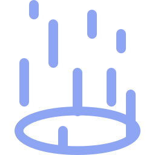

# SVG

Eu tenho explorado maneiras de fazer gráfico para o meu jogo.  

## Pixel art

Meu plano sempre foi fazer algo simples, e originalmente a ideia seria pixel art com [Aseprite](https://www.aseprite.org/), porém com o tempo eu percebi que mesmo coisas "simples" em pixel art me dariam trabalho 😆.  

Infelizmente eu não lembro dos problemas que tive durante a utilização mas acredito que seja pelo fato de eu não conhecer boas práticas de arte para jogos em geral (e eu não tinha planos de me aventurar em detalhes sobre assunto).  

Eu não queria entender como fazer para a arte não perde qualidade depois de alterar a escala, ou como a fazer animações boas, ... O foco para mim sempre foi aprender a utilizar bem [Godot](https://godotengine.org/).  

## SVG

O interesse começou pelo fato de SVG conseguir escalar para diversos tamanhos sem perda de qualidade. Isto quer dizer que eu poderia fazer em um tamanho pequeno e escalar no jogo sem que ficasse esquisito.  

Isso pode ser fácilmente demonstrado alterando duas propriedades da imagem SVG, que por sua vez é algo simples de fazer (abrir a imagem com um editor de texto e alterar).  


  

Estas 3 imagems possuem 16 pixel para `width` e `height`.  

```svg
<svg
   width="16"
   height="16"
   ...
></svg>
```

Agora alterando elas para respectivamente 64, 128 e 256:  


  

Zero perda de qualidade e tudo que eu fiz foi alterar a propriedades dentro da imagem.  

```svg title="Última imagem"
<svg
   width="256"
   height="256"
   ...
></svg>
```

## Aseprite

Aseprite exporta para SVG de uma maneira bem precária. Cada pixel é transformado em um quadrado, cada quadrado é uma linha do tipo:  

```svg
<rect x="1" y="1" width="1" height="1" fill="#000000" />
```

Para representar um retângulo de 10 pixels, ele iria fazer 10 quadrados um no lado do outro.

O que é horrível quando você entende que a qualidade do SVG vem pelo fato de você conseguir representar uma forma geométrica com uma tag apenas.  

```svg title="Aseprite"
<rect x="1" y="5" width="1" height="1" fill="#000000" />
<rect x="2" y="5" width="1" height="1" fill="#000000" />
<rect x="3" y="5" width="1" height="1" fill="#000000" />
<rect x="4" y="5" width="1" height="1" fill="#000000" />
<rect x="5" y="5" width="1" height="1" fill="#000000" />
<rect x="6" y="5" width="1" height="1" fill="#000000" />
<rect x="7" y="5" width="1" height="1" fill="#000000" />
<rect x="8" y="5" width="1" height="1" fill="#000000" />
<rect x="9" y="5" width="1" height="1" fill="#000000" />
<rect x="10" y="5" width="1" height="1" fill="#000000" />
```

```svg title="Escrito a mão"
<rect x="1" y="5" width="10" height="1" fill="#000000" />
```

Os dois geram a mesma imagem porém o do Aseprite utiliza muitos mais bytes que o outro.

## Inkscape

Eu tive muita aversão ao [Inkscape](https://inkscape.org/) no início e passei um bom tempo procurando por ferramenta alternativa. Não que Inkscape seja uma ferramenta ruim, mas ao me ver é ferramenta avançada que a muito tempo se tornou visualmente instável.  

O visual de uma ferramenta precisa ser flexível a ponto de aprender o como certas features não estão sendo bem entregues a novos usuários.  

Como ferramenta, seu objetivo é ajudar o usuário a alcançar o seu objetivo com o mínimo de esforço. Isto inclui o usuário não ter que buscar tutoriais ou videos na internet para utilizar a ferramenta.  

## Conclusion

Muitas alternátivas ainda estavam incompletas ou eram utilizadas de maneiras que eu não gostaria (era uma ferramenta web).  

Eu optei por utilizar Inkscape mesmo por ser a ferramenta mais completa disponível e de **graça**.  