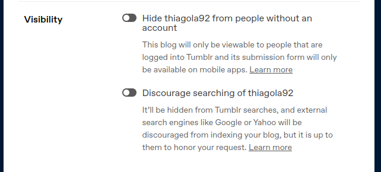

# Tumblr

Estou experimentando alternativas já que o Tumblr me deixou revoltado.  
E a pior parte é que foram funcionalidades importantes para um site de blogs!  

## Text Editor

Primeiro precisamos entender o 3 editores de texto que o Tumblr fornece:
- Rich Text (default)
    - **Positivo**: Os criadores do site gastaram tempo planejando como melhor te passar a habilidade de escrever texto em negrito/itálico ou como inserir links/imagens/videos.  
    - **Negativo**: Não existe garantia que possa mover seu texto para outros blogs sem perder qualidade, as chances de estar preso ao Tumblr são altas.  
- HTML
    - **Positivo**: Todos os websites são feitos utilizando HTML, então o único limite do que se pode fazer é o quanto o Tumblr limitou de utilização.  
    - **Negativo**: Não é prático de escrever ou alterar sem ajuda de editores de texto modernos.  
- Markdown
    - **Positivo**: Criada para providênciar formatação ao texto sem dificultar a legibilidade. Por baixo dos panos faz uma conversão para HTML, então também é normal ver essa linguagem aceitar funcionalidade do HTML.  
    - **Negativo**: Relativamente limitado de como se pode formatar seu texto.  

Na minha cabeça HTML e Markdown parecem existir apenas para enfeitar, eles não parecem dar suporte para nada que não seja possível no Rich Text. Funcionalidades simples como a linha horizontal não são implementadas e apenas recebemos o aviso:

> Contents contains unsupported HTML, the post may not be what you expected.  

> Contents contains unsupported Markdown, the post may not be what you expected.  

Filtrar funcionalidades do HTML é aceitável pois poderia ser perigoso permitir tudo. 

Filtrar funcionalidade do Markdown não faz sentido já que a linguagem já foi feita para ser bem limitada e não oferecer nenhum risco.  

No final ambos acabam sendo uma versão mais limitada que o próprio Rich Text. Se tentarmos ser otimistas, podemos dizer que agora podemos exportar para HTML/Markdown e levar para outros sites. Isto parece ótimo se você não liga para como vai ficar seu HTML ou Markdown no outro site, pois aviso que tem grande chances do Tumblr alterar o texto.  

## Switching Text Editors

Primeiro vamos deixar claro que é um bom senso na vida não alterar algo que você vá precisar da versão original mais tarde. E no caso do Tumblr eu não tenho certeza de qual formato é o original entre Rich Text, HTML e Markdown (eu apostaria no Rich Text por ser o formato padrão).  

O problema é que ao trocar de editor de texto, nem todas as funcionalidades dos editores de texto que são conversiveis entre eles, e Tumblr não ajuda a entender o que vai acontecer com elas ao mudar de editor de texto.  

- **Rich text to HTML/Markdown**
    - A funcionalidade "read more" vai ser removido.  
- **Rich text to Markdown**
    - Texto em Lucille vai ficar invisível porém ainda vai estar lá quando salvar.

## Preview

Normalmente visualização prévia seria apenas para demonstrar como o seu trabalho irá ficar quando finalizado, sem alterar em nada o escrito...  

Por algum motivo Tumblr decide alterar o seu trabalho durante a preparação da visualização, ou seja, grande chance de alterarem seu HTML ou Markdown. Nestes casos diga adeus a qualquer organização que tivesse sido usada, pois agora terá que lidar com o código da maneira que o Tumblr deixou.  

<iframe width="560" height="315" src="https://www.youtube.com/embed/uQBsBePphYI" title="YouTube video player" frameborder="0" allow="accelerometer; autoplay; clipboard-write; encrypted-media; gyroscope; picture-in-picture; web-share" allowfullscreen></iframe>  

## Hide Request Referer

Quando você clica em um link de um site, o seu navegador irá fazer a requisição do conteúdo daquele link para depois exibir ele na sua tela. Neste caso é normal enviar para o link que você clicou de onde você está vindo, para que o site que vai te enviar o conteúdo saber de onde está vindo o tráfico.  

Tumblr obrigatoriamente altera todos seus links que levem a sites exteriores, justamente para que consiga esconder este tipo de informação. Por exemplo:  

<iframe width="560" height="315" src="https://www.youtube.com/embed/ullzdbGvQp8?si=oPAob5XZzFmYSX9T" title="YouTube video player" frameborder="0" allow="accelerometer; autoplay; clipboard-write; encrypted-media; gyroscope; picture-in-picture; web-share" allowfullscreen></iframe>  

Existem casos que você realmente não quer que o outro site saiba de onde está vindo o tráfico. Mas eu imagino que exista casos onde você quer que o outro lado saiba que você está levando tráfico a eles.  

  

Note como ambos "Hide thiagola92 from people without an account" e "Discourage searching of thiagola92" estão desligados mas mesmo assim eu recebo aquela proteção de privacidade.  

## Conclusion

Aqui estou eu experimentando outra maneira de escrever um blog.  