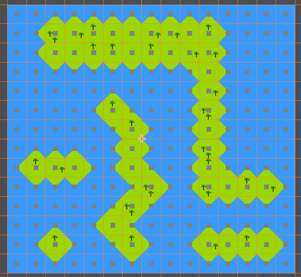

# Wang Tiles

:::info

[Conteúdo extraido do site cr31.co.uk](http://www.cr31.co.uk/stagecast/wang/intro.html).  
Nunca se sabe quando um site antigo pode desaparecer então este post é uma maneira de continuar transmitindo parte do conhecimento.  

:::

Wang tiles foi proposto pelo matemático Hao Wang em 1961.  

Assuma que teremos um conjunto de tiles onde cada lado está pintado de apenas uma cor. Por exemplo:  

  

1. Cada lado do tile de uma cor.  
2. Dois lados podem ter a mesma cor.  
3. Todos os lados podem ter a mesma cor.
4. Dois lados adjacentes podem ter a mesma cor.
5. Pode ser uma variação das cores já vistas só que em posições diferentes.

:::note

Por simplicidade mudaremos para duas cores apenas.  

:::

Vamos reutilizar os mesmos tiles quantas vezes quisermos para botar eles lado a lado e formar um plano, porém as cores laterais do tiles devem sempre casar. Por exemplo:  

  

Tiles **não** podem se sobrepor.  
Tiles **não** podem ser rotacionados ou refletidos (por enquanto).  

## Automation

Embora reutilização de tiles para gerar diversos planos/áreas/mapas não seja especial, Wang tiles adiciona a lógica de relacionar os tiles entre si.  

Por exemplo, possuindo 2 cores e 4 lados, podemos formar 16 (24) tiles diferentes:  

  

:::note

Adicionamos um quadrado cinza no centro de cada tile.

:::

Podemos inserir em ferramentas como [Godot](https://godotengine.org/) que permitem definir relações entre os tiles e com isto construir diversos mapas em segundos:  

  

  

Note que não há problema criar variações do mesmo tile. Por exemplo, vamos adicionar tiles com árvores:  

  

Quando a ferramenta for botar um tile com quatro lados verdes, ela poderá escolher em 4 tiles diferentes:  

  

## Rotate & Reflect

Na proposta de Wang não se pode rotacionar e refletir tiles pois não existe garantia que a imagem continuará fazendo sentido após rotacionada ou refletida.  

Porém como criador dos tiles, somos capazes de deduzir está informação e apenas fazer os tiles necessários. Vamos pegar este conjunto de tiles:  

  

Alguns destes tiles são variações dos anteriores porem rotacionandos ou refletindos. Levando isto em conta, podemos minimizar para 6 tiles apenas:  

  

É importante notar que só é possível se conhecermos a imagem. Botando a mesma árvore utilizada anteriormente em um dos tiles, podemos ver o tile perder o sentido quando rotacionado porém não quando refletido:  

  

## Example

Todos nossos tiles tem sido com cores, porém as cores apenas servem para representar a relação entre os tiles. Utilizando estes 6 tiles como base, podemos fazer um labirinto:  

  

Basta imaginarmos o **azul como sendo arbustos** que não vão deixar uma pessoa passar e o **verde como caminho** de terra que foram feitos para pessoas caminharem:  

  

Utilizando estes tiles com suas rotações/relexões, podemos facilmente criar um labirinto:  

  

:::note

Este labirinto está com cara de circuitos da placa mãe. 🤔

:::

## References

- [cr32 website](http://www.cr31.co.uk/stagecast/wang/intro.html)  
- [Wikipedia](https://en.wikipedia.org/wiki/Wang_tile)  