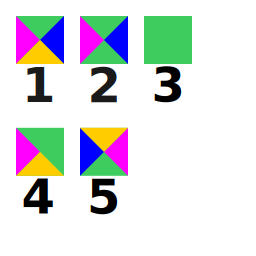
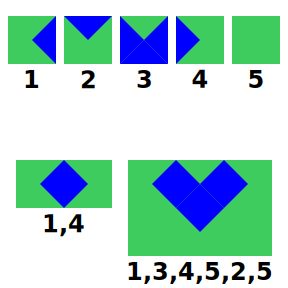
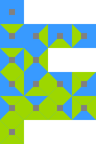
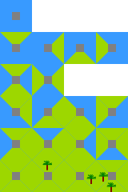
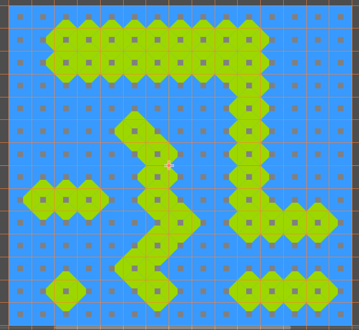
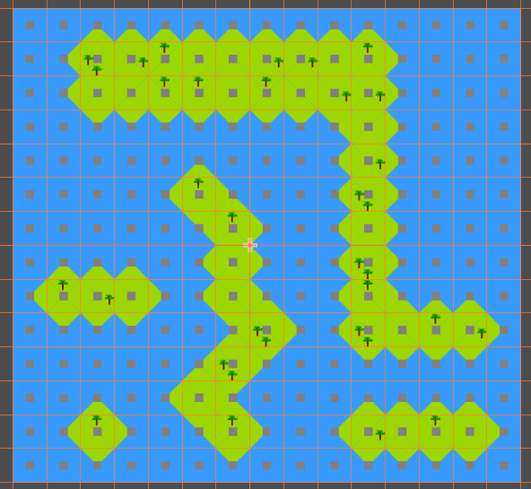
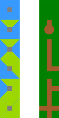
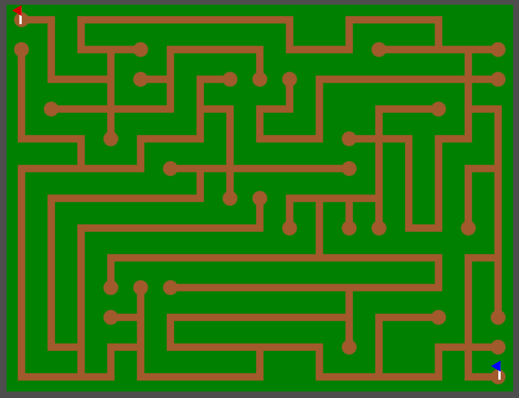

# Wang Tiles

(Wang tiles foi proposto pelo matemático Hao Wang em 1961)  

Assuma que teremos um conjunto de tiles onde cada lado está pintado de apenas uma cor. Por exemplo:  

  

1. Cada lado com uma cor.  
2. Dois lados com a mesma cor.  
3. Todos os lados com a mesma cor.
4. Dois lados adjacentes com a mesma cor.
5. Variação das cores já vistas só que em posições diferentes.

:::note

Por simplicidade mudaremos para duas cores apenas.  

:::

A ideia é reutilizar os mesmos tiles quantas vezes quisermos para botar eles lado a lado e formar um plano, porém com as cores laterais do tiles sempre casando. No exemplo seguinte temos 5 tiles e 2 exemplos de planos formados por eles:  

  

Importante notar que:
- Tiles **não** podem se sobrepor.  
- Tiles **não** podem ser rotacionados ou refletidos.  

Pois não é possível saber se seriam tiles válidos sem conhecer a imagem utilizada neles.  

## Automation

Embora reutilização de tiles para gerar diversos planos/mapas não seja especial, Wang tiles adiciona a lógica de relacionar os tiles entre si. Isto nos permite verificar se um tile é válido numa determinada posição.  

Por exemplo, possuindo 2 cores e 4 lados, podemos formar 16 (24) tiles diferentes:  

  

:::note

Adicionamos um quadrado cinza no centro de cada tile.

:::

Botamos estes tiles na game engine [Godot](https://godotengine.org/) e nela definimos a relação entre os tiles.  

Ao começar a pintar tiles dentro da game engine, podemos ver que ela consegue verificar qual tile é válido naquela posição ou se precisa alterar os vizinhos.  

<iframe width="560" height="315" src="https://www.youtube.com/embed/aWyol4H4Csc?si=JpoIgIEVf9v2dJ45" title="YouTube video player" frameborder="0" allow="accelerometer; autoplay; clipboard-write; encrypted-media; gyroscope; picture-in-picture; web-share" allowfullscreen></iframe>  

Em segundos conseguimos construir planos onde os tiles tem uma conexão entre si.  

## Variations

É importante notar que não há problema criar variações do mesmo tile. Por exemplo:  

  

No momento de preencher por um tile válido naquela posição, a ferramenta iria ter que escolher entre 4 tiles diferentes. Algumas ferramentas como Godot escolheram aleatoriamente:  

Antes  
  

Depois  
  

## Rotation & Reflection

Na proposta de Wang não se pode rotacionar e refletir tiles pois não existe garantia que a imagem continuará fazendo sentido após rotacionada ou refletida.  

Porém como criador dos tiles, somos capazes de deduzir está informação e apenas fazer os tiles necessários. Vamos pegar este conjunto de tiles:  

  

Alguns destes tiles são variações dos anteriores porém rotacionados ou refletidos. Levando isto em conta, podemos minimizar para 6 tiles apenas:  

  

É importante notar que só é possível se conhecermos a imagem. Botando a mesma árvore utilizada anteriormente em um dos tiles, podemos ver o tile perder o sentido quando rotacionado mas não quando refletido:  

  

## Example

Todos nossos tiles tem sido com cores, porém as cores apenas servem para representar a relação entre os tiles.  

Para deixar isto claro, vamos substituir o desenho dos tiles por desenhos que melhor representem um labirinto. Vamos trocar **azul por arbustos** e **verde por terra**:  

  

Utilizando estes tiles com suas rotações/relexões, podemos criar em segundos o nosso labirinto:  

  

:::note

Este labirinto está com cara de circuitos da placa mãe. 🤔

:::

## References

- [cr32 website](http://www.cr31.co.uk/stagecast/wang/intro.html)  
- [Wikipedia](https://en.wikipedia.org/wiki/Wang_tile)  