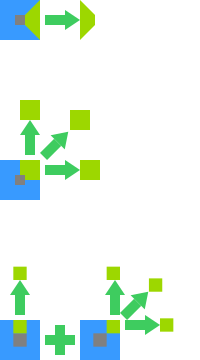
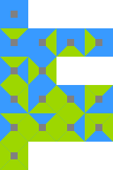
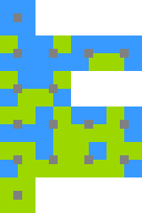
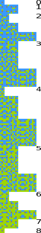

# Wang Tiles pt. 2

Na [**primeira parte**](../2023-09-19-wang-tiles/index.md) nós focamos exclusivamente em tiles que precisavam apenas satisfazer uma relação com os adjacentes. Porém existe casos onde relação com as diagonais também é importante.  

Vamos organizar em 3 tipos:
- **Sides** (visto anteriormente)
    - O foco era casar a adjacente.
- **Corners** (será visto)
    - O foco vai ser casar **duas** adjacentes e **uma** diagonal.
- **Corners and Sides** (será visto)
    - O foco vai ser resolver **corners** e **sides**.

A seguinte imagem desmonstra como cada tipo deve casar:  

  

Tirando isto a lógica principal de Wang tiles permanece, ou seja, não precisamos falar dos mesmos assuntos vistos na primeira parte pois você só precisa adaptar a maneira de casar tiles.  

Porém iremos mostrar para cada um dos tipos:
- Todos os possiveis tiles
- Mínimo de tiles considerando rotação e reflexão

-----------------------------------

## Sides

  

16 tiles  

### Minimal  

  

6 tiles  

-----------------------------------

## Corners

  

16 tiles  

### Minimal  

  

6 tiles  

-----------------------------------

## Corners and Sides

:::note

Clique nas imagens para abrir em outra janela e depois de bastante zoom.  
E lembre que para restar o zoom existe o atalho `Ctrl+0`.  

:::

  

256 tiles  

### Minimal  

  

51 tiles  

-----------------------------------

## References

- [cr31 website](http://www.cr31.co.uk/stagecast/wang/intro.html)  