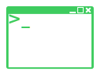
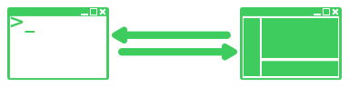
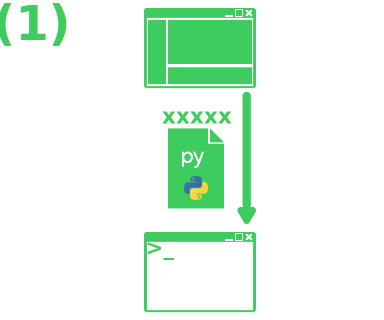
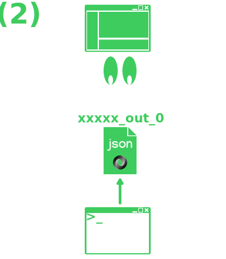
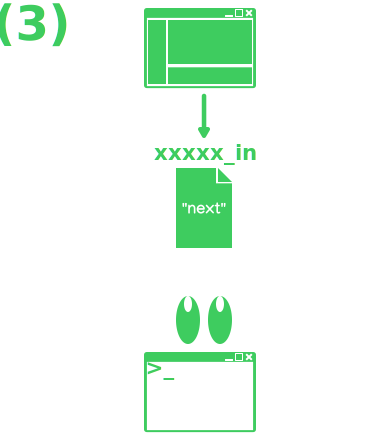
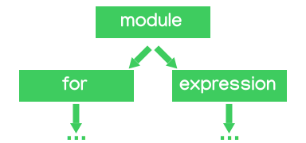

# Mondot

No [post anterior](../2023-09-22-mongodb-gui/index.md) declarei que busquei por um tempo uma interface gráfica (GUI) para [MongoDB](https://www.mongodb.com/) porém não fiquei satisfeita com nenhuma.  

Neste post vou falar do desenvolvimento do [Mondot](https://github.com/thiagola92/Mondot), interface gráfica para o banco MongoDB.  

> Por favor, levar em conta que eu posso tomar decisões ruins 🤣

## Reason

Em 2021, eu tinha duas coisas em mente:
- Nenhuma GUI de Mongo me agrada
- Quero aprender [Godot](https://godotengine.org/)

Bastou essas duas coisas para eu querer começar este projeto.  
Eu não queria fazer a melhor GUI do mundo, eu queria me divertir com Godot ao mesmo tempo que resolvia um incomodo que eu tinha com GUIs.  

## Start

Abri o Godot, comecei a criar containers, janelas, botões, etc. Dias depois me veio a pergunta:  

> Como diabos eu vou me comunicar com o Mongo?  

  

Eu vou pegar o texto que o usuário escrever e fazer o que com ele?  
Passar para um Node.js?  
Eu vou ter que instalar Node.js na máquina da pessoa?  
Como eu pego a resposta?  
Eu conseguiria usar GDNative?  
Como que os outros projetos fazem isto?  

Agora eu precisava descobrir como faria isto acontecer.  

## Cheating

  

**[Robomongo](https://github.com/Studio3T/robomongo)**! Também conhecido como **Robo 3T**.  
Um projeto open-source que em 2017 foi adquirido pelos criadores do [Studio 3T](https://studio3t.com/).  

O que importa é que eu tenho um projeto para ~~copiar~~ estudar!  

Robo 3T possui dois repositórios:
- robomongo
    - Responsável pela interface gráfica
- robomongo-shell
    - Responsável pela interação com o Mongo.

Importante notar que o segundo é um fork do Mongo oficial, justamente pois nele é incluido um shell interativo para se comunicar com o banco.  

Isso faz sentido, já que a interface de linha de comando geralmente é a primeira coisa a ser feita para interagir com bancos. Como mais as pessoas interagiriam com o banco antes de GUI existirem? Poderia ser por código mas seria um baita trabalho cada operação.  

Então era isso, tudo que eu tinha que fazer era:
1. Incluir o shell do Mongo na minha interface gráfica
2. Utilizar o modo iterativo do shell

## Problems

Eu não tinha ideia de como fazer para incluir o shell na interface gráfica.  
Decidi aceitar que passaria como o shell separado para o usuário e dei essa parte como dada.  

Eu que não vou reclamar das minhas decisões idiotas no meu projeto pessoal.  


Agora tudo que eu tinha que fazer é chamar o shell pelo Godot.  
Para isto eu iria precisar usar o método [`OS.execute()`](https://docs.godotengine.org/en/3.6/classes/class_os.html#class-os-method-execute).  

```
int execute (
    String path,
    PoolStringArray arguments,
    bool blocking=true,
    Array output=[],
    bool read_stderr=false,bool open_console=false
)
```

O problema é que essa função possui dois comportamentos dependendo se `blocking` for `true` ou `false`, porém nenhum dos dois era o que eu buscava.  

  

`blocking` -> `true`: Godot vai pausar enquanto a saída não é escrita em output.  

Não queremos isto pois uma busca pode resultar em milhares de documentos. Queremos retornar mais documentos conforme o usuário pedir por mais documentos.  

`blocking` -> `false`: Godot vai continuar executando e o comando irá rodar em um processo separado. Porém não será possível recuperar o output do comando.  

Nós queremos receber a saída aos poucos se estivermos falando de pesquisas que resultam em muitos documentos.  

Função do Godot não é interativa, como vou usar o shell interativo?  
Posso ler input e output usando algum conhecimento do sistema operacional?  
Eu vou ter que conhecer bem todos sistemas operacionais?  
Vou ter que descobrir como Robo 3T linka o shell?  

## Solution

Criar meu próprio shell.  

  

Vantagens:
- Utilizar a linguagem que mais estou em dia Python
    - Em outras palavras: Nenhum tempo perdido por errar algo de uma linguagem que não estou acostumado (JavaScript)
- Utilizar a mesma linguagem com qual trabalho para fazer queryies
- Utilizar o padrão de comunicação que eu quiser
    - No próximo tópico você vai entender o que eu quero dizer com isto

Se estivessemos falando de um produto para diversos usuários, definitivamente JavaScript seria a melhor escolha.  

Para projeto pessoal com interesse em Godot? Utilizar a linguagem que mais tenho conhecimento no momento.  

## Communication

  

De todas as maneiras para duas aplicações se comunicarem, eu escolhi a mais simples.

**Arquivos...** :D  

Em vez de quebrar a cabeça para entender como eu poderia reproduzir a interatividade do shell do Mongo, eu poderia apenas fazer com que ambos escrevessem em arquivos quando quisessem se comunicar um com o outro.  

O processo em si é bem simples:  
1. Godot executa o shell, passando a query
2. Shell escreve X documentos em um arquivo
3. Godot solicita mais documentos

Note que você deve repetir etapa 2 e 3 até acabar os documentos ou Godot mandar parar.  

### Start

  

1. Godot escreve o código Python em um arquivo
    - `xxxxx` representa o nome do arquivo
    - O nome do arquivo é aleatório
2. Godot executa o shell passando o caminho para o arquivo como parâmetro

### Output

  

- Godot fica periodicamente conferindo se o arquivo de saída existe
    - `xxxxx_out_0` representa o **primeiro** arquivo de saída
        - `xxxxx_out_1` segundo arquivo de saída
        - `xxxxx_out_2` terceiro arquivo de saída
        - etc
- Shell escreve no arquivo de saída um [JSON](https://en.wikipedia.org/wiki/JSON) com o resultado da query
    - O resultado de uma query pode ser partido em diversos arquivos
        - `xxxxx_out_0`, `xxxxx_out_1`, `xxxxx_out_2`, ...
        - Esses arquivos são criados conforme o usuário solicita mais documentos do resultado

### Input

  

- Godot escreve no arquivo de entrada solicitando mais documentos do resultado da query
- Shell fica periodicamente conferindo se tem algo escrito no arquivo de entrada
    - `xxxxx_in` representa o arquivo de entrada
    - Ele lê o arquivo e remove o conteúdo do arquivo
        - Justamente para receber futuras solicitações pelo mesmo arquivo

## Shell

O que o meu shell precisa fazer?

- Receber o código do usuário
- Executar o código do usuário
- Iterar sobre o resultado do código
    - Iterar em partes (pegando X documentos por vez)

Em outras palavras, eu preciso acoplar o código do usuário ao código do shell.  

  

Note que existem operações que meu shell irá fazer antes e após a execução do código do usuário. Por causa disso, o desenho mostra o código no meio do código shell.  

O plano era receber um código simples do usuário, parecido com o do shell do Mongo:  

```python
db.test.find({})
```

### Attempt 1

[`eval(expression, globals=None, locals=None)`](https://docs.python.org/3/library/functions.html#eval)  

**Bom**: A função faz o parser e avalia a expressão, retornando o resultado dela.  

```python
result = eval("""
    db.test.find({})
""")
```  

**Ruim**: Precisa ser uma expressão. Uma ou mais declarações não funcionam.  

```python
# Error
result = eval("""
    db.test.find({})
    db.test.find({})
""")
```

### Attempt 2

[`exec(object, globals=None, locals=None, /, *, closure=None)`](https://docs.python.org/3/library/functions.html#exec)  

**Bom**: Executa múltiplas declarações.  

```python
exec("""
    db.test.find({})
    db.test.find({})
""")
```

**Ruim**: Cada declaração pode ter ou não um resultado, então essa função não retornar nada.  

```python
# result is None
result = exec("""
    db.test.find({})
    db.test.find({})
""")
```

### Problem

Nas tentativas acima, para obter o resultado desejado eu teria que alterar a string. Porém, isto apresenta grande risco da alteração dar erro pois cada caso pode requer uma alteração diferente.  

No final eu seria forçado a ler o código, entende-lo para depois alterar sem grande chance de erros. Mas sabe quem já faz isso de ler e entender código? O compilador.  

## AST

  

A compilação de uma linguagem envolve diversas etapas. Uma delas envolve gerar uma [árvore sintática abstrata](https://en.wikipedia.org/wiki/Abstract_syntax_tree), uma árvore que garante que os objetos estão ligados corretamente.  

Podemos usar este conhecimento para compilar parcialmente o código do usuário. Por exemplo, o seguinte código:  

```python
for x in db.test.find({}):
    db.test.update({"_id": x["_id"]}, {"code": x["code"] + 1})
db.test.find({})
```

Gera uma árvore com a seguinte raiz:  

  

> Note que eu só mostrei o início da árvore pois todo o resto é irrelevante para nós.  
> Não vamos alterar nada que esteja a fundo do código do usuário, apenas na raiz.  

Com esse conhecimento em mão, podemos finalmente alterar o código do usuário!  

:::info
Utilizei um módulo do próprio Python chamado [ast](https://docs.python.org/3/library/ast.html#module-ast) para analisar e reestruturar a AST.  
:::

## Rewriting code

Vamos criar um código inútil apenas para usar como exemplo:  

```python
# User code
doc = db.test.find_one({})
db.test.update_one({}, {"valid": True})
db.test.find({})
```

A idéia é transformar este código em uma função que o shell poderá chamar e receber de volta o valor da última expressão. Em outras palavras, queremos isto:  

```python
def code():
    # User code
    doc = db.test.find_one({})
    db.test.update_one({}, {"valid": True})
    return db.test.find({})
```

Vamos ao passo a passo de como obter isto:

1. Análisar o código do usuário com AST
2. Inserir o conteúdo do módulo dentro de uma função pré montada
3. Encapsular a última expressão em um `return`
    - Apenas fazer isto se for uma expressão que retorna valor

O video seguinte demonstra a transformação que está sendo feita de certa forma.  

<iframe width="560" height="315" src="https://www.youtube.com/embed/F2In19FGfxg?si=zNhw4kjCnjwPBRJg" title="YouTube video player" frameborder="0" allow="accelerometer; autoplay; clipboard-write; encrypted-media; gyroscope; picture-in-picture; web-share" allowfullscreen></iframe>  

## Conclusion

Com isto eu consegui preparar justamente uma interface gráfica para o Mongo em Godot. Esse foi meu projeto de 2021!  

<iframe width="560" height="315" src="https://www.youtube.com/embed/OlV9N12_UxE?si=bmihRtrP3vznuQo5" title="YouTube video player" frameborder="0" allow="accelerometer; autoplay; clipboard-write; encrypted-media; gyroscope; picture-in-picture; web-share" allowfullscreen></iframe>  

---

Em 2023 eu decidi dar uma refatorada e criei uma segunda versão. Mas toda essa base vista do Mondot ainda é a mesma!  

<iframe width="560" height="315" src="https://www.youtube.com/embed/laGAwJniaUc?si=rtEg3tyhduiRbFh-" title="YouTube video player" frameborder="0" allow="accelerometer; autoplay; clipboard-write; encrypted-media; gyroscope; picture-in-picture; web-share" allowfullscreen></iframe>  

---

Agora já estou cansado de falar deste projeto hahahaha, foi bom enquanto durou.  

## References

- [Robomongo adquirido pelo 3T](https://blog.robomongo.org/robomongo-has-been-acquired-by-3t/)  
- [Robomongo e integração com shell](https://blog.robomongo.org/mongodb-shell-integration/)  
- [robomongo-shell](https://github.com/Studio3T/robomongo-shell)  
- [robomongo](https://github.com/Studio3T/robomongo)  
- [Mongo](https://github.com/mongodb/mongo)  
- [Mongo shell docs](https://www.mongodb.com/docs/v4.4/mongo/)  
- [AST](https://en.wikipedia.org/wiki/Abstract_syntax_tree)  
- [Python AST](https://docs.python.org/3/library/ast.html)  
