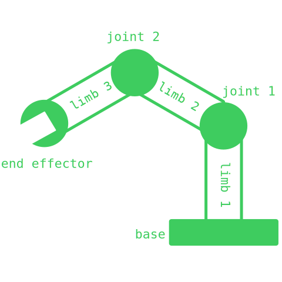
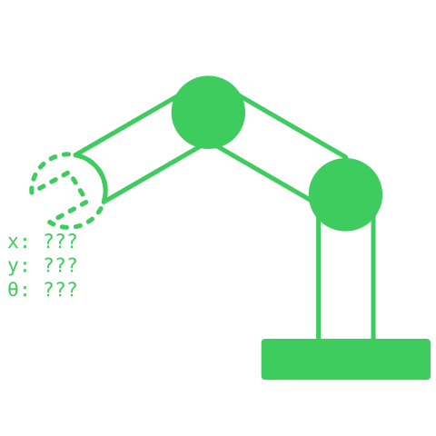
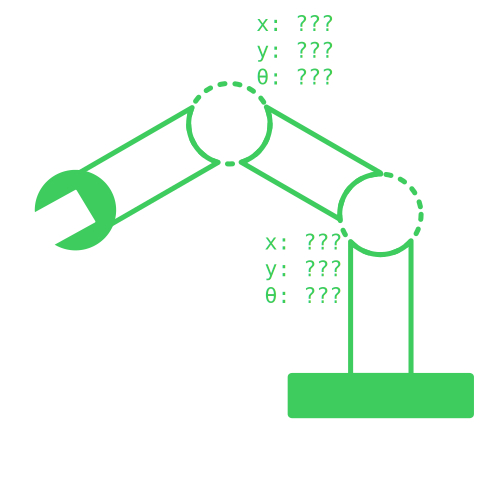

# Forward Kinematics

Esses últimos meses eu tenho gastado um grande tempo (mais do que gostaria) vendo o código de inverse kinematics 2D do Godot.  

E eu preciso passar a limpo o conhecimento básico que eu possuo, para melhor garantir que não estou cagando tudo no código deles.  

**monkey face image**

## Robotic Arms

É difícil falar de forward kinematics (FK) e inverse kinematics (IK) sem entender braços robóticos, pois foi o primeiro uso destas lógicas.  

Para entender melhor um braço, vamos dividi-lo em 4 partes:  
- Base
- Limbs (membros)
- Joints (articulações)
- End effector (mão do braço)  

  

- Base, providência estabilidade para o braço
- Limbs, separa as partes entre si
- Joints, são responsáveis por se rotacionar
- End effector, interage com o objeto

A parte que mais damos atenção quando falamos de FK e IK são joints, pois elas providência a lógica de movimentação do braço.

## FK & IK

Se tivessemos que resumir cada assunto, seria algo por parte de:
- Forward kinematics
    - Foca em descobrir o estado da mão, dado que o braço está em certo estado.  
- Inverse kinematics
    - Foca em descobrir o estado do braço, dado que deseja a mão em certa estado.  

:::note
Quando eu digo "estado", estou me referindo a posição e rotação dos respectivos componentes.
:::

### FK
  

### IK
  

## Forward Kinematic
TODO

## References

- [Alan Zucconi Blog](https://www.alanzucconi.com/2017/04/06/forward-kinematics/)
- [Miloš Černý Animation Video](https://www.youtube.com/watch?v=0a9qIj7kwiA)
- [Forward Kinematics Wikipedia](https://en.wikipedia.org/wiki/Forward_kinematics)
- [Robot Kinematics Wikipedia](https://en.wikipedia.org/wiki/Robot_kinematics)