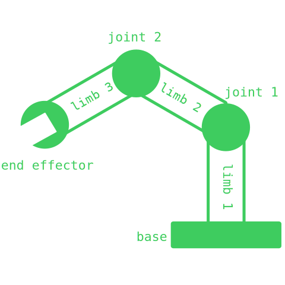
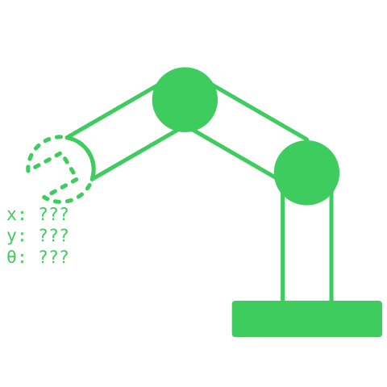
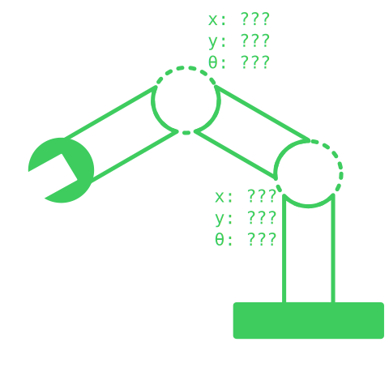
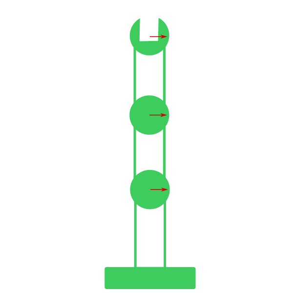
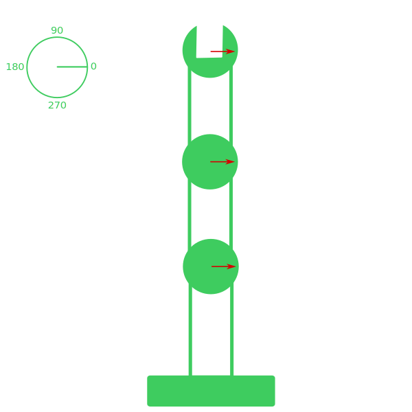
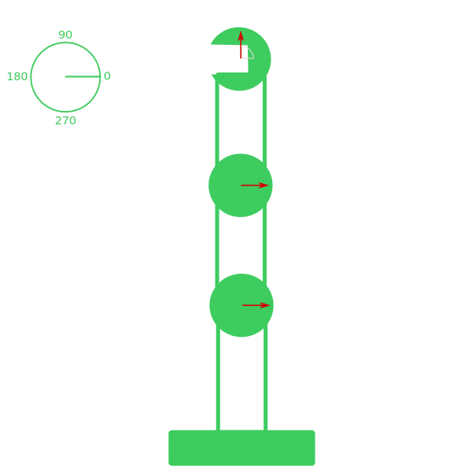
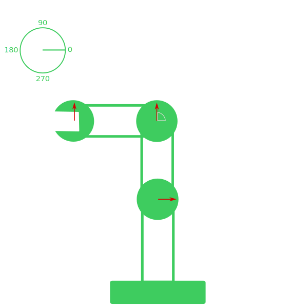
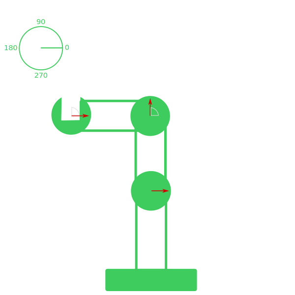
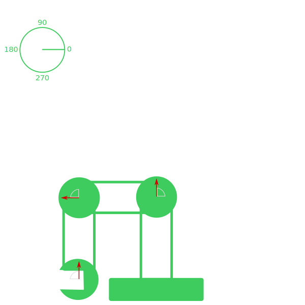

# Forward Kinematics

Esses últimos meses eu tenho gastado um grande tempo (mais do que gostaria) vendo o código de inverse kinematics 2D do Godot.  

E eu preciso passar a limpo o conhecimento básico que eu possuo, para melhor garantir que não estou cagando tudo no código deles.  

  

## Robotic Arms

É difícil falar de forward kinematics (FK) e inverse kinematics (IK) sem entender braços robóticos, pois foi o primeiro uso destas lógicas.  

Para entender melhor um braço, vamos dividi-lo em 4 partes:  
- Base
- Limbs (membros)
- Joints (articulações)
- End effector (mão do braço)  

  

- Base, providência estabilidade para o braço
- Limbs, separa as partes entre si
- Joints, são responsáveis por se rotacionar
- End effector, interage com o objeto

A parte que mais damos atenção quando falamos de FK e IK são joints, pois elas providência a lógica de movimentação do braço.

## FK & IK

Se tivessemos que resumir cada assunto, seria algo por parte de:
- Forward kinematics
    - Foca em descobrir o estado da mão, dado que o braço está em certo estado.  
- Inverse kinematics
    - Foca em descobrir o estado do braço, dado que deseja a mão em certa estado.  

:::note
Quando eu digo "estado", estou me referindo a posição e rotação dos respectivos componentes.
:::

### FK
  

### IK
  

## Forward Kinematic

Minha kinematic favorita por ser a mais simples de calcular, onde tudo se resume a um grande somatório.  

  

Adicionei setas nessa imagem para represetarem as rotações locais das joints (articulações), essa rotação se refere ao quanto aquela joint (articulação) se rotacionou.  

  

Agora adicionei uma circuferência mostrando os ângulos clássicos e podemos usar eles como referência para a rotação global, essa rotação é sempre relacionada à direita (eixo X).  

Para começar nosso experimento, podemos rotacionar o end effector (mão) por 90 graus e ver o que podemos concluir.  

  

- End effector
    - Rotação local: 90º
    - Rotação global: 90º
- Joint 2
    - Rotação local: 0º
    - Rotação global: 0º
- Joint 1
    - Rotação local: 0º
    - Rotação global: 0º

Podemos ver que rotacionar um ponto localmente não afeta os anteriores (os pais). Também importante notar que rotação local sempre irá afetar a rotação global daquele ponto.  

Mas se tivessemos rotacionado a joint 2 por 90 graus?  

  

- End effector
    - Rotação local: 0º
    - Rotação global: 90º
- Joint 2
    - Rotação local: 90º
    - Rotação global: 90º
- Joint 1
    - Rotação local: 0º
    - Rotação global: 0º

Notamos que rotacionar localmente um ponto, afeta a rotação global dos pontos seguintes pela mesma quantidade.  

Se rotacionarmos localmente o end effector por -90 graus?  

  

- End effector
    - Rotação local: -90º
    - Rotação global: 0º
- Joint 2
    - Rotação local: 90º
    - Rotação global: 90º
- Joint 1
    - Rotação local: 0º
    - Rotação global: 0º

Nós conseguimos voltar a rotação global do end effector para 0º pois rotacionar localmente sempre afeta o global do mesmo ponto.  

Nesse pequeno experimento já podemos começar a notar uma formula bem simples:  
`Rotação global = Rotação global do ponto anterior + Rotação local`  

Utilizando o end effector como referência:  
`Rotação global = 90º + (-90º) = 0º`  

:::info
No caso do primeiro ponto (joint 1), a rotação global anterior seria 0 graus.  
`Rotação global = 0 + Rotação local`  
:::

O que aconteceria se rotacionarmos a joint 1 por 90 graus?  

  

- End effector
    - Rotação local: -90º
    - Rotação global: 90º
- Joint 2
    - Rotação local: 90º
    - Rotação global: 180º
- Joint 1
    - Rotação local: 90º
    - Rotação global: 90º

Podemos ver que afetamos a rotação global de todos os pontos seguintes, aumentando eles por 90 graus.  

## Conclusion

Lembra quando falei que forward kinematics "foca em descobrir o estado da mão, dado que o braço está em certo estado".  É exatamente esse somatório que nos ajuda a resolver o problema.  

Vamos supor que temos 5 pontos (ponto 1 é a base):

- Ponto 5
    - Rotação local: -90º
    - Rotação global: ?
- Ponto 4
    - Rotação local: 0º
    - Rotação global: ?
- Ponto 3
    - Rotação local: 180º
    - Rotação global: ?
- Ponto 2
    - Rotação local: 0º
    - Rotação global: ?
- Ponto 1
    - Rotação local: 90º
    - Rotação global: ?

E que nós queremos descobrir para onde cada ponto está apontando.  

Se a gente começar da base, podemos ir calculando a rotação global de cada ponto usando a formula:  
`Rotação global = Rotação global do ponto anterior + Rotação local`  

Rotação global do ponto 1: `0º + 90º = 90º`  
Rotação global do ponto 2: `90º + 0º = 90º`  
Rotação global do ponto 3: `90º + 180º = 270º`  
Rotação global do ponto 4: `270º + 0º = 270º`  
Rotação global do ponto 5: `270º + -90º = 180º`  

:::note
Isto também deixa bem visível o como a rotação global de um ponto anterior afeta o próximo ponto. Por exemplo:  

Somar 90 graus ao ponto 1 faria com que ponto 2 tivesse mais 90 graus...  
Ponto 2 com 90 graus a mais faria com que ponto 3 tivesse mais 90 graus...  
Ponto 3 com 90 graus a mais faria com que ponto 4 tivesse mais 90 graus...  
:::

- Ponto 5
    - Rotação local: -90º
    - Rotação global: 180º
- Ponto 4
    - Rotação local: 0º
    - Rotação global: 270º
- Ponto 3
    - Rotação local: 180º
    - Rotação global: 270º
- Ponto 2
    - Rotação local: 0º
    - Rotação global: 90º
- Ponto 1
    - Rotação local: 90º
    - Rotação global: 90º

## References

- [Alan Zucconi Blog](https://www.alanzucconi.com/2017/04/06/forward-kinematics/)
- [Miloš Černý Animation Video](https://www.youtube.com/watch?v=0a9qIj7kwiA)
- [Forward Kinematics Wikipedia](https://en.wikipedia.org/wiki/Forward_kinematics)
- [Robot Kinematics Wikipedia](https://en.wikipedia.org/wiki/Robot_kinematics)