# Inverse Kinematics Look At

Dado que já refleti sobre [forward kinematics](../2023-12-18-fk/index.md), está na hora de falar sobre inverse kinematics (por mais que eu esteja com preguiça de fazer isso).  

Vamos começar por algo que eu até me questiono se seria inverse kinematic: Look at.  

Ser capaz de fazer uma mão apontar para uma posição ou a cabeça olhar para uma direção.  

  

# Look At

Lembrando que articulações armazenam informações sobre si (informação local) e as informações globais sempre somos capaz de calcular.  

O que não sabemos é o quanto temos que adicionar na rotação para alcançar o ângulo desejado.  

TO CONTINUE