# Inverse Kinematics: Look At

Dado que já refleti sobre [forward kinematics](../2023-12-18-fk/index.md), está na hora de falar sobre inverse kinematics (por mais que eu esteja com preguiça de fazer isso).  

Vamos começar por algo que eu até me questiono se seria inverse kinematic: **Look at**.  

Ser capaz de fazer uma mão apontar para uma posição ou a cabeça olhar para uma direção.  

  

## Look At

Lembrando que articulações sempre possuem as suas informações locais e que as informações globais são facilmente calculáveis, nossa tarefa é descobrir como queremos alterar qualquer uma delas para alcançar nosso objetivo.  

No caso, nosso objetivo é fazer com que o vetor da articulação aponte para X.  

  

Na primeira parte da imagem, temos o vetor já apontando em direção do X.  
Na segunda parte da imagem, o X se encontra a 90º graus do vetor.  

Olhando a imagem nós conseguimos saber que para continuar apontando para X temos que rotacionar por 90º, mas como conseguir este ângulo matemáticamente?  

Talvez você já tenha notado mas vamos fazer isto usando trigonometria (se prepare que IK é triângulo para tudo que é lado).  

## 0º ~ 90º

Um bom começo é sabermos calcular o ângulo para uma posição, sem se preocupar com detalhes como global e local.  

  

Funções trigonométricas são o segredo para trabalhar com triângulos (seno, cosseno e tangente) e neste caso tangente é justamente o que procuramos.  

```
tan θ = cateto oposto / cateto adjacente
```

Agora nós temos o valor da tangente para qualquer posição (x,y).  

* (1,1)
    * `tan(θ) = 1`
* (3,2)
    * `tan(θ) = 2/3`
* (4,7)
    * `tan(θ) = 7/4`

Se você bem se lembra, existem funções trigonométricas inversas que são justamente quem vão nos dar o ângulo que chega ao valor que temos.  

* (1,1)
    * `tan(θ) = 1`
        * `atan(1) = θ`
            * 45
* (3,2)
    * `tan(θ) = 2/3`
        * `atan(2/3) = θ`
            * 33.690067526
* (4,7)
    * `tan(θ) = 7/4`
        * `atan(7/4) = θ`
            * 60.255118703


## 0º ~ 360º

Um problema que cedo ou tarde iriamos notar é que dos valores da tangete não é possível definir qual quadrante se trata.  

  

`atan(1)` pode ser 45º ou 225º  
`atan(-1)` pode ser 135º ou 315º  

Única maneira de saber exatamente o quadrante é sabendo o sinal dos eixos.  

* (positivo,positivo)
    * atan(θ) + 0º
* (negativo,positivo)
    * atan(θ) + 90º
* (negativo,negativo)
    * atan(θ) + 180º
* (positivo,negativo)
    * atan(θ) + 270º

É por isso que em muitas bibliotecas matemáticas existe a função `atan(v)` e a função `atan2(x, y)`.  
A segunda utiliza os eixos para saber o real ângulo.  

## Rotating

Agora que sabemos como obter o ângulo do ponto (0,0) até uma posição qualquer, podemos finalmente rotacionar a articulação.  

O próximo problema é que **não** estamos falando de rotacionar a partir do ponto (0,0) mas sim da posição da articulação.  

  

**θ1**: Rotação global, usando ponto (0,0) como referência.  
**θ2**: Rotação local, usando a posição da articulação como referência.  

Para solucionar isto podemos calcular a posição do ponto em relação a articulação:  

```
posição do ponto relativa à articulação =
        posição global do ponto - posição global da articulação
```  

Exemplo:

Posição global do ponto: (35, 10)  
Posição global da articulação: (25, 10)  
Posição do ponto relativa à articulação: (10, 0)  
Ângulo: 0º  

Se movermos o ponto:  

Posição global do ponto: (50, 30)  
Posição global da articulação: (25, 10)  
Posição do ponto relativa à articulação: (25, 20)  
Ângulo: 38º  

Pronto, agora sabemos qual deveria ser a rotação daquela articulação!  

## Conclusion

Você provavelmente não terá que pensar em nada disso pois muitas game engines já possuem métodos para lidar com isto, por exemplo em Godot podemos encontrar algo como:  

`Node2D.get_angle_to(global_position)`  

Essa função retorna o ângulo global que falta para estar em direção ao ponto global.  

## References
- https://www.youtube.com/watch?v=8Eur16foTMw  
- https://cplusplus.com/reference/cmath/atan2/  