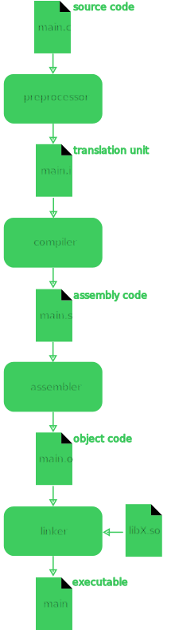

# C/C++ Libs

- Durante a faculdade eu aprendi C
    - Abri Visual Studio
    - Escrevi código em C
    - Executei

- Recentemente eu usei C++ no projeto Godot
    - Segui instrução do Godot para configurar o VSCode
    - Escrevi código em C++
    - Executei

Em ambos os casos eu nunca aprendi direito sobre bibliotecas... Notei claramente quando segui as instruções de projeto para **Build from Source** e não sabia mais o que fazer com o arquivo `.so` gerado.  


Eu sabia que poderia compilar C/C++ com GCC ou Clang, mas meu conhecimento se resumia a compilar um arquivo só.  

```
gcc Main.c -o Main
```

Nunca imaginaria que para executar meu código com uma biblioteca iria acabar com algo como:  

```
gcc start.c -o start -Iinclude -Llib -lname -Wl,-Rlib
```

# GCC 4 Steps

[](./big_steps.svg)  

Um resumo seria:

- Preprocessor
    - Responsável por fazer pré processamentos, o mais popular é a substituição de `#include` pelo código dentro dos headers (`.h`).
    - A saída dessa etapa é conhecida como [translation unit](https://en.wikipedia.org/wiki/Translation_unit_%28programming%29) (ainda é código C).
- Compiler
    - Responsável por converter o código C para código assembly.
- Assembler
    - Responsável por converter o código assembly para um [object code](https://en.wikipedia.org/wiki/Object_code), ele é formado de código de máquina (código especifico para rodar naquela máquina) e "referências" a serem encontradas.
        - Por exemplo, você pode referênciar a função `void do_it()` mas ela não estar neste arquivo `.c`.
- Linker
    - Responsável por encontrar as referências de um arquivo e linkar elas, a saída é justamente o executável final.

# CLI

Vamos voltar a essa linha de comando horrorosa.  

```
gcc start.c -o start -Iinclude -Llib -lname -Wl,-Rlib
```

Para entender está linha de comando um ChatGPT é mais que o suficiente mas aqui o resumo:

- `-Iinclude`: Adiciona o diretório `include` a lista de diretórios para se buscar headers (`.h`) durante a etapa do **compiler**.
- `-Llib`: Adiciona o direitório `lib` a lista de diretórios para se buscar libs (`.so`) durante a etapa do **linker**.
- `lname`: Adiciona a lib `libname.so` a um lugar a se olhar por simbolos durante a etapa do **linker**.
- `-Wl,-Rlib`
    - `-Wl`: Passa os seguintes comandos para o **linker** (separados por virgula).
        `-Rlib`: Adiciona o diretório `lib` a lista de diretórios para se buscar libs (`.so`) durante a etapa de **execução do código**.

Sim, muitos dos comandos são realmente juntos em vez de argumentos separados (`-Iinclude` em vez de `-I include`).  

Sim, o nome da lib seria `libname.so` e você botaria no argumento apenas `-lname` (removendo a parte `lib` e `.so`).  

Nota: teoricamente você poderia usar `-l:libname.so` em vez de `-lname`.  

# Conclusion

Isto me da uma idéia melhor do que está falhando e quando está falhando, porém é uma outra complexidade comparado a python, rust, javascript e outras linguagens que dependem bastante do package manager.  

# References
- https://en.wikipedia.org/wiki/GNU_Compiler_Collection#Design  
- https://en.wikipedia.org/wiki/Preprocessor  
- https://en.wikipedia.org/wiki/Linker_(computing)  
- https://stackoverflow.com/questions/25160245/clang-linking-with-a-so-file  
- https://stackoverflow.com/questions/31176747/how-to-use-a-library-with-headers-and-so-files  
- https://stackoverflow.com/questions/480764/linux-error-while-loading-shared-libraries-cannot-open-shared-object-file-no-s  
- https://www.youtube.com/watch?v=or1dAmUO8k0  
- https://www.youtube.com/watch?v=pLy69V2F_8M  
- https://www.youtube.com/watch?v=Wt4dxDNmDA8  