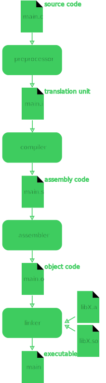

# C/C++ Libs

- Durante a faculdade eu aprendi C
    - Abri Visual Studio
    - Escrevi código em C
    - Executei

- Recentemente eu usei C++ no projeto Godot
    - Segui instrução do Godot para configurar o VSCode
    - Escrevi código em C++
    - Executei

Em ambos os casos eu nunca aprendi direito sobre bibliotecas... Notei claramente quando segui as instruções de projeto para **Build from Source** e não sabia mais o que fazer com os arquivos `.a` e `.so` gerados.  


Eu sabia que poderia compilar C/C++ com GCC ou Clang, mas meu conhecimento se resumia a compilar projetos 100% meus.  

```
gcc main.c -o main
```

Bem, vamos entender cada um dois formatos primeiro.

# `.a` (archive)

Se trata de uma biblioteca estática (**static library**), ou seja, podemos ver como um conjunto de funções/variáveis que seram anexadas ao seu executável durante a etapa de compilação (na etapa do **linker**).  

Ótimo quando você quer que seu programa tenha toda a lógica.  

# `.so` (shared object)

Se trata de uma biblioteca compartilhada (**shared library**), ou seja, podemos ver como um executável que será utilizado por qualquer programa que precise dele (ainda é preciso avisar ao **linker** da existencia da biblioteca).  

Ótimo pois ocupa menos espaço do computador da pessoa com a mesma lógica.  

# GCC 4 Steps

Eu já mencionei linker duas vezes, para entender o que ele é precisamos olhar para cada etapa do GCC.  

[](./big_steps.svg)  

Um resumo seria:

- Preprocessor
    - Responsável por fazer pré processamentos, o mais popular é a substituição de `#include` pelo código dentro dos headers (`.h`).
    - A saída dessa etapa é conhecida como [translation unit](https://en.wikipedia.org/wiki/Translation_unit_%28programming%29) (ainda é código C).
- Compiler
    - Responsável por converter o código C para código assembly.
- Assembler
    - Responsável por converter o código assembly para um [object code](https://en.wikipedia.org/wiki/Object_code), ele é formado de código de máquina (código especifico para rodar naquela máquina) e "referências" a serem encontradas.
        - Por exemplo, você pode referênciar a função `void do_it()` mas ela não estar neste arquivo `.c`.
- Linker
    - Responsável por encontrar as referências de um arquivo e linkar elas, a saída é justamente o executável final.

# Project from Zero

Começamos com uma estrutura bem vazia de projeto:  

```
project/
└── src/
    ├── main.c
    └── ...
```

Apens possuimos código nosso então tudo que precisamos fazer para criar o executável é  

```
gcc main.c -o main
``` 

---

Algum momento do nosso projeto decidimos usar bibliotecas de terceiro e não queremos misturar ela com o nosso código então resolvemos sempre separar os arquivos dela em outros diretórios.  

O primeiro tipo de arquivo que bibliotecas trazem junto são os headers, utilizados justamente para o compilador conseguir determinar o que exatamente tem que buscar nas bibliotecas.  

```
project/
├── include/
│   └── header.h
└── src/
    ├── main.c
    └── ...
```
 
Podemos adicionar um diretório onde se buscar headers com o argumento `-I` seguido pelo diretório (não é separado por espaço):  

```
gcc main.c -o main -Iinclude
```

Agora podemos adicionar `#include <header.h>` sem o compilador reclamar que `header.h` não foi encontrado.  

Se tentarmos chamar uma função que está no `header.h` ainda teremos erro pois não temos a função, apenas a assinatura dela. Nós precisamos do código da função, que pode estar em um `.so` ou `.a`.  

:::warning
Saiba se sua biblioteca é C++ ou C para saber se deve usar `gcc` ou `g++`.
:::

---

### `.a`

Novamente não vamos querer misturar este arquivo com os do nosso projeto, então vamos deixar a biblioteca na pasta `lib`.  

```
project/
├── include/
│   └── header.h
├── lib/
│   └── libname.a
└── src/
    ├── main.c
    └── ...
```

Podemos passar ao compilador diretório onde as nossas bibliotecas se encontram com o argumento `-L` seguido pelo diretório (não é separado por espaço):  

```
gcc main.c -o main -Iinclude -Llib
```

Precisamos especificar as que desajamos usar e isso é feito com o argumento `-l` seguido pelo nome base da biblitoeca (não é separado por espaço):  

```
gcc main.c -o main -Iinclude -Llib -lname
```

:::note
`-lname` vai buscar pela biblioteca `libname.a`, este é um atalho para referênciar bibliotecas.  
`-l:libname.so` pode ser usado em casos que o nome da biblioteca não segue estes padrões.  
:::

### `.so`

Segue basicamente a mesma lógica do `.a`, deixar a biblioteca no diretório `lib`.  

```
project/
├── include/
│   └── header.h
├── lib/
│   └── libname.so
└── src/
    ├── main.c
    └── ...
```

Passar ao compilador diretório onde as nossas bibliotecas se encontram com o argumento `-L` seguido pelo diretório (não é separado por espaço):  

```
gcc main.c -o main -Iinclude -Llib
```

No caso de bibliotecas compartilhadas este diretório pode possuir centenas de bibliotecas, então faz sentido você ter que especificar as que você quer usar. Novamente usamos o argumento `-l` seguido pelo nome base da biblitoeca (não é separado por espaço):  

```
gcc main.c -o main -Iinclude -Llib -lname
```

:::note
`-lname` vai buscar pela biblioteca `libname.so`, este é um atalho para referênciar bibliotecas.  
`-l:libname.so` pode ser usado em casos que o nome da biblioteca não segue estes padrões.  
:::

Ainda precisamos passar ao linker onde ele deve buscar essa biblioteca durante a execução do código (dentro do seu projeto sabemos que está no diretório `lib` mas na máquina de quem estiver executando vai estar aonde?).  

```
gcc main.c -o main -Iinclude -Llib -lname -Wl,-Rlib
```

:::note
Este argumento (`-Wl`) passa diversos argumentos para o linker (separados por virgula).  
Poderiamos passar outros argumentos, por exemplo `-Wl,X,Y,Z`.  
:::

Nosso executável agora vai sempre tentar buscar a biblioteca na pasta `lib` que estiver no mesmo diretório que ele.  

# References
- https://en.wikipedia.org/wiki/GNU_Compiler_Collection#Design  
- https://en.wikipedia.org/wiki/Preprocessor  
- https://en.wikipedia.org/wiki/Linker_(computing)  
- https://stackoverflow.com/questions/25160245/clang-linking-with-a-so-file  
- https://stackoverflow.com/questions/31176747/how-to-use-a-library-with-headers-and-so-files  
- https://stackoverflow.com/questions/480764/linux-error-while-loading-shared-libraries-cannot-open-shared-object-file-no-s  
- https://www.youtube.com/watch?v=or1dAmUO8k0  
- https://www.youtube.com/watch?v=pLy69V2F_8M  
- https://www.youtube.com/watch?v=Wt4dxDNmDA8  
- https://tree.nathanfriend.io/  