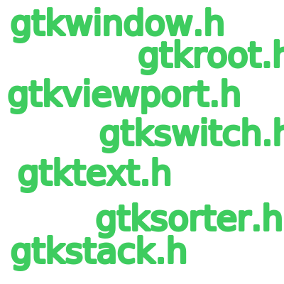
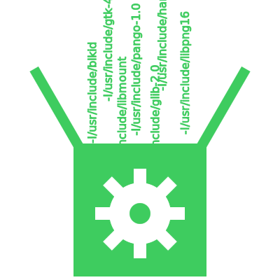
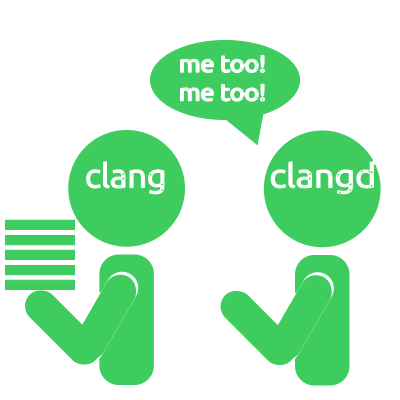

# C lib package
Não bastava meu sofrimento com [utilização de bibliotecas](../2024-02-12-c-cpp-lib/index.md), agora tive mais dor de cabeça por elas virem do package manager (`apt`).  

Meu sofrimento foi enquanto tentava usar a biblioteca [GTK](https://www.gtk.org/) em C.  

  

## Installing
Duas opções:  
- Instalar o pacote pronto da minha distribuição
- Baixar e compilar o código fonte

Como eu ainda tenho algum amor por mim mesmo, fui pela primeira opção:  
```bash
$ sudo apt install libgtk-4-1 libgtk-4-dev
```

E podemos descobrir os arquivos que estes pacotes trouxeram com:  
```bash
$ dpkg -L libgtk-4-1 libgtk-4-dev
```

O que nos mostra que o pacote responsável por desenvolvimento (`libgtk-4-dev`) trouxe **muitos** headers files e uma biblioteca compartilhada (`/usr/lib/x86_64-linux-gnu/libgtk-4.so`).  



## Code
Qual será o grande código utilizado durante este post???  
```C
#include <gtk/gtk.h>

int main() { return 0; }
```

Exatamente! Estou cagando para o código, apenas quero acessar a biblioteca!  
> ¿Donde esta la biblioteca?  


## Includes
Talvez seja meio óbvio mas o código não vai ser executado com um simples  
```bash
$ clang -o my_project main.c
```

Pois o compilador não irá encontrar a biblioteca.  
```bash
$ clang -o my_project main.c
main.c:1:10: fatal error: 'gtk/gtk.h' file not found
#include <gtk/gtk.h>
         ^~~~~~~~~~~
1 error generated.
```

Existe duas maneiras de adicionar headers ao seu código:  
- `#include "biblioteca.h"`
    - Dentro do seu diretório atual, busque o arquivo `biblioteca.h`.
- `#include <biblioteca.h>`
    - Dentro dos diretório padrões, busque o arquivo `biblioteca.h`.

:::info
Ambos os tipos aceitam caminhos para o arquivo. Exemplo:  
`#include "dir1/dir2/biblioteca.h"`  
`#include <dir1/dir2/biblioteca.h>`  

E aspas também podem ser usadas para buscar em diretórios padrões...  
Mas se você faz isso, você é um criminoso.
:::

Qual o diretório padrão para bibliotecas? `/usr/include`  

Lembra quando vimos a lista dos arquivos que o pacote trouxe? Muitos headers foram justamente para o diretório padrão.  
```bash
...
/usr/include/gtk-4.0/gtk/gtkshortcutmanager.h
/usr/include/gtk-4.0/gtk/gtkshortcutsgroup.h
/usr/include/gtk-4.0/gtk/gtkshortcutssection.h
/usr/include/gtk-4.0/gtk/gtkshortcutsshortcut.h
/usr/include/gtk-4.0/gtk/gtkshortcutswindow.h
...
```

Perfeito então, podemos alterar nosso código para usar `#include <gtk-4.0/gtk/gtk.h>`  
```C
#include <gtk-4.0/gtk/gtk.h>

int main() { return 0; }
```

E vai dar tudo cert.... ei...  
```bash
$ clang -o my_project main.c
In file included from main.c:1:
/usr/include/gtk-4.0/gtk/gtk.h:29:10: fatal error: 'gtk/css/gtkcss.h' file not found
#include <gtk/css/gtkcss.h>
         ^~~~~~~~~~~~~~~~~~
1 error generated.
```

Nope!  

  

## Packages
Está é a organização do desenvolvedor da biblioteca:  
```
project/
├── gdk
├── gsk
├── gtk
└── unix-print
```

Para eles realmente é `#include <gtk/gtk.h>` por isso outras partes do código deles utiliza assim!  
E não é como se eles fossem ficar alterando **em todos os arquivos do projeto** para referênciar o caminho com versão mais recente do projeto.  

Queremos é dizer ao compilador os diretórios a procurar os arquivos...  
Pera, nós já fizemos isso no [post anterior](../2024-02-12-c-cpp-lib/index.md), usando a flag `-I`.  

```C
#include <gtk/gtk.h>

int main() { return 0; }
```

Agora basta executar utilizando a flag e sucess... ei...  
```bash
$ clang -o my_project main.c -I/usr/include/gtk-4.0
In file included from main.c:1:
In file included from /usr/include/gtk-4.0/gtk/gtk.h:29:
/usr/include/gtk-4.0/gtk/css/gtkcss.h:29:10: fatal error: 'glib.h' file not found
#include <glib.h>
         ^~~~~~~~
1 error generated.
```

Você esqueceu que está biblioteca pode usar outras bibliotecas e precisamos adicionar o diretório delas também!  

  

## Dependecies
Existe um programa justamente para ajudar a descobrir as depêndencias de um módulo.  

```bash
$ pkg-config --cflags gtk4
-I/usr/include/gtk-4.0 -I/usr/include/pango-1.0 -I/usr/include/glib-2.0 -I/usr/lib/x86_64-linux-gnu/glib-2.0/include -I/usr/include/harfbuzz -I/usr/include/freetype2 -I/usr/include/libpng16 -I/usr/include/libmount -I/usr/include/blkid -I/usr/include/fribidi -I/usr/include/cairo -I/usr/include/pixman-1 -I/usr/include/gdk-pixbuf-2.0 -I/usr/include/x86_64-linux-gnu -I/usr/include/graphene-1.0 -I/usr/lib/x86_64-linux-gnu/graphene-1.0/include -mfpmath=sse -msse -msse2 -pthread

$ pkg-config --libs gtk4
-lgtk-4 -lpangocairo-1.0 -lpango-1.0 -lharfbuzz -lgdk_pixbuf-2.0 -lcairo-gobject -lcairo -lgraphene-1.0 -lgio-2.0 -lgobject-2.0 -lglib-2.0
```

Mas como se descobre qual o nome do módulo da minha biblioteca? Não sei, se você souber, me conte!  

:::tip
Utilizando o `pkg-config --list-all` você consegue uma lista de todos os módulos mas nada me disse explicitamente que o módulo de `libgtk-4-dev` é `gtk4`.  

Talvez seja o `Source: gtk4` quando utilizando `apt show libgtk-4-1`...  
Mas não sei ¯\\\_(ツ)\_/¯  
:::

Graças a este programa podemos gerar facilmente as flags e finalmente executar o código!  
```bash
$ clang `pkg-config --cflags gtk4` -o my_project main.c `pkg-config --libs gtk4`
```

  

## Language Server
Sabe aquela ferramenta responsável por completar o código, avisar de errors, te levar à definições...  
Bem, ela está reclamando e não queremos deixar ela assim né?.  

```C
#include <gtk/gtk.h> // 'gtk/gtk.h' file not found

int main() { return 0; }
```

Estamos passando diversas informações para nosso compilador (`clang`) sobre diretórios para utilizar mas não estamos passando nada para o language server (`clangd`). Podemos fazer um teste rápido para ver o que `clangd` acha do nosso arquivo com:  

```bash
$ clangd --check=main.c
...
E[01:35:13.895] [pp_file_not_found] Line 1: 'gtk/gtk.h' file not found
...
```



## Project Dependencies
Poderiamos pesquisar e descobrir os argumentos a se passar ao `clangd` mas isso é algo que varia de projeto a projeto e última coisa que queremos é ficar configurando no Visual Studio os argumentos para cada projeto.  

Por isso que `clangd` por padrão sempre procura configurações do projeto em certos arquivos do projeto como `compile_commands.json`! Poderiamos escrever este arquivo na mão... mas não queremos então vamos utilizar um programinha amigo chamado `bear`!  

Ele recebe o comando que você está utilizando para criar o executável e cria o `compile_commands.json`:  

```bash
$ sudo apt install bear
$ bear -- clang `pkg-config --cflags gtk4` -o my_project main.c `pkg-config --libs gtk4`
```

Pronto, conseguimos o arquivo de configuração para o `clangd`.  

```
my_project/
├── compile_commands.json
├── main.c
└── my_project
```


Basta dar um tempo (ou reniciar o editor de texto) e seu language server deve perceber que está tudo certo!  

Fim!  
Código funciona!  
Language server funciona!  
Você está pronto para desenvolver com GTK!  
Não se sente uma nova pessoa com todo esse conhecimento?  

  

Bem, você não é a primeira pessoa a achar tudo isso desnecessariamente complicado para começar a programar... 
Outras pessoas criaram ferramentas para ajudar nisso!  

Então continue lendo se quiser jogar tudo que viu até aqui no lixo e descobrir uma maneira mais fácil!  

  

## Meson!
GTK adora falar do [Meson](https://mesonbuild.com/) e como já estou sofrendo mesmo... Por que não parar pra ver?  
Instalando!  

```
$ sudo apt install meson ninja-build
```

Claro que se vamos testar outra ferramenta, precisamos testar do zero! Apenas com o nosso querido arquivo `main.c`:  
```
my_project/
└── main.c
```

### Setuping
```bash
$ meson init
```

Isso cria o arquivo de configuração chamado `meson.build`, nele tem diversas informações mais sofisticadas sobre o projeto:  
```meson
project('my_project', 'c',
  version : '0.1',
  default_options : ['warning_level=3'])

executable('my_project',
           'main.c',
           install : true)
```

Viu?  
Ele não é apenas _"estou rodando um código"_.  
Ele é _"estou criando um ⭐projeto⭐"_.  

Como ele é um projeto sério, ele vai guardar todas as informações dele em um pasta separada para não sujar o **seu** projeto ❤️!  

Então diga para ele onde botar os arquivos dele (eu escolhi `builddir`):  
```bash
$ meson setup builddir
```

Seu projeto deve acabar com a estrutura:  
```
my_project/
├── builddir/
├── main.c
└── meson.build
```

### Project Dependencies
Sim! Em toda ferramenta é necessário que você a biblioteca que quer usar!  
Você não quer que ela ande por todos os diretórios do seu computador procurando a sua biblioteca, né?  
Imagina se pega a errada por acidente!  

Fazemos isso pelo `meson.build`!  
```meson
project('my_project', 'c',
  version : '0.1',
  default_options : ['warning_level=3'])

executable('my_project',
           'main.c',
           install : true,
           dependencies: dependency('gtk4'))
```

:::note
Eu ainda não sei o como se descobre que o nome do módulo é `gtk4`!
:::

:::info
Caso você tenha mais que uma dependência, o parâmetro `dependencies` aceita lista:  
```meson
executable('my_project',
           'main.c',
           install : true,
           dependencies: [dependency('gtk4')])
```
:::

### Compiling
Pronto! Você está pronto para ter seu projeto compilado **sem erro**! <sub>Talvez warnings coff coff...</sub>  

Entre no diretório de configuração do Meson (no meu caso `builddir`) e execute o comando de compilação:  
```bash
$ cd builddir
$ meson compile
```

:::note
Por que entrar no diretório antes? Meson permite que você tenha diversos setups.  
Se você estiver fora do diretório é possível rodar o comando se adicionar o argumento para `-C`:  
```bash
$ meson compile -C builddir
```
:::

"`clangd` está reclamando novamente de `'gtk/gtk.h' file not found`!"  
Não se desespere pois se você olhar os arquivos criados após compilação, um deles é bem útil.  
```
my_project/
├── builddir/
│   ├── ...
│   ├── compile_commands.json
│   └── my_project
├── main.c
└── meson.build
```

Olha lá arquivo que o `clangd` quer!  
E o seu executável mas isso era de se esperar...  

Copie ele para a raiz do seu projeto e pronto, seu `clangd` deve parar de chorar erro!  
```
my_project/
├── builddir/
│   ├── ...
│   ├── compile_commands.json
│   └── my_project
├── compile_commands.json
├── main.c
└── meson.build
```

### Conclusion
Meson possui uma etapa de configuração, mas tirando isso os comandos depois ficam bem mais sensatos!  

Compilando com `clang` e atualizando `compile_commands.json`:  
```bash
$ clang `pkg-config --cflags gtk4` -o my_project main.c `pkg-config --libs gtk4`
$ bear -- clang `pkg-config --cflags gtk4` -o my_project main.c `pkg-config --libs gtk4`
```

Compilando com `meson` e atualizando `compile_commands.json`:  
```bash
$ meson compile
$ cp compile_commands.json ../compile_commands.json
```

Se eu descobrir uma maneira de após compilação já copiar o arquivo `compile_commands.json`, tudo vai ficar perfeito!  

## References
- https://docs.gtk.org/gtk4/compiling.html
- https://linuxcommand.org/lc3_lts0040.php
- https://github.com/rizsotto/Bear
- https://mesonbuild.com/Tutorial.html
