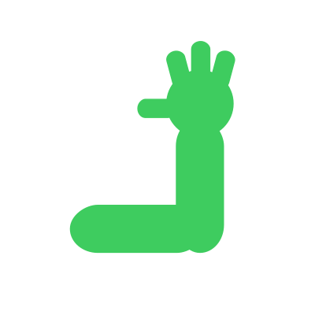
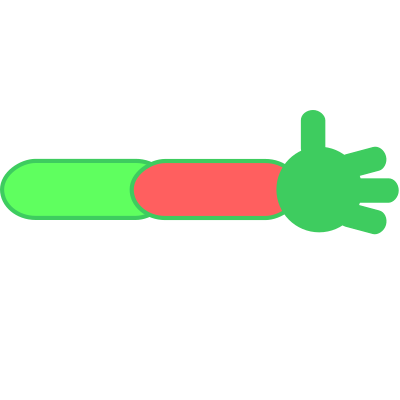
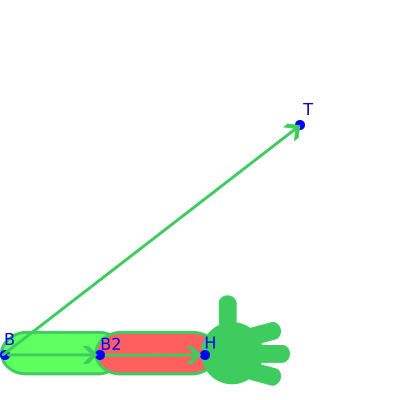
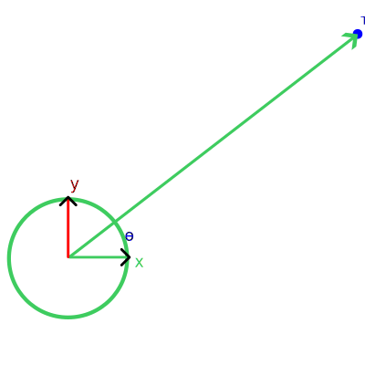
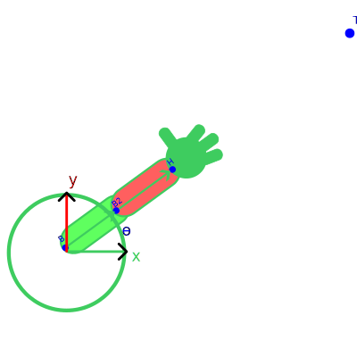
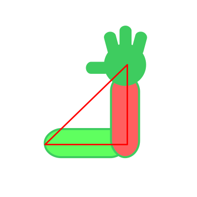

# Inverse Kinematics: Two Bone

Faz um mês desde que escrevi sobre [inverse kinematic look at](../2024-02-04-ik-look-at/index.md). Talvez eu esteja enrolando para falar desta pois foi por ela que eu comecei a ver inverse kinematics... e sofri muito.  

**Two bone** inverse kinematic! Dado que queremos a mão em uma devida posição, como os dois ossos responsáveis pelo braço devem se encontrar?  

Note que não vamos ditar onde a mão vai estar, porém onde desejamos que ela estivesse. Isso é importante pois o calculo muda dependendo se a mão alcança ou não a posição desejada.  

  

## Two Bone

O que você faz quando tentando alcançar algo longe de você? Estica o máximo possível. Esse é o caso simples de se resolver pois a ideia é fazer os ossos apontarem para a posição desejada.  

  

Primeira coisa a se fazer é descobrir se está fora do alcance 🤣, ou seja, a base do braço até o ponto desejado é maior que o braço todo?  

- Distância da base do braço até o ponto desejado
  - Primeiro o vetor representando distância: `T-B`
  - Segundo o tamanho do vetor: `√x²+y²`
- Tamanho do braço
  - Osso 1, vetor representando distância: `B2-B`
  - Osso 1, tamanho do vetor: `√x²+y²`
  - Osso 2, vetor representando distância: `H-B2`
  - Osso 2, tamanho do vetor: `√x²+y²`
  - Tamanho do osso 1 + tamanho do osso 2

  

Se a soma dos ossos for menor que a distância ao ponto desejado, podemos aplicar a lógica para pontos fora do alcance!  

```
Target Distance > (Bone1 length + Bone2 length)
```

## Out of Range

Acontece que estender o braço em uma direção é apenas tornar o ângulo global dos ossos equivalentes ao da direção.  

  

  

Já vimos em [IK Look at](../2024-02-04-ik-look-at/index.md) como fazer um osso/vetor apontar para uma direção e isso é tudo que precisamos fazer aqui também.  

- Apontar osso 1 para posição desejada
- Apontar osso 2 para posição desejada

Fim.

:::note
A ordem é importante, pois a rotação do osso 1 afeta a do osso 2.  
Bote o osso 1 corretamente antes de ajustar o osso 2.  
:::

## In range

  

# References
- https://www.alanzucconi.com/2018/05/02/ik-2d-1/