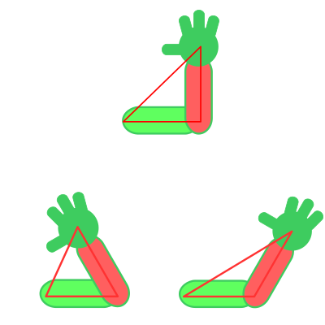
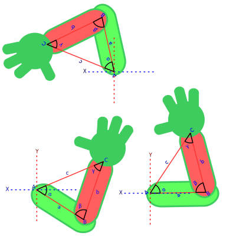
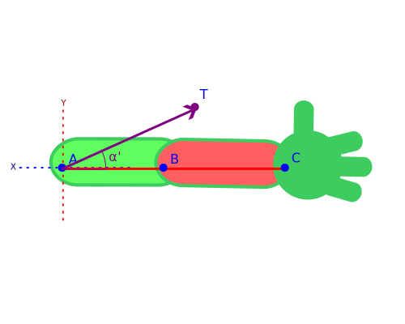
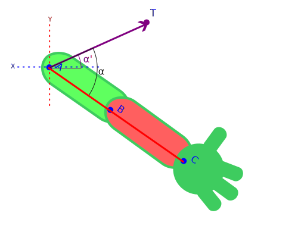
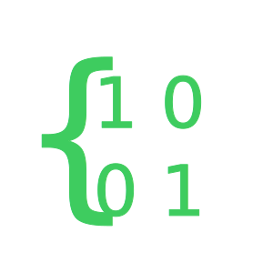

# Inverse Kinematics: Two Bone

Faz um mês desde que escrevi sobre [inverse kinematic look at](../2024-02-04-ik-look-at/index.md). Talvez eu esteja enrolando para falar desta pois foi por ela que eu comecei a ver inverse kinematics... e sofri muito.  

**Two bone** inverse kinematic! Dado que queremos a mão em uma devida posição, como os dois ossos responsáveis pelo braço devem se encontrar?  

Note que não vamos ditar onde a mão vai estar, porém onde desejamos que ela estivesse. Isso é importante pois o calculo muda dependendo se a mão alcança ou não a posição desejada.  

  

## Two Bone

  

O que você faz quando tenta alcançar algo longe de você?  
Estica o máximo possível. 

O que você faz quando tenta alcançar algo perto de você?  
Curva o braço de forma que sua mão acabe na posição desejada.  

Primeira coisa a se fazer é descobrir se está fora ou dentro do alcance 🤣.  
Em outras palavras, a base do braço até o ponto desejado é maior ou menor que o braço todo?  

  

Podemos descobrir a distância entre dois pontos se calcularmos o vetor entre eles e depois usarmos a clássica formúla para distância. Resumidamente:  
- `P2-P1`
- `√(x²+y²)`

Sabendo disso podemos calcular as seguintes distâncias:  
- `A` -> `T`
  - Distância até posição desejada
- `A` -> `B`
  - Tamanho do osso 1
- `B` -> `C`
  - Tamanho do osso 2

Agora podemos verificar justamente se está dentro ou fora do alcance!  

```
Distância até posição desejada > (Tamanho do osso 1 + Tamanho do osso 2)
```

## Out of Range

Acontece que estender o braço em uma direção é apenas tornar o ângulo global dos ossos equivalentes ao da direção.  

  

  

Já vimos em [IK Look at](../2024-02-04-ik-look-at/index.md) como fazer um osso/vetor apontar para uma direção e isso é tudo que precisamos fazer aqui também.  

- Apontar osso 1 para posição desejada
- Apontar osso 2 para posição desejada

Fim.

## In range - Triangle

Espero que este desenho já deixe claro como utilizaremos trigonometria com braços curvados.  

  

Neste caso o ponto onde desejamos posicionar a mão está dentro do alcance dela, então irá acabar sendo exatamente a posição da mão (utilizaremos `C` mas poderia ser `T`).  

  

Já calculamos os lados do triângulo, então agora vamos focar no seus ângulos internos (utilizaremos `α β γ`).  

  

Sabendo todos os lados do triângulo podemos utilizar leis do cossenos para descobrir cada ângulo interno:  

```
a² = b² + c² - 2bc*cos(α)
b² = a² + c² - 2ac*cos(β)
c² = a² + b² - 2ab*cos(γ)
```

Sabendo os lados e sabendo os ângulos internos nós conseguimos dizer como o braço precisa estar dobrado. O problema é que ele ainda pode estar dessa forma de diversas maneiras 🤣:  

  

## In range - Two Angles

Existem dois ângulos que estamos buscando descobrir, rotacionando eles conseguiremos os ossos exatamente onde queremos:  

  

Nessa imagem o braço estava esticado em direção ao eixo X, rotacionamos osso 1 por `θ1` e osso 2 por `θ2` para obter o braço no formato que queriamos.  

:::note
Eu sei que os desenhos tem ficado cada vez piores, eu deveria estar usando uma ferramenta apropriada ou organizando melhor os desenhos...  

Mas a preguiça ganhou 🙂  
:::

Como podemos obter `θ1`?  

Se você estava pensando *"é só calcular o ângulo do eixo X até o osso 2 que você consegue o `θ1`"*, deixe-me lembra-lo que o braço vai começar de forma desconhecida.  

Mesmo se estivesse esticado no eixo X, o osso 2 não vai estar na posição desejada ainda!  

  

Mas sabe o que podemos fazer? Calcular o ângulo do eixo X até o ponto desejado (`T`).  

  

Sabe o porque eu chamei ele de `α'`? Porque ele está relacionado com `α`!  

Acontece que para obter o ângulo desejado, podemos rotacionar até a direção de `T` e depois remover a rotação interna do triângulo (`α`).  

  

Não precisamos literalmente rotacionar, podemos calcular o ângulo e depois rotacionar: `α' - α`  

  


Como podemos obter `θ2`?  

Felizmente o osso 2 não rotacionado faz um ângulo de 180º com o osso 1.  

  

Se rotacionarmos por 180º e diminuirmos pelo ângulo interno (`β`), obtemos justamente o ângulo que queriamos.  

  

Novamente não precisamos literalmente rotacionar, podemos calcular o ângulo e depois rotacionar: `180º - β`  

  

No final chegamos aos ângulos graças aos ângulos internos do triângulo:  

```
θ1 = α' - α
θ2 = 180º - β
```

## In range - Bend Direction

Mas se nós quisermos que o braço fique curvado para o outro lado?  

Acontece que mesmo curvando para o outro lado, os valores internos do triângulo não se alteram.  

  

Então todo o calculo se mantém até a última etapa, onde precisamos mudar o sinal da rotação interna.  

```
θ1 = α' + α
θ2 = 180º + β
```

## In range - Negative Scale

Quando você escala qualquer um dos eixos por negativo, você também está dizendo que a direção para qual ele está rotacionando trocou:  

  

Se agora escalarmos o eixo Y negativamente, a rotação irá voltar a ser igual o início.  
Cada vez que você escala um eixo negativamente, você troca a direção das rotações.  

Como isso afeta nossos calculos?  

Apenas o ângulo que utiliza o eixo X como referência é afetado (pois o eixo X nunca é escalado negativamente)  

  

Agora não queremos reduzir do ângulo `α'`, mas sim acrescentar:  

```
θ1 = α' + α
```

Mas se quisermos o osso curvado para a outra direção? É, então queremos novamente reduzir...  

```
θ1 = α' - α
```

Err... basicamente estamos bricando de jogo do troca, dependendo da situação queremos rotacionar para diferentes direções.  

## Conclusion

Este é o meu código escrito em GDScript (linguagem do Godot):  

```python
var flip_bend: bool = false
var target_distance: float = bone_one.global_position.distance_to(target.global_position)
var bone_one_length: float = bone_one.get_bone_length()
var bone_two_length: float = bone_two.get_bone_length()
var angle_to_x_axis: float = (target.global_position - bone_one.global_position).angle()

# Fora do alcance.
if target_distance > bone_one_length + bone_two_length:
  bone_one.global_rotation = angle_to_x_axis
  return

# Lei dos cossenos.
var angle_0: float = acos(
  (target_distance ** 2 + bone_one_length ** 2 - bone_two_length ** 2) / (2 * target_distance * bone_one_length)
)

var angle_1: float = acos(
  (bone_two_length ** 2 + bone_one_length ** 2 - target_distance ** 2) / (2 * bone_two_length * bone_one_length)
)

# Direção da curva do braço.
if flip_bend:
  angle_0 = -angle_0
  angle_1 = -angle_1

# Escala negativa ou não.
if bone_one.global_scale.sign().x == bone_one.global_scale.sign().y:
  bone_one.global_rotation = angle_to_x_axis - angle_0
else:
  bone_one.global_rotation = angle_to_x_axis + angle_0

bone_two.rotation = PI + angle_1
```

## Extra - Negative Scale in Godot

Este é extra pois depende muito da ferramenta que está utilizando, no meu caso Godot em 2D.  

Godot representa translação, rotação e escala utilizando matriz. Entenda mais sobre transforms na [documentação do Godot](https://docs.godotengine.org/en/stable/tutorials/math/matrices_and_transforms.html), aqui iremos direto ao assunto.  

Matriz identidade representa um transform sem alteração nenhuma (translação, rotação e escala)

  

A desvantagem de utilizar uma matriz para armazenar todas essas informações é que algumas são impossíveis de extrarir corretamente. Olhe a matriz após escalar X por -1:  

  

Agora olhe a matriz após rotacionar por 180º e escalar Y por -1:  

  

Exatamente a mesma matriz... Se você der essa matriz para Godot, ele vai assumir que você fez a segunda opção (rotacionou e escalou Y por -1).  

Como isso afeta nossa Inverse Kinematic?  

Não afeta se você utilizou funções que já levam esse problema em conta, porém se vc operou diretamente sobre os transforms... Você talvez note alguns problemas.  

# References
- https://www.alanzucconi.com/2018/05/02/ik-2d-1/
- https://docs.godotengine.org/en/stable/tutorials/math/matrices_and_transforms.html