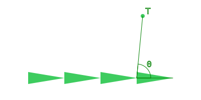
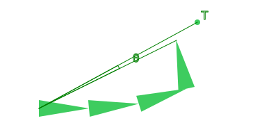

# Inverse Kinematics: CCD

Cyclic Coordinate Descent Inverse Kinematic (CCDIK) é diferente das lógicas anteriores, pois nós não sabemos qual o estado final que desejamos para os ossos. A ideia é fazer diversas iterações até que chegue em um resultado aceitável.  

Em outras palavras, CCDIK se trata da jornada e não do resultado final.  

  

## Cyclic Coordinate Descent

Para cada osso temos que calcular a rotação para a ponta chegue mais perto do ponto desejado.  

Dependendo da direção que você caminhar pela cadeia de ossos o movimento pode ser diferente. Nesse exemplo iremos fazer de tráz para frente (osso mais perto da ponta até osso mais longe da ponta).  

  

  

  

  

  

E com isto fizemos a primeira iteração. Vamos começar a segunda iteração.  

  

  

  

  

  

Cada iteração se aproximando mais do ponto desejado.  

  

O único cálculo que precisamos fazer toda iteração é o ângulo da ponta até o alvo.  

## Negative Scale

Recomendo ler no [Two Bone](../2024-03-25-ik-two-bone/index.md) sobre escala negativa. O que importa é que o mesmo se aplica neste caso, se uma das escalas for negativa, precisamos rotacionar na direção oposta.  

## Conclusion

Em GDScript o código seria algo como:  

```python
for bone in chain:
    var angle_to_target: float = bone.global_position.angle_to_point(target.global_position)
    var angle_to_tip: float = bone.global_position.angle_to_point(tip.global_position)
    var angle_diff: float = angle_to_target - angle_to_tip
    
    # Escala negativa ou não.
    if bone.global_scale.sign().x == bone.global_scale.sign().y:
        bone.rotate(angle_diff)
    else:
        bone.rotate(-angle_diff)
```

:::note
Normalmente toda iteração você verificaria se chegou em um resultado aceitável.  

No meu caso (game engine), estou fazendo uma iteração por frame e sem pensar se chegou ou não em um resultado aceitável.  
:::