# Inverse Kinematics: FABR

Forward And Backward Reaching Inverse Kinematics (FABRIK) é a última kinematic que veremos. É utilizada para cadeias de ossos também mas apenas precisamos de uma iteração para definir o estado final (diferentemente da [CCD](../2024-03-26-ik-ccd/index.md)).  

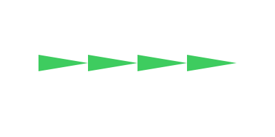  

## Forward And Backward Reaching

A idéia é duas caminhadas na cadeia de ossos, a primeira irá mover os ossos em direção ao alvo (forward) e a segunda vai voltar o osso a base (backward).  

A operação importante a se entender durante as duas etapas é ação de alcançar um outro ponto (reaching). Vamos utilizar ela durante as duas etapas então é bom entender isto primeiro.  

## Reaching

Alcançar um alvo é dividido em 2 etapas, olhar para o alvo e mover até o alvo.  

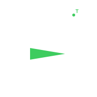  

Na primeira etapa podemos utilizar a mesma lógica do [look at](../2024-02-04-ik-look-at/index.md) ou usar a função que sua game engine disponibilizar para rotacionar até um ponto.  

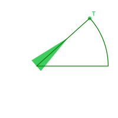  

Para mover até o ponto é preciso usar o tamanho do osso e calcular onde seria o novo ponto da base do osso. Visualizar onde seria é algo bem simples:  

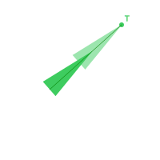  

Calcular isso envolve conseguir criar um vetor que represente o osso. Primeiro precisamos saber o vetor em que o osso se encontra, o vetor do ponto inicial dele até o alvo.  

```
Vetor = Posição do alvo - Posição do osso
```

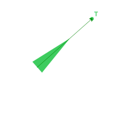  

Com isto podemos calcular a proporção desse vetor com o vetor do osso. Em outras palavras, qual o tamanho do vetor do osso em relação a esse vetor? É duas vezes o tamanho deste? É três vezes o tamanho? É metade desse vetor?  

```
Tamanho do vetor = √(Vetor.x² + Vetor.y²)
Proporção = Tamanho do osso / Tamanho do vetor
```

Utilizando essa proporção podemos criar um vetor do tamanho do osso.  

```
Vetor osso = Vetor * Proporção
```

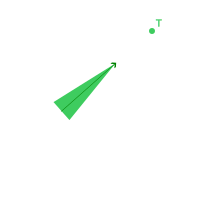  

A última coisa é calcular o novo ponto onde o osso deve inciar. Basta pegar o ponto do alvo e reduzir pelo vetor do osso.  

```
Posição do osso = Posição do alvo - Vetor osso
```

  

Pronto, sabemos onde botar o osso e podemos mover ele para lá (caso você já não tenha movido ele na última operação)  

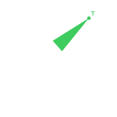  

## Forward

A primeira caminhada pela cadeia de ossos envolve fazer cada osso andar em direção (forward) ao osso seguinte. No caso da ponta da cadeia, ela irá mover em direção ao alvo.  

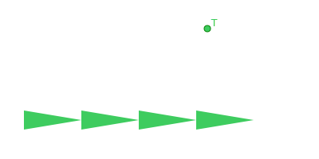  

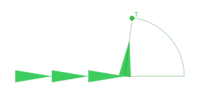  

O ponto vermelho irá representar onde globalmente o início do osso atual está, nós usamos ele para decidir onde o osso seguinte vai alcançar.  

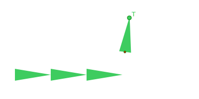  

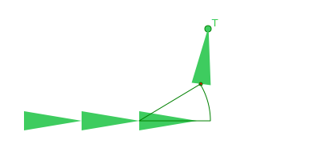  

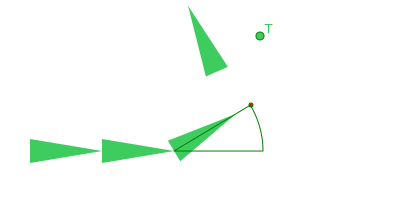  

Estou pausando aqui para lembrar que movimentar e rotacionar um osso afeta todos os filhos, por isto os ossos filhos são movimentados e rotacionados de forma a ficarem "piores" (mais longe do alvo).  

:::danger
Anos depois... Eu percebi que ajustar a posição e rotação do filho depois de fazer essa operação é uma boa pois conserta diversos problemas. Não irei atualizar este blog pois isto envolveria atualizar imagens e reler o post (esse é meu nível de preguiça aqui).  
:::

  

O osso seguinte irá utilizar o osso anterior como referência, seguimos essa tática para cada um dos ossos.  

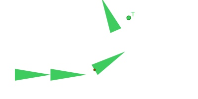  

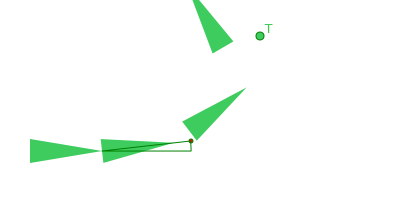  

  

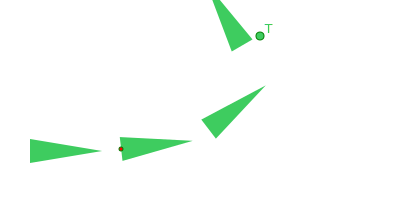  

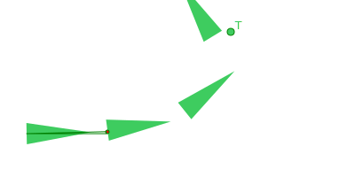  

  

O ponto azul representa a base da cadeia e é um ponto de referência que usaremos na próxima caminhada.  

## Backward

:::note
A última caminhada deixou tudo uma bagunça mas isso apenas porque eu escolhi trata-los da mesma forma que minha game engine (Godot) trata nodes nela.  

Se tivessemos usado um array de ossos em vez de relações pai e filho, um não afetaria o outro!  
:::

Nós focaremos agora a mover os ossos em direção a base, ou seja, eles caminharam para tráz (backward). Dessa vez não precisamos nos preocupar em rotacionar, apenas mover para o final do osso anterior.  

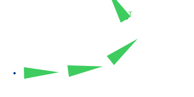  

  

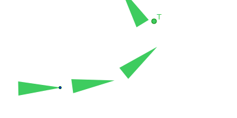  

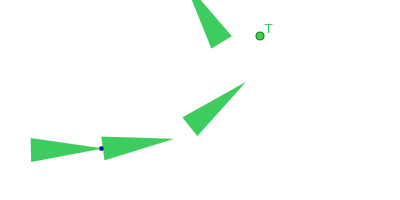  

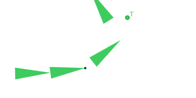  

  

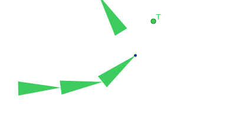  

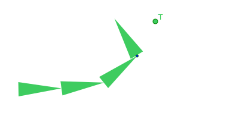  

## Iteration

Ao final de uma iteração podemos ter algo errado como visto acima, mas se repetirmos mais vezes vamos começar a caminhar para algo melhor.  

O que acontece se começarmos outra iteração? Vamos começar novamente rotacionando o osso da ponta.  

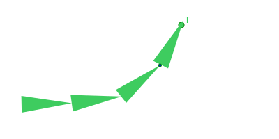  

Se você der zoom na imagem, vai notar que o último osso passou do ponto alvo. Mas a etapa seguinte é mover de forma que o ponto final do osso bata com a posição do alvo.  

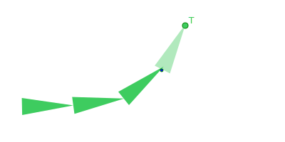  

Bem, agora o osso seguinte está incorreto... Mas se continuarmos repetindo o processo...  

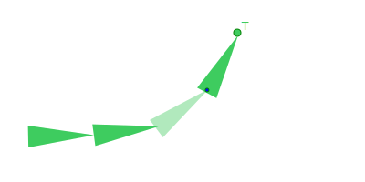  

Aos poucos os ossos vão indo para uma posição melhor, mas eu não pretendo mostra-lo uma segunda iteração pois eu fiz estes desenhos a mão. 🤣  

## Conclusion

O código simplificado em GDScript (linguagem do Godot):  

```python
for i in iterations:
    _apply_forwards()
    _apply_backwards(base_global_position)


func _apply_forwards() -> void:
    # O osso da ponta vai morar no alvo, os seguintes vão tratar o anterior como alvo.
    var target_global_position: Vector2 = target.global_position

    # Esse array leva da ponta até a base.
    for bone in chain:
        # Rotaciona em direção ao alvo.
        bone.look_at(target_global_position)

        # Evita calcular ratio como infinito.
        if target_global_position == bone.global_position:
            continue
        
        # Calcula a nova posição do osso.
        var stretch: Vector2 = target_global_position - bone.global_position
        var ratio: float = bone.get_bone_length() / stretch.length()
        bone.global_position = target_global_position - stretch * ratio
        
        # Define o alvo do osso seguinte.
        target_global_position = bone.global_position


func _apply_backwards(base_global_position: Vector2) -> void:
    # Esse array leva da ponta até a base, então agora precisamos caminhar ao contrário.
    for i in range(chain.size() - 1, -1, -1):
        var bone: Bone = chain[i]
        
        bone.global_position = base_global_position
        
        # Calcula a posição do osso seguinte.
        var direction := Vector2(cos(bone.global_rotation), sin(bone.global_rotation))
        base_global_position = bone.global_position + direction * bone.get_bone_length()
```

## References

- https://sean.cm/a/fabrik-algorithm-2d/