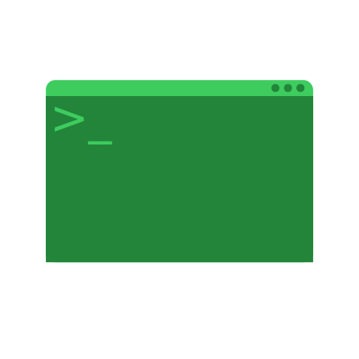

# TTY, Terminal, Shell, CLI, TUI, GUI

## TTY
**T**ele**ty**pe  
*(https://en.wikipedia.org/wiki/Teleprinter)*  

:::note
Já notou que muitas coisas no computador possuem o nome de objetos que existem fora do computador? Acontece que o nome é dado baseado nestes objetos, isso ajuda usuários a entenderem melhor o uso dele no computador!  

Infelizmente é por isso que para entendermos o TTY do computador, iremos entender no que ele é inspirado.  
:::

Teletype é uma [typewriter](https://en.wikipedia.org/wiki/Typewriter) elétrica com o propósito de enviar e receber dados.  

Tenha em mente que estamos falando de uma época que inicialmente não possuia monitores (onde o meio de comunicação principal era papel) e de uma máquina que mudou bastante durante o tempo... Não espere precisão de mim.  

- Originalmente substituiu os tradutores de [morse code](https://en.wikipedia.org/wiki/Morse_code), pois elas conseguiam ler e escrever morse code.  
- Com o tempo elas evoluiram para ler e escrever [punched tapes](https://en.wikipedia.org/wiki/Punched_tape), que eram a maneira de computadores armazenarem dados na época (antes de HD/SSD).  
- Consequentemente evoluiram para quando conectadas a um computador (na época antes de [monitores](https://en.wikipedia.org/wiki/Computer_monitor) aparecerem) serem capazes de ler e escrever a ele.  

Não existe melhor maneira de entender do que ver pessoas que restauraram esse tipo de ferramenta:  
https://www.youtube.com/watch?v=S81GyMKH7zw  

## Terminal
*(https://en.wikipedia.org/wiki/Computer_terminal)*  

Teletypes originalmente eram conhecidas como "hard-copy terminals" por usarem papel, mas com a vinda de telas nós formamos uma nova ideia de terminal nas nossas cabeças (a tela preta).  

Terminal não possui armazenamento de dados, da mesma maneira que teletypes apenas eram responsáveis por ler e escrever do computador, ou seja, a lógica ainda estava no computador. Alguns terminais possuiam um pouco de lógica neles porém nada comparado ao computador.    

Se você viu o video da sessão anterior então já deve ter ganhado uma ideia do que é um terminal, pois nele é mostrado uma teletype lendo e escrevendo para um terminal.  
Mas caso queira outro video mostrando melhor um terminal:  
https://www.youtube.com/watch?v=UNdu0YQfvF0  

  

## Terminal Emulator
*(https://en.wikipedia.org/wiki/Terminal_emulator)*  

Hoje em dia usamos o termo terminal para representarmos emuladores de terminais.  

Diferentemente de terminais, estes estão fortemente ligados a computador e não são máquinas separadas da lógica. Basicamente estamos falando da janela que finge ser um terminal (GNOME terminal).  

  

## Shell
*(https://en.wikipedia.org/wiki/Shell_script)*  

Um **programa** responsável por ficar em loop esperando **comandos** do usuário para serem executados.  

Comandos podem ser:
    - Programas
        - `echo`
        - `ls`
        - `touch`
        - `mkdir`
        - Buscados em lugares pré definidos (`/bin`, `/usr/bin`, ...)
            - Use `echo $PATH` para ver a lista de lugares a se olhar
    - Comandos do próprio shell
        - `type`
        - `which`
        - `help`
        - `man`
        - Estes existem dentro do shell e não precisam ser buscados.
    - Shell functions
    - Aliases
        - Comandos definidos por nós, construido de outros comandos

Existem variações e alternativas de shell:  
- [Bash](https://www.gnu.org/software/bash/)
- [Zsh](https://www.zsh.org/)
- [Fish](https://fishshell.com/)

## CLI
**C**ommand-**l**ine **i**nterface  
*(https://en.wikipedia.org/wiki/Command-line_interface)*  

## TUI
**T**erminal **u**ser **i**nterface  
*(https://en.wikipedia.org/wiki/Text-based_user_interface)*  

## GUI
**G**raphical **u**ser **i**nterface  
*(https://en.wikipedia.org/wiki/Graphical_user_interface)*  

## References
- https://en.wikipedia.org/wiki/System_console
- https://linuxcommand.org/lc3_lts0010.php
- https://linuxcommand.org/lc3_lts0060.php
- https://www.youtube.com/watch?v=ztsOwk1zB3o
- https://www.youtube.com/watch?v=SYwbEcNrcjI
- https://www.youtube.com/watch?v=byMwNPj47X8
- https://www.youtube.com/watch?v=S81GyMKH7zw