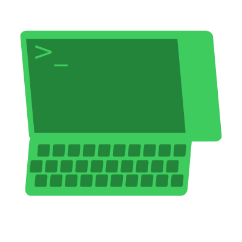
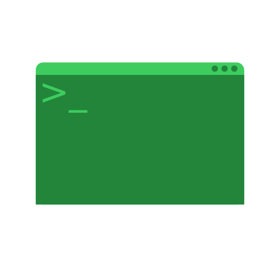
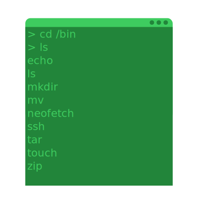
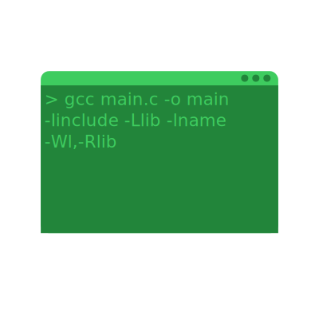
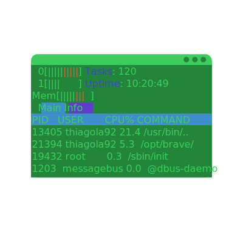
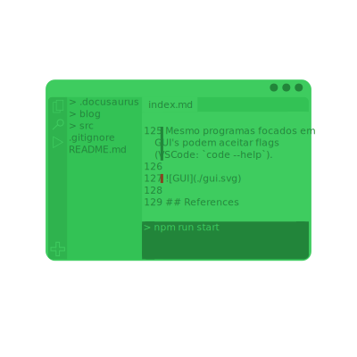

# TTY, Terminal, Shell, CLI, TUI, GUI

## TTY
**T**ele**ty**pe  
*(https://en.wikipedia.org/wiki/Teleprinter)*  

:::note
Já notou que muitas coisas no computador possuem o nome de objetos que existem fora do computador? Acontece que o nome é dado baseado nestes objetos, isso ajuda usuários a entenderem melhor o uso dele no computador!  

Infelizmente é por isso que para entendermos o TTY do computador, iremos entender no que ele é inspirado.  
:::

Teletype é uma [typewriter](https://en.wikipedia.org/wiki/Typewriter) elétrica com o propósito de enviar e receber dados.  

Tenha em mente que estamos falando de uma época que inicialmente não possuia monitores (onde o meio de comunicação principal era papel) e de uma máquina que mudou bastante durante o tempo... Não espere precisão de mim.  

- Originalmente substituiu os tradutores de [morse code](https://en.wikipedia.org/wiki/Morse_code), pois elas conseguiam ler e escrever morse code.  
- Com o tempo elas evoluiram para ler e escrever [punched tapes](https://en.wikipedia.org/wiki/Punched_tape), que eram a maneira de computadores armazenarem dados na época (antes de HD/SSD).  
- Consequentemente evoluiram para quando conectadas a um computador (na época antes de [monitores](https://en.wikipedia.org/wiki/Computer_monitor) aparecerem) serem capazes de ler e escrever a ele.  

Não existe melhor maneira de entender do que ver pessoas que restauraram esse tipo de ferramenta:  
https://www.youtube.com/watch?v=S81GyMKH7zw  

É baseado nessa ferramenta que TTY em linux existe, infelizmente ainda não terminei o estudo de como funciona e o que faz:  
https://www.linusakesson.net/programming/tty/  

## Terminal
*(https://en.wikipedia.org/wiki/Computer_terminal)*  

Teletypes originalmente eram conhecidas como "hard-copy terminals" por usarem papel, mas com a vinda de telas nós formamos uma nova ideia de terminal nas nossas cabeças (a tela preta).  

Terminal não possui armazenamento de dados, da mesma maneira que teletypes apenas eram responsáveis por ler e escrever do computador, ou seja, a lógica ainda estava no computador. Alguns terminais possuiam um pouco de lógica neles porém nada comparado ao computador.    

Se você viu o video da sessão anterior então já deve ter ganhado uma ideia do que é um terminal, pois nele é mostrado uma teletype lendo e escrevendo para um terminal.  
Mas caso queira outro video mostrando melhor um terminal:  
https://www.youtube.com/watch?v=UNdu0YQfvF0  

  

## Terminal Emulator
*(https://en.wikipedia.org/wiki/Terminal_emulator)*  

Hoje em dia usamos o termo terminal para representarmos emuladores de terminais.  

Diferentemente de terminais, estes estão fortemente ligados a computador e não são máquinas separadas da lógica. Basicamente estamos falando da janela que finge ser um terminal (GNOME terminal).  

  

## Shell
*(https://en.wikipedia.org/wiki/Shell_script)*  

Um **programa** responsável por ficar em loop esperando **comandos** do usuário para serem executados.  

Comandos podem ser:
    - Programas
        - `echo`
        - `ls`
        - `touch`
        - `mkdir`
        - Buscados em lugares pré definidos (`/bin`, `/usr/bin`, ...)
            - Use `echo $PATH` para ver a lista de lugares a se olhar
    - Comandos do próprio shell
        - `type`
        - `which`
        - `help`
        - `man`
        - Estes existem dentro do shell e não precisam ser buscados.
    - Shell functions
    - Aliases
        - Comandos definidos por nós, construido de outros comandos

Existem variações e alternativas de shell:  
- [Bash](https://www.gnu.org/software/bash/)
- [Zsh](https://www.zsh.org/)
- [Fish](https://fishshell.com/)

  

## CLI
**C**ommand-**l**ine **i**nterface  
*(https://en.wikipedia.org/wiki/Command-line_interface)*  

É uma interface, ou seja, maneira do programa dar mais controle ao usuário sobre o programa.  

Está interface se basea no usuário passar flags e mais informações em conjunto ao comando, dessa maneira mudando o comportamento do commando. Por exemplo, o programa `ls` disponibiliza diversas flags para alterar o comportamento:  
- `ls`
    - Lista tudo no diretório atual mas ignora os começando com `.`
- `ls -a`
    - Lista tudo no diretório atual e **não** ignora os começando com `.`
- `ls -l`
    - Lista tudo no diretório atual mas com mais detalhes

Fique bem claro que é o programa te dando opções de como interagir com ele, não o shell ou terminal, então resta ao programa implementar comportamentos para certas flags.  

:::note
É muito comum programas oferecerem detalhes sobre as flags quando utilizando a flag `--help` (`ls --help`).  
:::

  

## TUI
**T**erminal **u**ser **i**nterface  
*(https://en.wikipedia.org/wiki/Text-based_user_interface)*  

Novamente é uma interface, ou seja, maneira do programa dar mais controle ao usuário sobre o programa. Porém está foca em dar uma interação mais visual e continua.  

Diferente de CLI's onde toda a interação começa e termina em um comando só, TUI's continuam esperando mais interações do usuário até um dos dois decidirem terminar.  

Um exemplo bem comum é `top` que providência uma visão dos programas/processos/threads em execução do sistema, uma vez inicializado ele esperar por mais interações do usuário. Se você apertar `q` ele termina, se você apertar `h` ele fornece a lista de comandos, etc.  

Note que a TUI's ainda podem providênciar flags para alterar o comportamento (`top --help`).  

  

## GUI
**G**raphical **u**ser **i**nterface  
*(https://en.wikipedia.org/wiki/Graphical_user_interface)*  

Novamente é uma interface, ou seja, maneira do programa dar mais controle ao usuário sobre o programa. Porém não está limitada a usar texto para a visualização, pois tem a capacidade de desenhar na tela.  

Hoje em dia é o meio mais popular de se usar uma aplicação, quando se abre VSCode, Google Chrome, Discord... Todos são GUI's pois utilizaram a capacidade de desenhar para dar uma interface ao usuário.  

Mesmo programas focados em GUI's podem aceitar flags (VSCode: `code --help`).  

  

## References
- https://en.wikipedia.org/wiki/System_console
- https://www.linusakesson.net/programming/tty/
- https://linuxcommand.org/lc3_lts0010.php
- https://linuxcommand.org/lc3_lts0060.php
- https://www.youtube.com/watch?v=ztsOwk1zB3o
- https://www.youtube.com/watch?v=SYwbEcNrcjI
- https://www.youtube.com/watch?v=byMwNPj47X8
- https://www.youtube.com/watch?v=S81GyMKH7zw