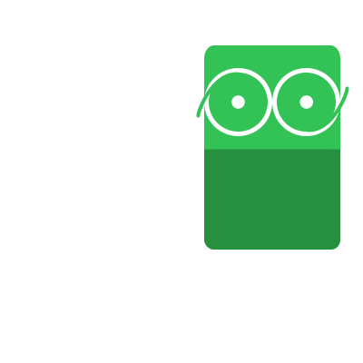

# TTY, Terminal, Shell, CLI, TUI, GUI

Esse post é meio que uma compilação do que eu entendi de cada assunto após de horas lendo na internet e perguntando para meu pai.  
Em outras palavras: Pode ter informação incorreta!  

## TTY
**T**ele**ty**pe  
*(https://en.wikipedia.org/wiki/Teleprinter)*  

TTY é um comando em linux para saber o nome do terminal o qual a input está **diretamente conectada**.  

```C
$ tty
/dev/pts/1

$ echo "example" | tty
not a tty
```

No primeiro exemplo, o comando `tty` veio como input diretamente do terminal.  

No segundo exemplo, o comando `tty` recebeu a input `example` do comando anterior (não de um terminal).  

Fim! Pode ir para a próxima sessão, ao menos que você queira saber o que diabos é uma teletype.  

  

Já notou que muitas coisas no computador possuem o nome de objetos que existem fora do computador?  

Acontece que o nome é dado baseado nestes objetos para ajudar usuários a entenderem melhor o uso deles no computador! Por exemplo:  
- file
- folder
- trash can
- window  

O mesmo vale para TTY, onde o nome veio de teletypes. Infelizmente não é um nome que ajude muito pois computadores já subsittuiram o uso delas então esse nome não ajuda ninguém a saber do que o comando se trata 🤣.  

O que são teletypes?  
Entenda que elas são uma junção de [typewriters](https://en.wikipedia.org/wiki/Typewriter) e [telegraph key](https://en.wikipedia.org/wiki/Telegraph_key).  
O primeiro utilizado para escrever em papel e o segundo utilizado para enviar [morse code](https://en.wikipedia.org/wiki/Morse_code) a distância.  

Morse code era muito utilizado como uma forma de comunicação binária (som curto/longo) via cabo. Porém para isso acontecer era necessário duas pessoas treinadas em morse code (uma para enviar e outra para receber).  
```
mensagem <=> tradutor <=> morse code <=> transmissão
```

Com a chegada das teletypes, os tradutores foram substituidos por estas máquinas que eram capaz de traduzir e ler morse code.  
```
mensagem <=> teletype <=> morse code <=> transmissão
```

Computadores da época utilizavam [paper tape](https://en.wikipedia.org/wiki/Punched_tape) como forma de armazenamento de dados e [monitores](https://en.wikipedia.org/wiki/Computer_monitor) não eram algo acessível. Teletypes viram está oportunidade para preencher outro meio de comunicação (dado que computadores também utilizam binário).  
```
mensagem <=> teletype <=> binário <=> computador
```

Este video mostra uma teletype recebendo e enviando dados de/a um terminal:  
https://www.youtube.com/watch?v=S81GyMKH7zw  

Por isto que o termo TTY era utilizado para referência aparelhos enviando/recebendo (input/output) mensagem do computador.  

Algumas linguagens até incluem código para fazer essa verificação:
- C
    -   ```C
        #include <unistd.h>

        isatty(fildes);
        ```
- Python
    -   ```python
        import os

        os.isatty(fd)
        ```
- NodeJS
    -   ```javascript
        tty.isatty(fd)
        ```

Onde a funcionalidade das funções é identificar se a input/ouput está vinculada a um aparelho (device).  

:::warning
Preste bem atenção que sua input pode estar ligada ou não a um aparelho **E** sua output pode estar ligada ou não a um aparelho.  
Um deles estar ligado não quer dizer que ambos estão.  

As funções recebem um file descriptor e dizem se ele está ou não linkado a um aparelho.  
Você poderia passar `STDIN`, `STDOUT` ou até `STDERR` para a função analisar.  

Esse video cobre bem o assunto: https://www.youtube.com/watch?v=SYwbEcNrcjI  
:::

Se realmente quiser saber detalhes sobre TTY, existe este blog **cheio** de informações (que eu não li):  
https://www.linusakesson.net/programming/tty/  

  

## Terminal
*(https://en.wikipedia.org/wiki/Computer_terminal)*  

Teletypes originalmente eram conhecidas como "hard-copy terminals" por usarem papel, mas com a vinda de telas nós formamos uma nova ideia de terminal nas nossas cabeças (a tela preta).  

Terminal não possui armazenamento de dados, da mesma maneira que teletypes apenas eram responsáveis por ler e escrever do computador, ou seja, a lógica ainda estava no computador. Alguns terminais possuiam um pouco de lógica neles porém nada comparado ao computador.    

Se você viu o video da sessão anterior então já deve ter ganhado uma ideia do que é um terminal, pois nele é mostrado uma teletype lendo e escrevendo para um terminal.  
Mas caso queira outro video mostrando melhor um terminal:  
https://www.youtube.com/watch?v=UNdu0YQfvF0  

  

## Terminal Emulator
*(https://en.wikipedia.org/wiki/Terminal_emulator)*  

Hoje em dia usamos o termo terminal para representarmos emuladores de terminais.  

Diferentemente de terminais, estes estão fortemente ligados a computador e não são máquinas separadas da lógica. Basicamente estamos falando da janela que finge ser um terminal (GNOME terminal).  

  

## Shell
*(https://en.wikipedia.org/wiki/Shell_script)*  

Um **programa** responsável por ficar em loop esperando **comandos** do usuário para serem executados.  

Comandos podem ser:
    - Programas
        - `echo`
        - `ls`
        - `touch`
        - `mkdir`
        - Buscados em lugares pré definidos (`/bin`, `/usr/bin`, ...)
            - Use `echo $PATH` para ver a lista de lugares a se olhar
    - Comandos do próprio shell
        - `type`
        - `which`
        - `help`
        - `man`
        - Estes existem dentro do shell e não precisam ser buscados.
    - Shell functions
    - Aliases
        - Comandos definidos por nós, construido de outros comandos

Existem variações e alternativas de shell:  
- [Bash](https://www.gnu.org/software/bash/)
- [Zsh](https://www.zsh.org/)
- [Fish](https://fishshell.com/)

  

## CLI
**C**ommand-**l**ine **i**nterface  
*(https://en.wikipedia.org/wiki/Command-line_interface)*  

É uma interface, ou seja, maneira do programa dar mais controle ao usuário sobre o programa.  

Está interface se basea no usuário passar flags e mais informações em conjunto ao comando, dessa maneira mudando o comportamento do commando. Por exemplo, o programa `ls` disponibiliza diversas flags para alterar o comportamento:  
- `ls`
    - Lista tudo no diretório atual mas ignora os começando com `.`
- `ls -a`
    - Lista tudo no diretório atual e **não** ignora os começando com `.`
- `ls -l`
    - Lista tudo no diretório atual mas com mais detalhes

Fique bem claro que é o programa te dando opções de como interagir com ele, não o shell ou terminal, então resta ao programa implementar comportamentos para certas flags.  

:::note
É muito comum programas oferecerem detalhes sobre as flags quando utilizando a flag `--help` (`ls --help`).  
:::

  

## TUI
**T**erminal **u**ser **i**nterface  
*(https://en.wikipedia.org/wiki/Text-based_user_interface)*  

Novamente é uma interface, ou seja, maneira do programa dar mais controle ao usuário sobre o programa. Porém está foca em dar uma interação mais visual e continua.  

Diferente de CLI's onde toda a interação começa e termina em um comando só, TUI's continuam esperando mais interações do usuário até um dos dois decidirem terminar.  

Um exemplo bem comum é `top` que providência uma visão dos programas/processos/threads em execução do sistema, uma vez inicializado ele esperar por mais interações do usuário. Se você apertar `q` ele termina, se você apertar `h` ele fornece a lista de comandos, etc.  

Note que a TUI's ainda podem providênciar flags para alterar o comportamento (`top --help`).  

  

## GUI
**G**raphical **u**ser **i**nterface  
*(https://en.wikipedia.org/wiki/Graphical_user_interface)*  

Novamente é uma interface, ou seja, maneira do programa dar mais controle ao usuário sobre o programa. Porém não está limitada a usar texto para a visualização, pois tem a capacidade de desenhar na tela.  

Hoje em dia é o meio mais popular de se usar uma aplicação, quando se abre VSCode, Google Chrome, Discord... Todos são GUI's pois utilizaram a capacidade de desenhar para dar uma interface ao usuário.  

Mesmo programas focados em GUI's podem aceitar flags (VSCode: `code --help`).  

  

## References
- https://en.wikipedia.org/wiki/System_console
- https://www.linusakesson.net/programming/tty/
- https://linuxcommand.org/lc3_lts0010.php
- https://linuxcommand.org/lc3_lts0060.php
- https://www.youtube.com/watch?v=wIjgZhAjQS4
- https://www.youtube.com/watch?v=ztsOwk1zB3o
- https://www.youtube.com/watch?v=byMwNPj47X8
- https://www.youtube.com/watch?v=3X93PnKRNUo