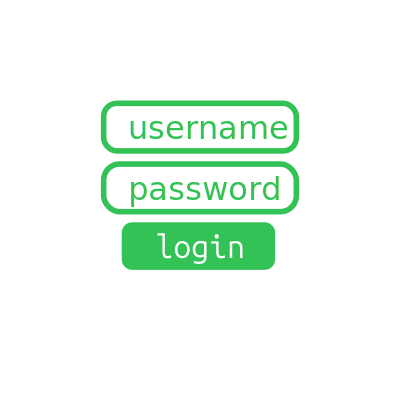
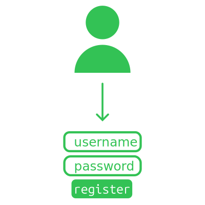
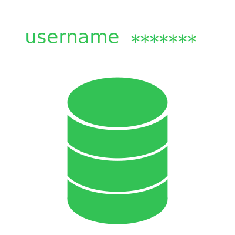

# Authentication - username & password
:::warning
Eu não estava feliz que o post era muito "aqui o código de X/Y/Z", pois gerava paredão de texto. E quando escrevo estes posts, a intenção é reforçar conhecimento para no futuro eu conseguir voltar e relembrar do assunto (e não do código em específico).  

O repositório com exemplos continua vivo em:  
https://github.com/thiagola92/learning-authentication  
:::

Username com password é uma das maneiras mais velhas de se criar autenticação no seu sistema.  

  

Nós confiaremos que aquele usuário é o dono da conta se ele souber a senha que está relacionada àquele username. Note que falei "confiaremos" pois nunca podemos ter 100% de certeza, só estamos tentando reduzir a possibilidade de ser alguém indesejado na conta.  

## Clint - register
  

Para entender como o registro de novos usuários funciona, podemos olhar como formulários em HTML funcionam.  

```html
<form action="./register">
</form>
```

Formulários coletam todos os dados dos elementos `<input>` dentro deles e enviam para o endereço especificado no atributo `action`. Tenha em mente que enviar quer dizer "mandar para aquele **endpoint** um request **HTTP**".  

:::note
Caso você já tenha feito uma API REST em qualquer linguagem, você pode começar a notar detalhes familiares. Acontece que os navegadores não fazem nenhuma mágica, eles enviam o mesmo tipo de request que você está acostumado a lidar no backend de APIs REST.  
:::

Como eu estou escrevendo isto ao mesmo tempo que testo o código, eu vou trocar o endpoint para a minha API (`http://127.0.0.1:8000/register`).  

```html
<form action="http://127.0.0.1:8000/register">
</form>
```

Nós precisamos adicionar o input do tipo `submit` pois ele é utilizado para engatilhar o envio.  

```html
<form action="http://127.0.0.1:8000/register">
  <input type="submit" value="register">
</form>
```

Se você clicar no botão de registrar, você mandara um request GET para o endpoint `register`, com nenhuma informação pois não existe nenhum campo `input` que segure informação.  

No nosso caso precisamos de um campo para o username e outro para o password:  
```html
<form action="http://127.0.0.1:8000/register">
  <input type="text" name="username" value="username"><br>
  <input type="password" name="password" value="password"><br>
  <input type="submit" value="register">
</form>
```

Note que utilizamos os tipos `text` e `password` apenas para dar o comportamento correto no navegador. O importante mesmo é o atributo `name` pois ele define o nome a qual o valor vai estar relacionado quando enviado.  

Se clicarmos no botão de registrar, enviaremos as informações na URL:  
`/register?username=username&password=password`  

Por padrão o formulário envia um request GET, o que é ótimo se você quiser compartilhar URL com alguém ou salvar no favoritos.  

Porém não é nada seguro quando estamos falando de informação sensível como a senha do usuário! Neste caso queremos enviar no corpo do request POST (onde não fica visível a qualquer pessoa olhando a tela do seu computador).  

Podemos especificar o método utilizado no request atráves do atributo `method`:  
```html
<form action="http://127.0.0.1:8000/register" method="post">
  <input type="text" name="username" value="username"><br>
  <input type="password" name="password" value="password"><br>
  <input type="submit" value="register">
</form>
```

Agora ao clicar no botão de registrar, enviaremos as informações no corpo do request e a URL para qual você vai ser direcionado **não** vai conter seus dados (`/register`).  

Corpo do request: `username=username&password=password`  

:::note
Note que no final das contas é o mesmo formato porém em lugares diferentes.  

Se você tiver uma API, conseguirá ver que ambos possuem o campo `content-type` da requisição com o valor `application/x-www-form-urlencoded`.  
:::

Tudo isto poderia ser reproduzido em python com:  
```python
import httpx
from urllib.parse import urlencode

body = urlencode({"username": username, "password": password})
headers = {"Content-Type": "application/x-www-form-urlencoded"}

httpx.post("http://127.0.0.1:8000/register", headers=headers, content=body)
```

## Server - register
Okay, seu server recebeu a requisição de cadastro do usuário. O que fazer agora? Validações!  

  

O conteúdo da requisição está no formato esperado?  

Podemos verificar se o campo `content-type` está com `application/x-www-form-urlencoded`.  
```python
if request.headers.get("Content-Type") != "application/x-www-form-urlencoded":
    raise Exception("Invalid body format")
```

Claro que isso não impede o usuário de formatar o conteúdo incorretamente, porém agora podemos assumir que ele errou o formato e enviarmos uma mensagem de erro coerente com o problema.  
```python
try:
    body = await request.body()
    body = body.decode()
    fields = parse_qs(body)
except ValueError:
    raise Exception("Body incorrectly formatted")
```

E se o usuário esquecer um dos campos? Sim, precisamos validar isto também.  
```python
if "username" not in fields or "password" not in fields:
    return Exception("Missing username or password")
```

E se o usuário tiver caracters inválido?  
E se a senha tiver caracters inválido?  
E se o usuário já existir no banco?  
...  

Acho que você já entendeu que validação é importante.  
Agora vamos falar de storage!  

  

Como se armazena o username?  
Igual a qualquer outro campo texto...  

Como se armazena a senha?  
Não se armazena senhas...  

Pode parecer estranho a primeira vista mas não precisamos armazenar a senha para conferir se alguém nos deus a senha correta.  

Existem funções chamadas **funções hash** que produzem saídas com propriedades que nos ajudam a conferir se a senha de um usuário está correta.  

Propriedades que nos interessão em uma função hash:
- Dada uma entrada de bytes, sempre produz a mesma saída de bytes
    - Nada de especial aqui, apenas está garantindo que não é afetado por outro fatores aleatórios (tempo, temperatura, etc)
- Não existe função que reverte a operação
    - Em outras palavras, tendo a saída de bytes da função você não consegue saber a entrada que foi dada para a função hash (sem ir chutando todas as possibilidades)
- Qualquer mudança na entrada de bytes gera uma saída de bytes muito diferente
    - A ideia é que as pessoas não devem saber que as entradas são parecidas a partir da saída

Diversas funções hash existem, cada uma com o próprio algoritmo.  
No nosso caso vamos utilizar o algoritmo sha256 para os exemplos!  

```shell
$ sha256(entrada) => saida
```

:::note
Segurança é algo que muda com o tempo, então funções hash seguras de antigamente podem já não ser mais seguras.  
Estou usando a função hash sha256 apenas para exemplo, não estou considerando se é segura ou não para o ano atual.  
:::

| entrada | saída                                                            |
| ------- | ---------------------------------------------------------------- |
| abc     | ba7816bf8f01cfea414140de5dae2223b00361a396177a9cb410ff61f20015ad |
| abd     | a52d159f262b2c6ddb724a61840befc36eb30c88877a4030b65cbe86298449c9 |
| ABC     | b5d4045c3f466fa91fe2cc6abe79232a1a57cdf104f7a26e716e0a1e2789df78 |
| 123     | a665a45920422f9d417e4867efdc4fb8a04a1f3fff1fa07e998e86f7f7a27ae3 |

Se você der a mesma entrada, vai receber a mesma saída.  
Olhando a saída você não sabe a entrada.  
A mudanaça de um bit entre "abc" e "abd" mudou totalmente a saída.  

Não sei se ficou claro, mas isso é perfeito para podermos conferir se alguém acertou a senha.  
Quando alguém registra no nosso serviço, nós armazenamos o hash da senha (saída da função hash dado que recebeu a senha como entrada).  

| username   | hash                                                             |
| thiagola92 | 5e884898da28047151d0e56f8dc6292773603d0d6aabbdd62a11ef721d1542d8 |
| darklord   | 2d2c3f7eb9152d67258cd1068a64a746c130d4cca3f571bd28a86d7f7589aa25 |
| juninho    | b7e94be513e96e8c45cd23d162275e5a12ebde9100a425c4ebcdd7fa4dcd897c |

Quando alguém for logar no nosso serviço, a pessoa vai inserir a senha e nós vamos conferir se o hash dessa senha é igual ao que temos no banco.  
Se for igual, você sabe a senha da conta e pode ter acesso ao serviço.  
Se não for igual, vai gerar um hash que é diferente deste e nós não daremos acesso ao serviço.  

Qual a vantagem de armazenar assim?  
Se algum hacker acessar nosso banco, ele não vai conseguir saber a senha das pessoas.  
Mesmo que a pessoa saiba que meu hash é `5e884898da28047151d0e56f8dc6292773603d0d6aabbdd62a11ef721d1542d8`, se ela tentar passar isto como senha, o hash gerado vai ser totalmente diferente!  

```shell
5e884898da28047151d0e56f8dc6292773603d0d6aabbdd62a11ef721d1542d8 => 113459eb7bb31bddee85ade5230d6ad5d8b2fb52879e00a84ff6ae1067a210d3
```


-------------

Essa maneira de autenticação envolve armazenar no banco o **hash** da senha e o **salt** utilizado durante o hash.  

- Hash
    - Formalmente conhecido como digest, é o resultado de obtido ao se passar um array de bytes à uma função hash  
- Salt
    - Array de bytes gerado randomicamente para ser usado durante a função hash  

## Questions

> Por que não salvar a senha direto no banco de dados?

Pois se alguém olhar o banco, vai conseguir todas as senhas dos seus usuários.  

> O que é função hash?

Uma função que dada uma entrada de bytes, sempre produz a mesma saída de bytes.  

```
funcao("senha_secreta") => "2c005c01d9b373a068941949669ccfb69ef1b4a0315b10313185761803e05e69"
```

Se você tiver uma a saída de bytes, **não** temos algoritmo para descobrir qual foi a entrada de bytes.  
```
funcao(???) <= "f00c15643396616a89a0cb79039f740575defe9dbe307cccdaf8ae210e1c9cc6"
```

> O que acontece se alguém conseguir acesso ao banco de dados neste caso?

A pessoa vai ter acesso a todos os hash, mas não vai ter a senha então não vai conseguir acessar a conta.  

> Como vamos saber se o usuário acertou a senha se não sabemos a senha?

Iremos comparar o hash da senha que o usuário nos der.  

Se no banco nos temos o hash `fn54978fn435u9gnweru` e o usuário nos der uma senha que gere esse hash, então ele sabe a senha certa.  

> Por que a função hash usa salt?

Se duas pessoas tiverem a mesma senha e jogarem na função hash, o resultado será o mesmo.  
```
usuário 1 => senha_secreta => "2c005c01d9b373a068941949669ccfb69ef1b4a0315b10313185761803e05e69"
usuário 2 => senha_secreta => "2c005c01d9b373a068941949669ccfb69ef1b4a0315b10313185761803e05e69"
```

Se gerarmos algo aleatório para adicionar na entrada da função hash, o resultado muda completamente.  
```
usuário 1 => uejfisenha_secreta => "1c131f765a97e3bcf5101cd3e9e269e552716ad30be97e54f852e4f78ed90e44"
usuário 2 => 2ncWQsenha_secreta => "81feed1d27d67d6da5ebfa18ce58255d2822d95d286161fa3e42e323415d8263"
```

Agora ninguém sabe que os dois usuários tem a mesma senha, porém vamos precisar salvar o salt para reproduzir o resultado.  

## Server
Script para preparar o diretório dos exemplos:  
```shell
mkdir server
cd server
python3 -m venv venv
. venv/bin/activate
pip install duckdb starlette uvicorn
touch main.py auth.py database.py
```

### Server - Database Operations
Faremos apenas 3 operações no nosso banco de dados durante este post:
- Preparar o banco
    - Não é boa prática fazer isto por código, estamos fazendo para ter um projeto com tudo incluso
- Pegar autenticação do usuário
- Criar usuário

```python title="database.py"
import duckdb


def setup():
    cursor = duckdb.connect("users.db")

    cursor.execute("""
        CREATE SEQUENCE IF NOT EXISTS user_id_sequence START 1
    """)

    cursor.execute("""
        CREATE TABLE IF NOT EXISTS users (
            id      integer     primary key     default nextval('user_id_sequence'),
            user    text        not null        unique,
            salt    text        not null,
            hash    text        not null
        )
    """)


def get_user_auth(user: str) -> tuple[str, str]:
    cursor = duckdb.connect("users.db")
    result = cursor.execute(
        "SELECT salt, hash FROM users WHERE user = $user",
        {"user": user},
    ).fetchone()

    if result:
        return (result[0], result[1])
    return ("", "")


def create_user(user: str, salt: str, hash: str) -> bool:
    cursor = duckdb.connect("users.db")
    cursor.execute(
        """
        INSERT INTO users (user, salt, hash) VALUES
        ($user, $salt, $hash)
        """,
        {"user": user, "salt": salt, "hash": hash},
    )
```

### Server - Authentication
Código que sempre ira rodar para validar a autenticação do usuário em páginas que precisam de autenticação.  

Na framework Starlette isso pode ser feito dentro de um Middleware.  

```python title="auth.py"
import base64
import hashlib
import binascii

from starlette.authentication import (
    AuthenticationBackend,
    AuthenticationError,
    AuthCredentials,
    SimpleUser,
)
from starlette.requests import HTTPConnection

from database import get_user_auth


class AuthBackend(AuthenticationBackend):
    async def authenticate(self, conn: HTTPConnection):
        # No authroization, no access
        if "Authorization" not in conn.headers:
            return

        auth = conn.headers["Authorization"]
        scheme, credentials = auth.split()

        # Wrong authorization scheme
        if scheme.lower() != "basic":
            return

        # Extract username and password from credentials
        credentials = base64.b64decode(credentials)
        credentials = credentials.decode()
        username, _, password = credentials.partition(":")

        # Get real hash from database
        salt, hash = get_user_auth(username)
        if not salt or not hash:
            raise AuthenticationError("Invalid credentails")

        # Generate guess of hash
        password = password.encode()
        salt = binascii.a2b_hex(salt)
        guess = hashlib.scrypt(password, salt=salt, n=2, r=64, p=1)
        guess = binascii.b2a_hex(guess)
        guess = guess.decode()

        # Check if the hash guess is the same as real hash
        if hash != guess:
            raise AuthenticationError("Wrong password")

        return AuthCredentials(["authenticated"]), SimpleUser(username)
```

Note que `hashlib.scrypt()` retorna bytes e que eles podem não ser conversiveis para utf-8, ascii, etc...  

Então para facilitar a comparação, convertemos para uma string hexadecimal e armazenamos desta maneira.  

### Server - Main
Criamos 2 endpoints:
- Registrar usuário
- Acessar um conteúdo exclusivo para usuários

```python title="main.py"
import os
import hashlib
import binascii
from urllib.parse import parse_qs

from starlette.applications import Starlette
from starlette.responses import PlainTextResponse
from starlette.requests import Request
from starlette.routing import Route
from starlette.middleware import Middleware
from starlette.middleware.authentication import AuthenticationMiddleware
from starlette.authentication import requires

import database
from auth import AuthBackend


async def register(request: Request):
    # Refuse if not in the right format
    if request.headers.get("Content-Type") != "application/x-www-form-urlencoded":
        return PlainTextResponse("Invalid body format", 400)

    # Break down body
    body = await request.body()
    body = body.decode()
    fields = parse_qs(body)

    # Body must have username and password
    if "username" not in fields or "password" not in fields:
        return PlainTextResponse("Missing username or password", 400)

    # Get username and password
    username = fields["username"][0]
    password = fields["password"][0]

    # Found user with this username
    if database.get_user_auth(username)[0]:
        return PlainTextResponse("User already exist", 403)

    # Create salt and password hash
    salt = os.urandom(16)
    password = password.encode()
    hash = hashlib.scrypt(password, salt=salt, n=2, r=64, p=1)
    salt = binascii.b2a_hex(salt)
    hash = binascii.b2a_hex(hash)

    database.create_user(username, salt, hash)

    return PlainTextResponse("User created")


# Needs to be authenticated to receive this response
@requires("authenticated")
async def content(request: Request):
    return PlainTextResponse("Private content")


database.setup()

app = Starlette(
    debug=True,
    routes=[Route("/", content), Route("/register", register, methods=["post"])],
    middleware=[Middleware(AuthenticationMiddleware, backend=AuthBackend())],
)
```

Agora você pode iniciar o server com:
```
uvicorn --reload main:app
```

## Client
Script para preparar o diretório dos exemplos:  
```shell
mkdir client
cd client
python3 -m venv venv
. venv/bin/activate
pip install httpx
touch content.py register.py
```

### Client - Access Content
A convenção para se enviar usuário e senha é:  
- Concatenar usuário e senha com `:`
    - `username:password`  
- Transformar em base64
    - `dXNlcm5hbWU6cGFzc3dvcmQ=`
- Escrever antes o scheme utilizado
    - `Basic dXNlcm5hbWU6cGFzc3dvcmQ=`
- Enviar no campo `Authorization` do headers

```python title="content.py"
import sys
import httpx
import base64

# Get username and password from command line
username = sys.argv[1]
password = sys.argv[2]

# Setup credentials string
credentials = f"{username}:{password}"
credentials = credentials.encode()
credentials = base64.b64encode(credentials)
credentials = credentials.decode()

# Get content
response = httpx.get("http://127.0.0.1:8000/", headers={"Authorization": f"Basic {credentials}"})
print(response.content)
```

Execute o código para testar obter o conteúdo do sistema:  
```
python content.py username password
```

Se você ainda não escreveu o código de registar, isto deve estar proibindo você de ver o conteúdo da página.  

### Client - Register User
No caso de registrar, o campo `Content-Type` no headers deve conter `application/x-www-form-urlencoded`.  

Enquanto a convenção do body é:
- Concatenar nome do campo e a informação do campo com `=`
    - `username=USERNAME`
- Concatenar todos os grupos de informação com `&`
    - `username=USERNAME&password=PASSWORD`
- Enviar no body do request

```python title='register.py'
import sys
import httpx
from urllib.parse import urlencode

# Get username and password from command line
username = sys.argv[1]
password = sys.argv[2]

# Setup body string
body = urlencode({"username": username, "password": password})

# Register user
response = httpx.post(
    "http://127.0.0.1:8000/register",
    headers={"Content-Type": "application/x-www-form-urlencoded"},
    content=body,
)
print(response.content)
```

Execute o código para registar o usuário e senha:  
```
python register.py username password
```

Agora se executar novamente o código de pegar conteúdo, deve conseguir ler o conteúdo da página.  
```
python content.py username password
```

## References
- https://developer.mozilla.org/en-US/docs/Web/HTTP/Headers/Authorization
- https://developer.mozilla.org/en-US/docs/Web/HTTP/Methods/POST
- https://developer.mozilla.org/en-US/docs/Web/HTTP/Headers/Content-Type
- https://www.w3schools.com/tags/att_form_enctype.asp