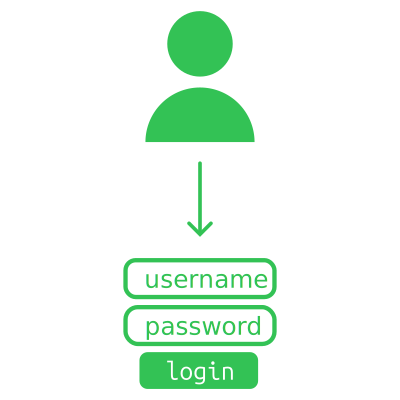

# Authentication - username & password
:::warning
Eu não estava feliz que o post era muito "aqui o código de X/Y/Z", pois gerava paredão de texto. E quando escrevo estes posts, a intenção é reforçar conhecimento para no futuro eu conseguir voltar e relembrar do assunto (e não do código em específico).  

O repositório com exemplos continua vivo em:  
https://github.com/thiagola92/learning-authentication  
:::

Username com password é uma das maneiras mais velhas de se criar autenticação no seu sistema.  

  

Nós confiaremos que aquele usuário é o dono da conta se ele souber a senha que está relacionada àquele username. Note que falei "confiaremos" pois nunca podemos ter 100% de certeza, só estamos tentando reduzir a possibilidade de ser alguém indesejado na conta.  

## Clint - register
  

Para entender como o registro de novos usuários funciona, podemos olhar como formulários em HTML funcionam.  

```html
<form action="./register">
</form>
```

Formulários coletam todos os dados dos elementos `<input>` dentro deles e enviam para o endereço especificado no atributo `action`. Tenha em mente que enviar quer dizer "mandar para aquele **endpoint** um request **HTTP**".  

:::note
Caso você já tenha feito uma API REST em qualquer linguagem, você pode começar a notar detalhes familiares. Acontece que os navegadores não fazem nenhuma mágica, eles enviam o mesmo tipo de request que você está acostumado a lidar no backend de APIs REST.  
:::

Como eu estou escrevendo isto ao mesmo tempo que testo o código, eu vou trocar o endpoint para a minha API (`http://127.0.0.1:8000/register`).  

```html
<form action="http://127.0.0.1:8000/register">
</form>
```

Nós precisamos adicionar o input do tipo `submit` pois ele é utilizado para engatilhar o envio.  

```html
<form action="http://127.0.0.1:8000/register">
  <input type="submit" value="register">
</form>
```

Se você clicar no botão de registrar, você mandara um request GET para o endpoint `register`, com nenhuma informação pois não existe nenhum campo `input` que segure informação.  

No nosso caso precisamos de um campo para o username e outro para o password:  
```html
<form action="http://127.0.0.1:8000/register">
  <input type="text" name="username" value="username"><br>
  <input type="password" name="password" value="password"><br>
  <input type="submit" value="register">
</form>
```

Note que utilizamos os tipos `text` e `password` apenas para dar o comportamento correto no navegador. O importante mesmo é o atributo `name` pois ele define o nome a qual o valor vai estar relacionado quando enviado.  

Se clicarmos no botão de registrar, enviaremos as informações na URL:  
`/register?username=username&password=password`  

Por padrão o formulário envia um request GET, o que é ótimo se você quiser compartilhar URL com alguém ou salvar no favoritos.  

Porém não é nada seguro quando estamos falando de informação sensível como a senha do usuário! Neste caso queremos enviar no corpo do request POST (onde não fica visível a qualquer pessoa olhando a tela do seu computador).  

Podemos especificar o método utilizado no request atráves do atributo `method`:  
```html
<form action="http://127.0.0.1:8000/register" method="post">
  <input type="text" name="username" value="username"><br>
  <input type="password" name="password" value="password"><br>
  <input type="submit" value="register">
</form>
```

Agora ao clicar no botão de registrar, enviaremos as informações no corpo do request e a URL para qual você vai ser direcionado **não** vai conter seus dados (`/register`).  

Corpo do request: `username=username&password=password`  

:::note
Note que no final das contas é o mesmo formato porém em lugares diferentes.  

Se você tiver uma API, conseguirá ver que ambos possuem o campo `content-type` da requisição com o valor `application/x-www-form-urlencoded`.  
:::

Tudo isto poderia ser reproduzido em python com:  
```python
import httpx
from urllib.parse import urlencode

body = urlencode({"username": username, "password": password})
headers = {"Content-Type": "application/x-www-form-urlencoded"}

httpx.post("http://127.0.0.1:8000/register", headers=headers, content=body)
```

## Server - register
Okay, seu server recebeu a requisição de cadastro do usuário. O que fazer agora? Validações!  

  

O conteúdo da requisição está no formato esperado?  

Podemos verificar se o campo `content-type` está com `application/x-www-form-urlencoded`.  
```python
if request.headers.get("Content-Type") != "application/x-www-form-urlencoded":
    raise Exception("Invalid body format")
```

Claro que isso não impede o usuário de formatar o conteúdo incorretamente, porém agora podemos assumir que ele errou o formato e enviarmos uma mensagem de erro coerente com o problema.  
```python
try:
    body = await request.body()
    body = body.decode()
    fields = parse_qs(body)
except ValueError:
    raise Exception("Body incorrectly formatted")
```

E se o usuário esquecer um dos campos? Sim, precisamos validar isto também.  
```python
if "username" not in fields or "password" not in fields:
    return Exception("Missing username or password")
```

E se o usuário tiver caracters inválido?  
E se a senha tiver caracters inválido?  
E se o usuário já existir no banco?  
...  

Acho que você já entendeu que validação é importante.  
Agora vamos falar de storage!  

  

Como se armazena o username?  
Igual a qualquer outro campo texto...  

Como se armazena a senha?  
Não se armazena senha...  

Pode parecer estranho a primeira vista mas não precisamos armazenar a senha para conferir se alguém nos deus a senha correta.  

Existem **funções hash criptográficas** que produzem saídas com propriedades que nos ajudam a conferir se a senha de um usuário está correta.  

Propriedades que nos interessão nessas funções:
- Dada uma entrada de bytes, sempre produz a mesma saída de bytes
    - Nada de especial aqui, apenas está garantindo que não é afetado por outro fatores aleatórios (tempo, temperatura, etc)
- Não existe função que reverte a operação
    - Em outras palavras, tendo a saída de bytes da função você não consegue saber a entrada que foi dada para a função hash (sem ir chutando todas as possibilidades)
- Qualquer mudança na entrada de bytes gera uma saída de bytes muito diferente
    - A ideia é que as pessoas não devem saber que as entradas são parecidas a partir da saída

Diversas funções hash criptográficas existem, cada uma com o próprio algoritmo.  
No nosso caso vamos utilizar o algoritmo sha256 para os exemplos!  

```shell
>>> sha256(entrada)
saida
```

:::note
Segurança é algo que muda com o tempo, então funções hash criptográficas seguras de antigamente podem já não ser mais seguras.  

Estou usando a função hash que usa o algoritmo sha256 apenas de exemplo, não estou considerando se é segura ou não para o ano atual.  
:::

| entrada | saída                                                            |
| ------- | ---------------------------------------------------------------- |
| abc     | ba7816bf8f01cfea414140de5dae2223b00361a396177a9cb410ff61f20015ad |
| abd     | a52d159f262b2c6ddb724a61840befc36eb30c88877a4030b65cbe86298449c9 |
| ABC     | b5d4045c3f466fa91fe2cc6abe79232a1a57cdf104f7a26e716e0a1e2789df78 |
| 123     | a665a45920422f9d417e4867efdc4fb8a04a1f3fff1fa07e998e86f7f7a27ae3 |

- Se você der a mesma entrada, vai receber a mesma saída  
- Olhando a saída você não sabe a entrada  
- A mudanaça de um bit entre "abc" e "abd" mudou totalmente a saída  

Não sei se ficou claro, mas isso é perfeito para podermos conferir se alguém acertou a senha.  

Assim que um usuário registra no serviço e nos da senha, podemos calcular o hash da senha (saída da função hash para a senha) para armazenar.  

```shell
>>> sha256(b"password").hexdigest()
'5e884898da28047151d0e56f8dc6292773603d0d6aabbdd62a11ef721d1542d8'

>>> sha256(b"mega_password").hexdigest()
'2d2c3f7eb9152d67258cd1068a64a746c130d4cca3f571bd28a86d7f7589aa25'

>>> sha256(b"senha").hexdigest()
'b7e94be513e96e8c45cd23d162275e5a12ebde9100a425c4ebcdd7fa4dcd897c'
```

| username   | hash                                                             |
| ---------- | ---------------------------------------------------------------- |
| thiagola92 | 5e884898da28047151d0e56f8dc6292773603d0d6aabbdd62a11ef721d1542d8 |
| darklord   | 2d2c3f7eb9152d67258cd1068a64a746c130d4cca3f571bd28a86d7f7589aa25 |
| juninho    | b7e94be513e96e8c45cd23d162275e5a12ebde9100a425c4ebcdd7fa4dcd897c |

Quando alguém for logar no nosso serviço, a pessoa vai inserir a senha e nós vamos conferir se o hash dessa senha é igual ao que temos no banco.  
- Se for igual, a pessoa sabe a senha e nós podemos autorizar o acesso ao serviço  
- Se não for igual, a pessoa **não** sabe a senha e nós devemos negar o acesso ao serviço  

Qual a vantagem de armazenar assim?  
Se algum hacker acessar nosso banco, ele não vai conseguir saber a senha das pessoas.  

Mesmo que a pessoa saiba que meu hash é:  
`5e884898da28047151d0e56f8dc6292773603d0d6aabbdd62a11ef721d1542d8`  
Se ela tentar o hash como senha, o hash do hash vai ser totalmente diferente.  

```shell
>>> sha256(b"5e884898da28047151d0e56f8dc6292773603d0d6aabbdd62a11ef721d1542d8").hexdigest()
'113459eb7bb31bddee85ade5230d6ad5d8b2fb52879e00a84ff6ae1067a210d3'
```

Então é isso? Temos que armazenar o hash da senha? Nope.  

  

O que acontece quando dois usuários possuem a mesma senha?  

| username   | hash                                                             |
| ---------- | ---------------------------------------------------------------- |
| thiagola92 | 5e884898da28047151d0e56f8dc6292773603d0d6aabbdd62a11ef721d1542d8 |
| darklord   | **2d2c3f7eb9152d67258cd1068a64a746c130d4cca3f571bd28a86d7f7589aa25** |
| juninho    | b7e94be513e96e8c45cd23d162275e5a12ebde9100a425c4ebcdd7fa4dcd897c |
| mmiguel    | **2d2c3f7eb9152d67258cd1068a64a746c130d4cca3f571bd28a86d7f7589aa25** |

Isso quer dizer que se um hacker advinhar a senha de `mmiguel`, ele também sabe a senha de `darklord`.  

Para previnir isso é normal adicionar **salt** às senhas, ou seja, concatenar bytes extras na senha antes de fazer o hash.  

Assim que o usuário criar a conta, criaremos um salt para ele com uma função que gera X bytes aleatórios (`os.urandom(X)`):  

```python
# No caso vamos gerar 10 bytes aleatórios.
salt = os.urandom(10)
```

| username   | salt                 |
| ---------- | -------------------- |
| thiagola92 | cea3a49482094b096acb |
| darklord   | b9f195b7ce55a51fdc0d |
| juninho    | 885cfd855add75c08a7a |
| mmiguel    | 10cc25d0c8adcbc44e9a |

Iremos inserir na função hash a concatenação de `senha + salt`.  

```shell
>>> sha256(b"password" + b"cea3a49482094b096acb").hexdigest()
'a15760e9639bc64e8908d5d2109900dcbc508e6fc5fa7b161e5149fcdaa04eee'

>>> sha256(b"mega_password" + b"b9f195b7ce55a51fdc0d").hexdigest()
'8c7044c8e42efebbf7d19027db0a00c8d2242197a0e001d5d0d977cccfaa020c'

>>> sha256(b"senha" + b"885cfd855add75c08a7a").hexdigest()
'f51f77c4575127dbf8906c60b7b1c80e01772be217c8a1c9df68e4f527b7f8eb'

>>> sha256(b"mega_password" + b"10cc25d0c8adcbc44e9a").hexdigest()
'bbb70b912376b0c266d90cd3ebd1ffa99f6c439a50ed6481bb809b99fd93d300'
```

| username   | salt                 | hash                                                             |
| ---------- | -------------------- | ---------------------------------------------------------------- |
| thiagola92 | cea3a49482094b096acb | a15760e9639bc64e8908d5d2109900dcbc508e6fc5fa7b161e5149fcdaa04eee |
| darklord   | b9f195b7ce55a51fdc0d | 8c7044c8e42efebbf7d19027db0a00c8d2242197a0e001d5d0d977cccfaa020c |
| juninho    | 885cfd855add75c08a7a | f51f77c4575127dbf8906c60b7b1c80e01772be217c8a1c9df68e4f527b7f8eb |
| mmiguel    | 10cc25d0c8adcbc44e9a | bbb70b912376b0c266d90cd3ebd1ffa99f6c439a50ed6481bb809b99fd93d300 |

Agora se um hacker tentar todas as possibilidades de senhas para o `mmiguel` e um dia acertar, ele jamais vai ser que é a mesma senha para `darklord`.  

> E se o salt gerado for o mesmo para ambos?  

Uma maneira de solucionar isto é verificar se já existe alguém com o mesmo hash e salt.  
Caso sim, gere um novo salt...  

:::warning
Minha intenção aqui era explicar o conceito.  

É importante olhar a documentação da sua linguagem/biblioteca para saber a melhor função hash a se usar!  

Por exemplo, python já disponibiliza uma função que já concatena senha e salt, e depois faz o hash (`hashlib.scrypt()`). Então não existe necessidade de fazer cada etapa dita neste post.  
:::

## Client - login

  

Quando falando de website, a maneira para logar é a mesma de se registrar:  
```python
import httpx
from urllib.parse import urlencode

body = urlencode({"username": username, "password": password})
headers = {"Content-Type": "application/x-www-form-urlencoded"}

httpx.post("http://127.0.0.1:8000/login", headers=headers, content=body)
```

E o server responde enviando cookies para que o browser use nas próximas requisições de conteúdo.  

Note que esse request utiliza o body para enviar `username` e `password`, o que deixa o body ocupado por dados relacionados ao login (ao menos que você queira fazer uma bagunça e misturar login com pedido de dados).  

Outra maneira conhecida por APIs é passar a autentição no headers pelo campo `Authorization`:  
```python
import httpx
import base64

credentials = f"{username}:{password}"
credentials = credentials.encode()
credentials = base64.b64encode(credentials)
credentials = credentials.decode()

response = httpx.get("http://127.0.0.1:8000/", headers={"Authorization": f"Basic {credentials}"})
```

Note que nesse modelo nós botamos como valor do `Authroization` o esquema e depois a credencial:  
`<scheme> <credential>`  

No nosso caso o esquema é `Basic`, onde quer dizer que vamos passar as credenciais em base 64 e concatenadas com `:`.  
`<username>:<password>`  

A vantagem desta maneira é que em uma requisição nós já conseguiriamos nos autenticar e aplicar a operação desejada na API.  

:::note
Essa maneira não é incentivada pois passar em toda requisição username e password é arriscado, basta uma pessoa má intencionado conseguir acesso a uma mensagem para obter sua senha.  

Passar em uma requisição para obter um token/cookie é válido, pois toda requisição seguinte nós utilizariamos esse token/cookie para sermos validados no server.  
:::

## Server - login

Okay, seu servidor recebeu o request de logar... O que fazer? Validações! (novamente)  

  

Se estivermos falando da mesma maneira utilizada por websites, então as validações são bem parecidas com as de registrar!  

```python
if request.headers.get("Content-Type") != "application/x-www-form-urlencoded":
    raise Exception("Invalid body format")
```

```python
try:
    body = await request.body()
    body = body.decode()
    fields = parse_qs(body)
except ValueError:
    raise Exception("Body incorrectly formatted")
```

```python
if "username" not in fields or "password" not in fields:
    return Exception("Missing username or password")
```

Se estivermos falando da maneira das APIs, temos que adaptar ao outro local onde o username e password estão mas nada complicado!  

```python
if not request.headers.get("Authorization"):
    raise Exception("Missing authorization")
```

```python
auth = conn.headers["Authorization"]
scheme, credentials = auth.split()

if scheme.lower() != "basic":
    raise Exception("Incorrect authorization protocol")
```

```python
try:
    credentials = base64.b64decode(credentials)
    credentials = credentials.decode()
    username, _, password = credentials.partition(":")
except ValueError:
    raise Exception("Credentials incorrectly formatted")
```

Chegou a hora da verdade.  
Quem mandou a requisição é o usuário verdadeiro da conta?  

  

Bem... Ele não vai ser o usuário verdadeiro se o usuário nem existir né?  

Podemos verificar isso tentando pegar do banco o salt e hash.  

```python
salt, hash = get_user_auth(username)
if not salt or not hash:
    raise Exception("Invalid user")
```

Agora vem a parte fácil... Validar se a senha que ele passou está certa! Basta calcular o hash usando a senha que nos passaram.  

```python
if sha256(password + salt).hexdigest() != hash:
    raise Exception("Wrong password")
```

Fim!  

Principalmente porque não pretendo cobrir a fundo assuntos como cookies e tokens. Mas tudo coberto já da um ótimo início para entender autenticação/login/cadastro/etc.  

## References
- https://developer.mozilla.org/en-US/docs/Web/HTTP/Headers/Authorization
- https://developer.mozilla.org/en-US/docs/Web/HTTP/Methods/POST
- https://developer.mozilla.org/en-US/docs/Web/HTTP/Headers/Content-Type
- https://www.w3schools.com/tags/att_form_enctype.asp