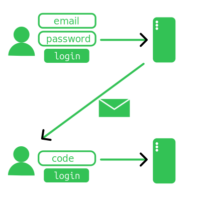
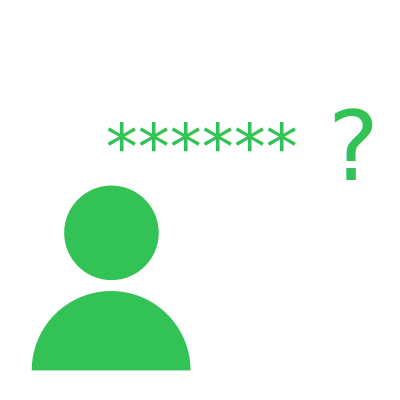

# Authentication - email & password
:::warning
Este post parte do princípio que o leitor viu o post anterior!  

Além disto este post for reescrito pois o formato não estava do meu agrado (igual ao post anterior).  

O repositório com exemplos continua vivo em:  
https://github.com/thiagola92/learning-authentication  
:::

A lógica básica é a mesma que o post anterior, porém usando o email no lugar do username.  

  

O que temos de extra é que podemos utilizar o email do usuário para nos dar mais confiança que a pessoa acessando é o dono da conta.  

## Register

### Client
Segue exatamente o mesmo passo a passo do post anterior (utilizando o email em vez de usuário).  

### Server
Segue exatamente o mesmo passo a passo do post anterior (utilizando o email em vez de usuário) porém não cadastramos o usuário ao final!  

  

O motivo é bem simples: O email fornecido é realmente da pessoa que cadastrou a conta?  

Imagina se nós terminassemos o cadastro acreditando naquele email... Dia seguinte aquele email poderia receber emails nosso, achar super esquisito e nos marcar como spam. Se isso acontecesse muito o Google iria acabar marcando nosso email corporativo como spam!  

Para resolver esse problema basta cobrarmos uma prova que a pessoa é a dona do email. Podemos fazer isso enviando um email para ela e esperando que ela nos diga algo que possue no email.  

:::note
Partindo do princípio que a pessoa dona do email é a única que deveria ter acesso ao email.  
:::

O modo clássico é gerar um código no servidor e enviar para o email da pessoa este código, agora ela precisa acessar o email e nos dizer o código para provar que ela conseguiu o código certo.  

  

Email é bom pois nós não precisamos ser dependentes de terceiros para utilizar (Gmail/Outlook/etc).  
```python
import smtplib
from email.message import EmailMessage

message = EmailMessage()
message["Subject"] = "Confirmation code"
message["From"] = "noreply@yourwebsite.com"
message["To"] = "user@example.com"
message.set_content("Your confirmation code is 123")

# I'm running my own email server for tests
with smtplib.SMTP("localhost", 8025) as s:
    s.send_message(message)
```

:::info
Utilizei a biblioteca [aiosmtpd](https://aiosmtpd.aio-libs.org/en/latest/) para criar o server de test:  
`python -m aiosmtpd -n`  

Se tudo foi feito corretamente, todo email novo deve aparecer lá no formato:  
```
---------- MESSAGE FOLLOWS ----------
Subject: Confirmation code
From: noreply@yourwebsite.com
To: user@example.com
Content: Your confirmation code is 123
X-Peer: ('127.0.0.1', 52020)

------------ END MESSAGE ------------
```
:::

Porém o exemplo acima é inseguro, pois não utiliza a SLL (que ajuda a criar uma camada de segurança entre nós e o serviço). Hoje em dia isso é obrigatório para interagir com quase todos os serviços de email (eles não vão aceitar emails sem essa segurança).  
```python
import smtplib
from email.message import EmailMessage

message = EmailMessage()
message["Subject"] = "Confirmation code"
message["From"] = "noreply@yourwebsite.com"
message["To"] = "user@example.com"
message.set_content("Your confirmation code is 123")

with smtplib.SMTP("localhost", 8024) as s:
    s.starttls()
    s.send_message(message)
```

:::info
Levantei outro server de email e nele estou utilizando TLS.  

Criei meu certificado auto-assinado:  
`openssl req -x509 -newkey rsa:4096 -keyout key.pem -out cert.pem -days 365 -nodes -subj '/CN=localhost'`  

E utilizei ele durante a inicialização do server:  
`python -m aiosmtpd -n --tlscert cert.pem --tlskey key.pem -l localhost:8024`  
:::

Então é isso? Podemos mandar email para provedores como Gmail? Nope.  

  

Deve ser bem óbvio que embora este código funcione localmente, ele jamais passaria por qualquer segurança do nível de aplicação.  

Ele possui TLS para proteger contra [man-in-the-middle](https://en.wikipedia.org/wiki/Man-in-the-middle_attack) mas como que o provedor vai saber que nós somos os donos daquele email? Se nós botarmos `noreply@gmail.com`, nós temos que provar que temos acesso à aquela conta no Gmail.  

A maneira clássica é logar na conta.  
```python
import smtplib
from email.message import EmailMessage

# Removed "From" because providers will use the email used in s.login()
message = EmailMessage()
message["Subject"] = "Confirmation code"
message["To"] = "user@example.com"
message.set_content("Your confirmation code is 123")

with smtplib.SMTP("localhost", 8024) as s:
    s.starttls()
    s.login("noreply@gmail.com", "password")
    s.send_message(message)
```

Este código **não** vai funcionar!  

Hoje em dia já sabemos que usuário e senha sozinhos não providênciam uma segurança forte durante a autenticação, por isso que Google nos cobra outros métodos de [MFA](https://en.wikipedia.org/wiki/Multi-factor_authentication) para provar que nós somos nós mesmos durante os logins (telefone, passkeys, authenticators, ...).  

Google requer que você explicitamente adicione uma senha para aquele "app" e mesmo assim ele não recomenda fazer isto!  
[Link para a resposta no StackOverflow](https://stackoverflow.com/questions/10147455/how-to-send-an-email-with-gmail-as-provider-using-python/27515833#comment138495306_27515833)  

Bem, vamos parar por aqui pois eu apenas tenho interesse em ver o conceito de segurança com o email (não quero ensinar a se autenticar em diversos provedores com email).  

### Client 2
Existe duas opções aqui, a primeira é o server ter armazenado numa tabela temporária seu email, código enviado por email e hash da senha.  

| email                | code | hash                                                             |
| -------------------- | ---- | ---------------------------------------------------------------- |
| thiagola92@email.com | 4893 | 5e884898da28047151d0e56f8dc6292773603d0d6aabbdd62a11ef721d1542d8 |
| darklord@email.com   | 3892 | 2d2c3f7eb9152d67258cd1068a64a746c130d4cca3f571bd28a86d7f7589aa25 |
| juninho@email.com    | 0283 | b7e94be513e96e8c45cd23d162275e5a12ebde9100a425c4ebcdd7fa4dcd897c |

Neste caso basta o usuário enviar o código para o server validar a conta.  
```python
import httpx
from urllib.parse import urlencode

body = urlencode({"code": code})
headers = {"Content-Type": "application/x-www-form-urlencoded"}

httpx.post("http://127.0.0.1:8000/register/code", headers=headers, content=body)
```

:::note
Embora eu tenha feito como um requisição POST, não existe nenhuma obrigação de ser assim.  

Uma maneira mais familiar é o usuário receber uma URL com o código/token para o usuário acessar e isto seria o suficiente para confirmar.  
```
http://127.0.0.1:8000/register/{code}
```
:::

A outra é ele não ter armazenado o hash e só esperar que você envie a senha novamente.  

| email                | code |
| -------------------- | ---- |
| thiagola92@email.com | 4893 |
| darklord@email.com   | 3892 |
| juninho@email.com    | 0283 |

```python
import httpx
from urllib.parse import urlencode

body = urlencode({"email": email, "password": password, "code": code})
headers = {"Content-Type": "application/x-www-form-urlencoded"}

httpx.post("http://127.0.0.1:8000/register/code", headers=headers, content=body)
```

:::note
Em ambas as tabelas é normal de ter a data de criação do código, para que ele não fique válido para sempre (não queremos que ninguém chute todas as opções de código).  
:::

### Server 2
Segue exatamente o mesmo passo a passo do post anterior (utilizando o email em vez de usuário).  

## Recovery

### Client
A grande vantagem de ter email é adicionar um ponto de recuperação de senha.  

  

Dado que o usuário esqueceu a senha, ele só precisa requisitar o resete de senha da conta relacionada a aquele email.  
```python
import httpx
from urllib.parse import urlencode

body = urlencode({"email": email})
headers = {"Content-Type": "application/x-www-form-urlencoded"}

httpx.post("http://127.0.0.1:8000/recovery", headers=headers, content=body)
```

Como estamos falando do caso em que o usuário não lembra a senha, não podemos cobrar nenhuma autenticação... Em outras palavras, qualquer pessoa má intencionada pode ficar requisitando e resta ao server tomar cuidados para elas não conseguirem acesso.  

### Server
É a mesma ideia do login, queremos confirmar que é o dono da conta então mandamos para o email dele um código/token para ele utilizar na alteração da senha atual dele.  

Lembrando que é importante botarmos tempo para o usuário fazer essa alteração e limite de tentativas, pois não queremos que usuários má intencionados usem força bruta para descobrir o código/token.  

### Client 2
Basicamente idêntico ao registrar, porém temos que fornecer a nova senha. Isto pode ser feito tudo em uma requisição ou em duas (acessar o URL com token e inserir a nova senha em um form).  

### Server 2
Valide o código/token!  

Cada tentativa errada é um sinal de perigo, por isso é importante lembrar:  
- Invalidar o código/token depois de certo tempo
    - Por isto alguns tokens são grandes, pois nunca é possível chutar todas as possibilidades antes do tempo esgotar
- Contar o número de tentativas de acertar o código/token para um email
    - Importante invalidar o código depois de certo número de tentativas, não queremos X máquinas tentando acertar o código

  

## References
- https://docs.python.org/3/library/smtplib.html
- https://aiosmtpd.aio-libs.org/en/latest/
- https://stackabuse.com/how-to-send-emails-with-gmail-using-python/
- https://www.youtube.com/watch?v=PJo5yOtu7o8
- https://mailtrap.io/blog/smtp/
- https://stackoverflow.com/questions/10147455/how-to-send-an-email-with-gmail-as-provider-using-python/27515833#comment138495306_27515833