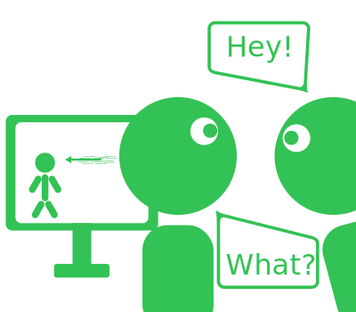
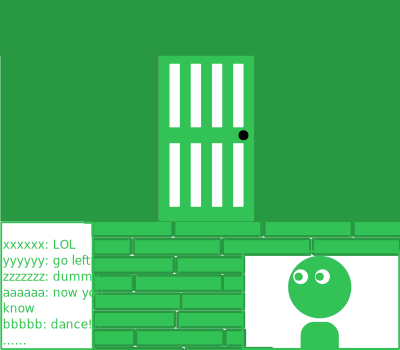

:::warn
My english is trash :v
:::

# Making games for streamers seems hard as f***

Remember the old days where we would immerse ourselfs while reading books?  

I don't... I suck at books.  

  

But you know the feeling, right? We just have to change books for movies/games/sports...  

Pretty sure that after the title and text above, you can guess everything that I'm going to write about (if you reflect deep enough, you don't even have to read this post...).  

## Storytelling

What do theaters, movie theaters and libraries have in common? When you make noise, people go "Shh".  

  

I'm joking... They are storytelling places.  

Where you go to read, watch, see, or hear a predetermined story. The author tries to build a path for how you should feel in that storytelling (sometimes is not even close).  

Video games are storytelling? If you put a story in it... Yes! They may not be the best storytelling because it's hard to control what players feel, but that's why people insert cinematics in games. 

Cinematics are a way of telling a story without letting you ruin everything (I'm being dramatic). Just think about what stupid thing players could if you let them free in the cinematic (probably throw themselves from a high place... I don't know).  

People love to test the boundaries of the games or try to find something that the [author didn't count on](https://www.youtube.com/watch?v=lZXCgZZn6jg).  

Anyway, I'm getting off track. It's harder than movies and books because it's not just storytelling, but it's still possible to do a great job at it.  

:::info
> "It's not **just** storytelling"

Not saying that storytelling is easy, just that when you have to count everything that the player can do... Telling a good story becomes difficult.  

Think about a great book or movie that somebody attempted to transform into a game... It's really hard to tell the same story. The developer may want them to feel like a great hero, but maybe they are pissed after dying 20 times to the same boss.  

¯\\\_(ツ)\_/¯
:::

## Immerse our selfs

Remember when I joked about places where people "Shh" you? I wasn't joking.  

  

Is kind of obvious that people "Shh" in those places because it's really hard to immerse in something, but it's very easy to lose focus.  

When I say "immerse", think about the situation where you are so focused on something that you ignore somebody calling your name.  

Obviously, is important for storytelling games (except comedy, which is a free ticket to "f*ck it" town), but it's also important for competitive games! You don't have to immerse yourself in feelings but in the game mechanics (thinking about everything that others players can do).  

That's probably why we get more **angry** or **sad** after losing a competitive game where we invest ourselfs to win. Over time, we learn to manage these feelings better, but it's still not a happy feeling.    

:::note
> "I don't get sad or angry"

Err... Not even fustrated? Are you sure that you were invested in the game? Maybe you just didn't care about the game.  
:::

## Attention problem

Attention is a limited resource... We can't make 20 tasks at the same time and get the same quality of making one with all our attention (exceptions exist, but I don't think you are one of them).  

  
(It was supposed to be someone getting distracted and dying in the game...)  

A classic example is your parents trying to talk to you while you are playing. In this cases, you attempt to multitask between playing and answering them (if you are like me, you are probably dead in the game).  

In case of games/movies/books storytelling the same can happen... How can you get in the horror game mood of "I'm going to die, I want to run" if you have to stop to do something for your parents just before the scary moment?  

:::note
> Stop blaming the player, is also devs fault.

You want me to blame developers? Okay, it's also the developers fault for not making great storytelling that locks you into the screen... But this post is more about our problem, I can't just start badmouthing developers now (this post would get BIG and I don't have time to complain about everyone (I actually have... I'm unemployed... Sad...)).  
:::

## Streamers

> "Making games for streamers seems hard as f***"

How do you capture the attention of someone who may stop to read others people messages and thinking about an answer to them?  

How do you reproduce into another the feeling that you had when children where you would play in front of TV without noticing your parents calling you?  

How do you tell about the struggles of your character if the other person is busy reflecting their life to other people?  

Streamers are not "just" players, they are entertainment too! This means that they need to share their attention with their viewers.  

- Look at the chat to check if the stream didn't go offline
- Interact with the chat to show that you cares about them
- Thanks the subscrpitions and donations
- Express what is on their mind while playing because the viewers want to know

I'm not here to blame anyone, just pointing the difficulties.  

Compared to other options for playing games:  

- Playing the game alone in the room
    - You don't have to say a word
- Recording a video for Youtube
    - People normally want to know what is on your mind
    - I didn't reflect enough on this so I don't have another point... Sorry Youtubers

## Conclusion

I don't have any...  

I don't know how developers attack this... They invest less in long immersive moments? They do more short content? They always assume that the player is a streamer? I mean, you can't just ignore the fact that a streamer could badmouth your game (this can affect sales, right?).  