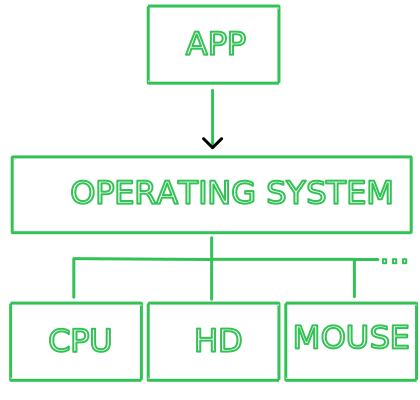
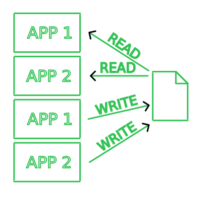

# Lock Files in Process
  

Quando você quer ler o arquivo, você pede ao sistema operacional pelo conteúdo do arquivo.  

Quando você quer escrever no arquivo, você pede ao sistema operacional para inserir o conteúdo no arquivo.  

É importante saber que o sistema operacional toma diversos cuidados para que desenvolvedores não acessem diretamente o hardware, ou seja, por baixo dos panos você está pedindo para o sistema operacional ler/escrever.  

- C
    - `fgets()`
    - `fwrite()`
- Python
    - `file.read()`
    - `file.write()`
- Rust
    - `file.read_to_string()`
    - `file.write_all()`
- Go
    - `os.ReadFile()`
    - `os.WriteFile()`

Veremos como garantir a segurança de um arquivo quando se tem múltiplos processos querendo altera-lo.  

## Process
A função utilizada para se criar processos é `fork()`, está função faz com que o atual processo crie um processo filho quase idêntico e executando o mesmo código que o pai.  

Olhe este código que printa duas vezes "Hi":  

```C
#include <stdio.h>
#include <unistd.h>

int main() {
    fork();
    printf("Hi\n");
}
```

Se você executa-lo irá notar que o filho é tão igual ao pai que ele continua exatamente do mesmo local que o pai se encontrava (logo após `fork()` retornar um valor). Se tivessemos variáveis, poderiamos ver que até o valor delas são idênticos ao do pai.  

No entanto, precisamos de uma maneira de reconhecer quem é o pai e filho, caso contrário este código executária exatamente a mesma coisa para ambos (não seria nada produtivo). Acontece que a função `fork()` retorna um valor e este valor é utilizado para sabermos se estamos no pai ou no filho.  

```C
#include <stdio.h>
#include <unistd.h>

int main() {
  int pid = fork();

  if (pid == -1) {
    printf("Failed to create child process\n");
  } else if (pid == 0) {
    printf("I'm the child process\n");
  } else {
    printf("I'm the parent process\n");
  }
}
```

A função `fork()` vai retornar ao pai o PID do filho (ou -1 em caso de error).  
A função `fork()` vai retornar ao filho zero.  

:::tip
Normalmente o código do pai e filho são inseridos em funções em vez de deixar tudo dentro de um if/else.  

```C
if(pid == 0) {
  child_code();
} else {
  parent_code();
}
```

Ou se utiliza funções `exec` para transformar completamente o código executado naquele processo.  
:::

## Problem
  

Quando dois processos interagem com o mesmo arquivo, pode acontecer da informação ser preenchida incorretamente? Afinal, precisamos primeiramente descobrir se isso é possível ou não de acontecer.  

Como o escalonamento pode ser imprevisivel, uma maneira de testar se durante a interação com um arquivo houve troca de processo é repetindo a ação diversas vezes e ver se pelo menos uma vez ocorreu.  

O seguinte código irá ser executado para o processo pai e filho:  

```C
int count = 0;
FILE* file = fopen("example.txt", "w+");

while(count < 10000) {
    int i;
    
    fscanf(file, "%d", &i);
    fseek(file, 0, SEEK_SET);
    fprintf(file, "%d     ", ++i);
    
    count++;
}

fclose(file);
```

O código irá ler o atual número do arquivo, mover o ponteiro para o início do arquivo e sobreescrever o número.  

:::note
```C
fprintf(file, "%d     ", ++i);
```

Por que inserir espaço após o número? Foi uma maneira de evitar que o número de ambos processos se misturem.  

Por exemplo: Processo 1 escreve 5000 e processo 2 escreve 9, o arquivo irá conter "9000" pois o 9 foi escrito em cima do 5.  
:::

Agora só precisamos adicionar a lógica de criar processo vista anteriormente:  

```C
#include <stdio.h>
#include <unistd.h>

void code() {
  int count = 0;
  FILE* file = fopen("example.txt", "w+");
  
  while(count < 10000) {
    int i;
    
    fscanf(file, "%d", &i);
    fseek(file, 0, SEEK_SET);
    fprintf(file, "%d     ", ++i);
    
    count++;
  }
  
  fclose(file);
}

int main() {
  FILE* file = fopen("example.txt", "w");
  fputc('0', file);
  fclose(file);
  
  int pid = fork();

  if (pid == -1) {
    printf("Failed to create child process\n");
  } else if (pid == 0) {
    code();
    printf("Child finished\n");
  } else {
    code();
    printf("Parent finished\n");
  }
}
```

Quando executei este código para 10 iterações, o valor final do arquivo foi 20.  
Quando executei este código para 1000 iterações, o valor final do arquivo foi 1000.  
Quando executei este código para 10000 iterações, o valor final do arquivo foi 10015.  

O que somos capaz de deduzir com isto?  

- O resultado é imprevisível pois não temos controle de quando o escalonador vai trocar os processos
- Dependendo do volume de iterações e da máquina do usuário, um processo pode ou não conseguir fazer a tarefa antes do escalonador trocar o processo
- Se houver troca durante uma tarefa, pode corromper o resultado do arquivo

Quais as chances disto acontecer? Depende do software, pois existem arquivos que a chance de dois softwares interagirem ao mesmo tempo é 0%.  

## Locks
Acontece que existe mais de uma maneira de aplicar locks no Linux.  

  

- [flock](https://man7.org/linux/man-pages/man2/flock.2.html)
  - **f**ile **lock**
  - Origem do sistema operacional BSD
- [lockf](https://man7.org/linux/man-pages/man3/lockf.3.html)
  - **lock** **f**ile
  - POSIX
  - É uma versão simplificada do _fcntl "Advisory record locking"_
- [fcntl "Advisory record locking"](https://man7.org/linux/man-pages/man2/fcntl.2.html)
  - **f**ile **c**o**nt**ro**l**
  - POSIX
  - Uma função capaz de fazer diversas operações sobre file descriptors
    - Uma delas é utilizar "Advisory record locking"
- [fcntl "Open file description locks (non-POSIX)"](https://man7.org/linux/man-pages/man2/fcntl.2.html)
  - **f**ile **c**o**nt**ro**l**
  - Linux specific
    - Existem propostas para ser adicionado ao padrões POSIX
  - Uma função capaz de fazer diversas operações sobre file descriptors
    - Uma delas é utilizar "Open file description locks (non-POSIX)"

Se quiser saber mais sobre cada um, é bom ler o post no blog: https://gavv.net/articles/file-locks/  
Incrivel como um blog de 8 anos atrás me ajudou mais do que pesquisas no Google.  

### flock

```C
#include <stdio.h>
#include <stdlib.h>
#include <string.h>
#include <sys/file.h>
#include <unistd.h>

#define BUFFER_SIZE 256

void code() {
  int count = 0;
  char *buffer = malloc(sizeof(char) * BUFFER_SIZE);
  int fd = open("example.txt", O_RDWR);

  while (count < 10000) {
    int i;

    flock(fd, LOCK_EX);
    lseek(fd, 0, SEEK_SET);
    read(fd, buffer, BUFFER_SIZE);
    i = atoi(buffer) + 1;
    sprintf(buffer, "%d     ", i);
    lseek(fd, 0, SEEK_SET);
    write(fd, buffer, strlen(buffer));
    flock(fd, LOCK_UN);

    count++;
  }

  close(fd);
}

int main() {
  FILE *file = fopen("example.txt", "w");
  fputc('0', file);
  fclose(file);

  int pid = fork();

  if (pid == -1) {
    printf("Failed to create child process\n");
  } else if (pid == 0) {
    code();
    printf("Child finished\n");
  } else {
    code();
    printf("Parent finished\n");
  }
}
```

### lockf

```C
#include <fcntl.h>
#include <stdio.h>
#include <stdlib.h>
#include <string.h>
#include <unistd.h>

#define BUFFER_SIZE 256

void code() {
  int count = 0;
  char *buffer = malloc(sizeof(char) * BUFFER_SIZE);
  int fd = open("example.txt", O_RDWR);

  while (count < 10000) {
    int i;

    lockf(fd, F_LOCK, 0);
    read(fd, buffer, BUFFER_SIZE);
    i = atoi(buffer) + 1;
    sprintf(buffer, "%d     ", i);
    lseek(fd, 0, SEEK_SET);
    write(fd, buffer, strlen(buffer));
    lockf(fd, F_ULOCK, 0);

    count++;
  }

  close(fd);
}

int main() {
  FILE *file = fopen("example.txt", "w");
  fputc('0', file);
  fclose(file);

  int pid = fork();

  if (pid == -1) {
    printf("Failed to create child process\n");
  } else if (pid == 0) {
    code();
    printf("Child finished\n");
  } else {
    code();
    printf("Parent finished\n");
  }
}
```

### fcntl - "Advisory record locking"

```C
#include <fcntl.h>
#include <stdio.h>
#include <stdlib.h>
#include <string.h>
#include <unistd.h>

#define BUFFER_SIZE 256

void code() {
  int count = 0;
  struct flock fl;
  char *buffer = malloc(sizeof(char) * BUFFER_SIZE);
  int fd = open("example.txt", O_RDWR);

  fl.l_whence = SEEK_SET;
  fl.l_start = 0;
  fl.l_len = 0;

  while (count < 10000) {
    int i;

    fl.l_type = F_WRLCK;
    fcntl(fd, F_SETLKW, &fl);
    lseek(fd, 0, SEEK_SET);
    read(fd, buffer, BUFFER_SIZE);
    i = atoi(buffer) + 1;
    sprintf(buffer, "%d     ", i);
    lseek(fd, 0, SEEK_SET);
    write(fd, buffer, strlen(buffer));
    fl.l_type = F_UNLCK;
    fcntl(fd, F_SETLKW, &fl);

    count++;
  }

  close(fd);
}

int main() {
  FILE *file = fopen("example.txt", "w");
  fputc('0', file);
  fclose(file);

  int pid = fork();

  if (pid == -1) {
    printf("Failed to create child process\n");
  } else if (pid == 0) {
    code();
    printf("Child finished\n");
  } else {
    code();
    printf("Parent finished\n");
  }
}
```

## References
- https://www.youtube.com/watch?v=ioJkA7Mw2-U
    - O importante do video é o início que explica como chamadas ao sistema são feitas
- https://man7.org/linux/man-pages/man3/lockf.3.html
- https://man7.org/linux/man-pages/man2/flock.2.html
- https://man7.org/linux/man-pages/man2/fcntl.2.html
- https://man7.org/linux/man-pages/man3/flockfile.3.html
- https://man7.org/linux/man-pages/man3/fdopen.3.html
- https://en.wikipedia.org/wiki/Unistd.h
- https://en.wikipedia.org/wiki/C_standard_library
- https://en.wikipedia.org/wiki/C_file_input/output
- https://en.wikipedia.org/wiki/File_descriptor
- https://en.wikipedia.org/wiki/File_locking
- https://gavv.net/articles/file-locks/