# Godot GUI Tips


## 1 - Performance
Mude o modo de renderização para *Compatibility*, não é como se você fosse precisar de qualquer renderização além do básico para desenhar uma janela na tela.  

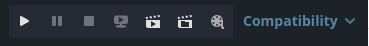  

Ative *Application > Run > Low Processor Mode* para que tenha um delay entre as renderizações da janela e apenas renderizar se alguma mudança for detectada. Em jogos a tela muda constantemente, então esse tipo de delay e validação só atrapalham mas como estamos falando de GUI que altera bem menos, isto ajuda muito.  

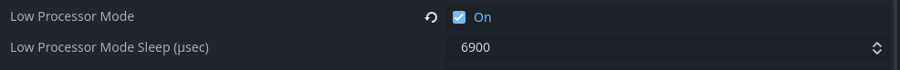  

## 2 - Window Title Bar
Por padrão o nosso sistema operacional nos providência o gráfico básico de uma janela e nos deixa responsável por desenhar o conteúdo dentro dela.  

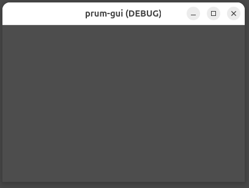  

O lado positivo é que isto nos providência o básico de uma janela, como aqueles 3 botões no topo da direita (minimizar, máximizar, fechar, ...).  

Porém note que, dependendo do sistema operacional, mais opções podem estar disponíveis! Se eu clicar com o botão direito na title bar do topo, podemos ver mais ações:  

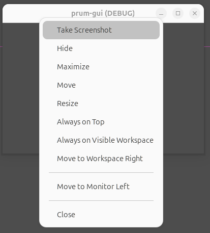  

Se ativarmos *Display > Window > Size > Borderless*, o sistema operacional deixará de adicionar a title bar no topo:  

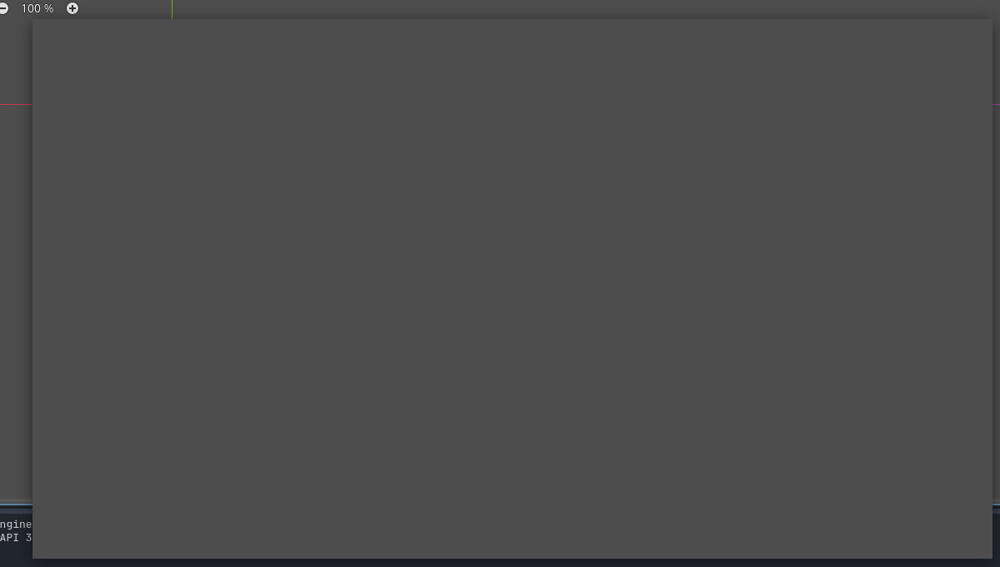  

Basicamente ele está assumindo que você mesmo irá desenhar a title bar no topo caso queira (normalmente em jogos isto não faz sentido).  

:::info
Borderless ou não, ainda se trata de uma janela no seu sistema operacional então alguns atalhos podem continuar funcionando (`Super + Up/Down/Left/Right`, `Alt + Space`).  
:::

## 3 - Multiple Windows
Janelas abertas são tratadas como processos filhos, ou seja, o encerramento de uma janela pai irá encerrar os filhos.  

Caso queiramos ter múltiplas janelas idênticas, igual a editores de textos e navegadores, precisamos ter certeza que a janela principal (processo inicial) não possa ser encerrado da maneira padrão (clickando no botão de fechar).  

Podemos resolver isto escondendo a janela principal e apenas exibindo as subwindows.  

Ative *Display > Window > Size > Transparent* para que o fundo cinza padrão não seja renderizado durante a execução.  

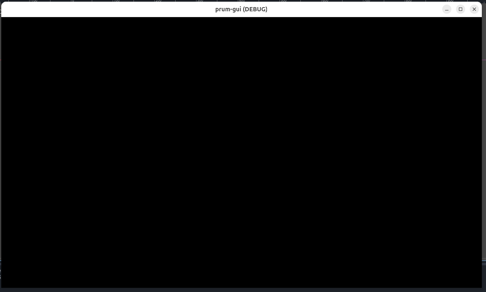  

:::note
Acredito que a cor padrão do canvas é preto, por isto deixar de pintar vai deixar a janela preta
:::

Ative *Display > Window > Per Pixel Transparency > Allowed* para que o fundo realmente seja transparente (caso contrário vai ficar o canvas preto).  

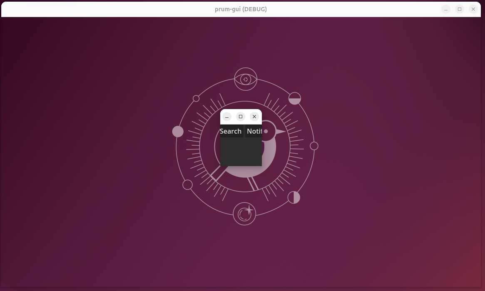  

:::warning
Existe uma configuração que eu ainda não entendi a necessidade: *Rendering > Viewport > Transparent Background*.  

Mas a documentação menciona ela como necessária.  
:::

**Como visto na sessão anterior...**  

Ative Display > Window > Size > Borderless para o sistema operacional deixará de adicionar a title bar no topo.  

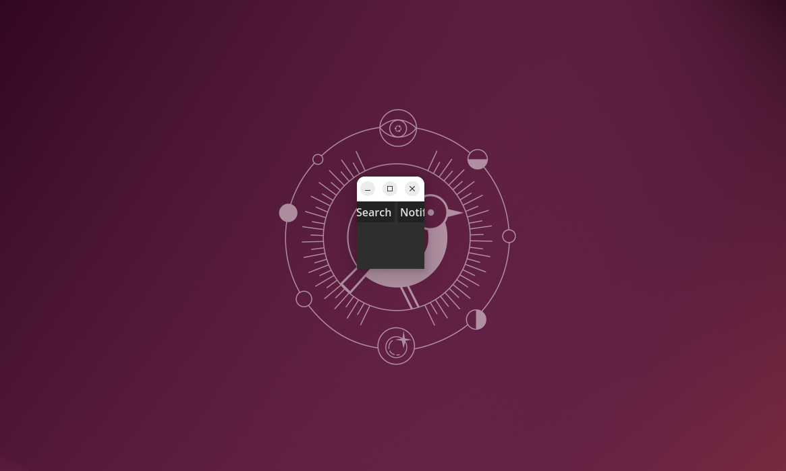  

Embora ela esteja transparente, ela ainda é uma janela como as outras. Podemos conferir que ela ainda aparece quando apertando Alt+Tab (ou apenas apertando Alt no Ubuntu).  

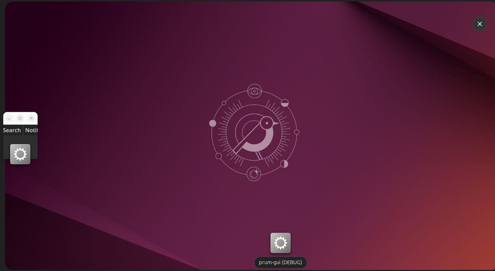  

Agora nós temos que tratar inputs!

**Primeiro** podemos notar que se está janela for posta na frente de outra, ela não irá deixar de consumir os seus clicks (mesmo que você queira selecionar algo na janela de trás).  

Para resolver isto podemos alterar janela raiz (criada quando seu programa inicia) para repassar adiante clicks do mouse.  

```gdscript
func _ready() -> void:
	get_window().mouse_passthrough = true
```

**Segundo** podemos notar que ela ainda está processando teclas (pode ser selecionada pelo `Alt + Tab`, fechada por `Alt + F4`, maximizada com `Super + Up`, etc).  

Ative *Display > Window > Size > No Focus* para que ela não possa ser focada (até por atalhos).  

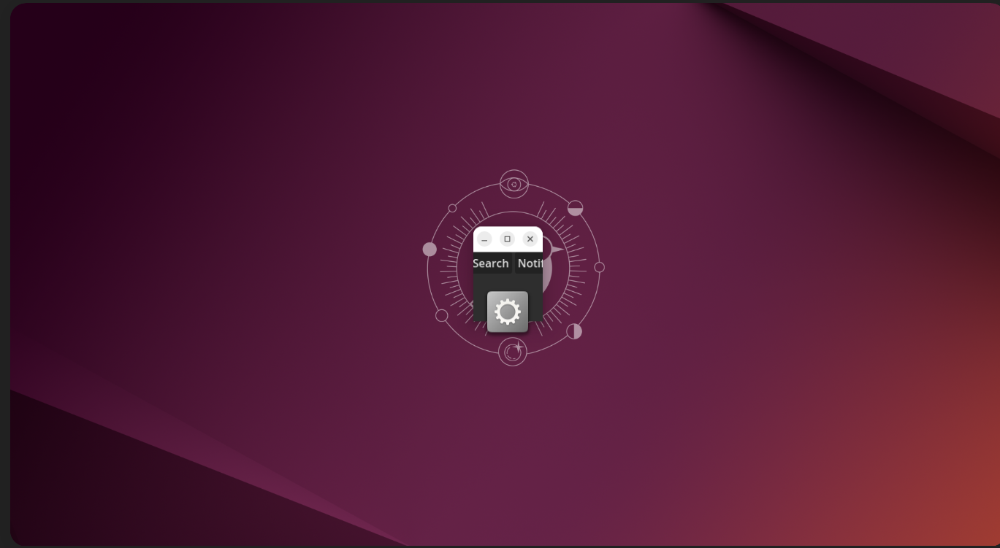  

Lembre que fechar o processo pai fecha todos os filhos, porém fechar todos os filhos não fecha o pai.

Isto quer dizer que o processo pai continua rodando mesmo se o usuário fechar todas as janelas filhas. Agora o usuário apenas conseguiria encerrar o programa pelo "gerenciador de tarefas" ou terminal.  

Para tratar isto podemos ligar um signal a um método responsável por notar quando a quantidade de filhos mudar e encerrar o programa se necessário.  

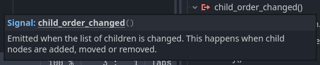

```gdscript
func _on_child_order_changed() -> void:
	if get_child_count() == 0:
		get_tree().quit()
```

:::note
Isto é apenas uma maneira de tratar!  

Nós poderiamos checar a cada frame se todas as janelas foram fechadas, poderiamos fazer os filhos avisarem o pai quando fossem encerrados, etc.  
:::

Agora precisamos entender que cada janela aberta é uma subwindow. Existem dois tipos de subwindows:
1. Subwindows
	- Quando sua janela pede ao sistema operacional para criar uma janela filha dela
	- Sua janela filha vai possuir a title bar padrão de janelas
2. Embed subwindows
	- Quando sua janela simula outra janela dentro dela mesmo
	- Isto impossibilita ela de ser mover para fora da janela pai

Se estamos tratando de uma aplicação que possui múltiplas janelas, precisamos que ela se mova para fora da janela pai. Caso contrário isso ocorreria:  

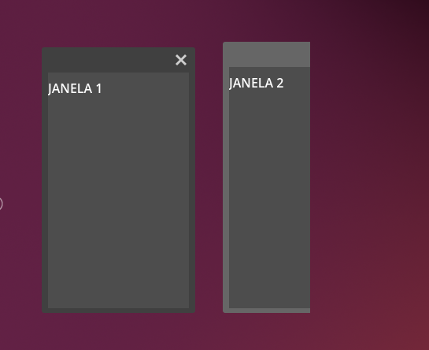  

A janela 2 está saindo do limite da janela pai.  

Poderiamos inicializar a janela pai maximizada para evitar isto porém outros problemas iriam aparecer, por exemplo: Janela pai ignorar clicks e teclas, tornando impossível interagir com as janelas simuladas nele.  

Desative *Display > Window > Subwindows > Embed Subwindows* para que as subwindows sejam tratadas como janelas reais pelo sistema operacional (em vez de simuladas pela janela pai).  

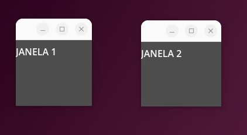  

Mas se quisermos ter uma title bar de janela única para as nossas janelas? Podemos fazer o mesmo que fizemos com janela principal, torna-la borderless.  

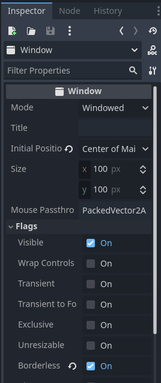  

Dentro das propriedades da Janela, ative *Flags > Borderless*.  

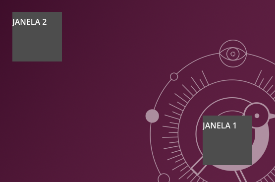  

Agora nós seriamos responsáveis por criar a title bar no topo da janela. Desta maneira poderiamos fazer uma title bar única igual ao Google Chrome ou Steam!  

## 4 - Custom Title Bar
Ter uma title bar própria é relativamente raro hoje em dia, pois muitas vezes requer reinventar a roda sem trazer benifícios reais.  

Mas isto não quer dizer que nenhuma aplicação faz isto:  
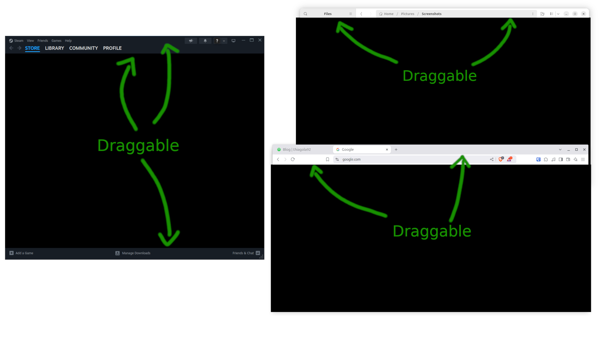  
<sub>(Steam, GNOME Files, Google Chrome)</sub>  

Note que as 3 aplicações aproveitaram o espaço para providênciar mais informações e funcionalidades ao usuário. Porém nós vamos focar em pelo menos reproduzir o básico:  
1. Exibir titulo
2. Providênciar botões de minimizar, maximizar e fechar
3. Double click maximizar
4. Arrastar a title bar deve mover a janela
5. Redimensionar janela se arrastar as bordas
6. Snap para um dos cantos do monitor quando arrastado para ele

Depois disso você deve ser capaz de adicionar ou remover mais utilidades conforme a sua vontade.  

:::warning
Estarei partindo do princípio que queremos customizar uma title bar na janela principal, por isto o código utiliza `get_window()`, mas adaptações podem ser necessárias caso esteja tratando subwindows.  
:::

### Exibir Titulo
Basta utilizar o node Label.  

### Minimize, Maximize, Close Buttons
Basta utilizar 3 nodes Button tratando o signal `pressed`:  

```gdscript
func _on_minimize_pressed() -> void:
	get_window().mode = Window.MODE_MINIMIZED


func _on_maximize_pressed() -> void:
	if get_window().mode == Window.MODE_MAXIMIZED:
		get_window().mode = Window.MODE_WINDOWED
	else:
		get_window().mode = Window.MODE_MAXIMIZED


func _on_close_pressed() -> void:
	get_tree().quit()
```

:::tip subwindows tip
É importante tratar o signal `close_requested` vindo da janela, pois é por ele que você recebe notificações que o usuário tentou fechar de outras maneiras (taskbar do windows, etc).  
:::

### Double Click Maximize
Container não possui signal para isto diretamente porém podemos utilizar o signal mais geral `gui_input`.  

```gdscript
func _on_minimize_pressed() -> void:
	...


func _on_maximize_pressed() -> void:
	...


func _on_close_pressed() -> void:
	...


// highlight-start
func _on_title_bar_gui_input(event: InputEvent) -> void:
	if event is InputEventMouseButton:
		_on_title_bar_mouse_button(event)


func _on_title_bar_mouse_button(event: InputEventMouseButton) -> void:
	if event.button_index == MOUSE_BUTTON_LEFT and event.double_click:
		_on_title_bar_double_click()


func _on_title_bar_double_click() -> void:
	match get_window().mode:
		Window.MODE_MAXIMIZED:
			get_window().mode = Window.MODE_WINDOWED
		_:
			get_window().mode = Window.MODE_MAXIMIZED
// highlight-end
```

Já estamos dividindo em funções menores pois os passos seguintes irão adicionar mais funcionalidades nestas funções gerais.  

### Drag Window
A princípio, arrastar a janela pode ser resumido em saber duas coisas:  
- Saber se o click do mouse está sendo pressionado
- Onde que o click estava quando começou

```gdscript
// highlight-start
var _title_bar_dragging: bool = false

var _title_bar_dragging_start: Vector2i
// highlight-end


func _on_minimize_pressed() -> void:
	...


func _on_maximize_pressed() -> void:
	...


func _on_close_pressed() -> void:
	...


func _on_title_bar_gui_input(event: InputEvent) -> void:
	if event is InputEventMouseButton:
		_on_title_bar_mouse_button(event)
	// highlight-start
	elif event is InputEventMouseMotion:
		_on_title_bar_mouse_motion(event)
	// highlight-end


func _on_title_bar_mouse_button(event: InputEventMouseButton) -> void:
	if event.button_index == MOUSE_BUTTON_LEFT and event.double_click:
		_on_title_bar_double_click()
	// highlight-start
	elif event.button_index == MOUSE_BUTTON_LEFT and event.pressed:
		_title_bar_dragging = true
		_title_bar_dragging_start = get_global_mouse_position()
	elif event.button_index == MOUSE_BUTTON_LEFT and not event.pressed:
		_title_bar_dragging = false
	// highlight-end


func _on_title_bar_double_click() -> void:
	...


// highlight-start
func _on_title_bar_mouse_motion(_event: InputEventMouseMotion) -> void:
	if _title_bar_dragging:
		_on_title_bar_dragged()


func _on_title_bar_dragged() -> void:
	match get_window().mode:
		Window.MODE_WINDOWED:
			get_window().position += get_global_mouse_position() as Vector2i - _title_bar_dragging_start
// highlight-end
```

:::tip subwindows tip
**Primeiro**: Talvez seja bom mover para o centro da tela a janela pois a posição poder não estar correta durante a inicialização (bug?):  

```gdscript
func _ready() -> void:
	get_window().move_to_center()
```

**Segundo**: Talvez seja necessário utilizar `get_local_mouse_position()` em vez de `get_global_mouse_position()` pois deve ser necessário o canvas da própria subwindow.  
:::

Esse foi apenas o essencial sobre arrastar, agora podemos pensar em implementar detalhes sobre a ação de arrastar janelas.  

Por exemplo: Quando o usuário tentar arrastar uma janela máximizada, ela automaticamente sai do máximizado e se posiciona para que o mouse esteja proporcionalmente na posição correta.   

```gdscript
var _title_bar_dragging: bool = false

var _title_bar_dragging_start: Vector2i

// highlight-next-line
var _title_bar_dragging_adjustment: float = 0


func _on_minimize_pressed() -> void:
	...


func _on_maximize_pressed() -> void:
	...


func _on_close_pressed() -> void:
	...


func _on_title_bar_gui_input(event: InputEvent) -> void:
	...


func _on_title_bar_mouse_button(event: InputEventMouseButton) -> void:
	...


func _on_title_bar_double_click() -> void:
	...


func _on_title_bar_mouse_motion(event: InputEventMouseMotion) -> void:
	...


func _on_title_bar_dragged() -> void:
	match get_window().mode:
		Window.MODE_WINDOWED:
			get_window().position += get_global_mouse_position() as Vector2i - _title_bar_dragging_start
// highlight-start
		Window.MODE_MAXIMIZED:
			_title_bar_dragging_adjustment = get_global_mouse_position().x / get_window().size.x
			get_window().mode = Window.MODE_WINDOWED


func _on_resized() -> void:
	if _title_bar_dragging_adjustment != 0:
		get_window().position += (get_global_mouse_position() as Vector2i)
		get_window().position.x -= get_window().size.x * _title_bar_dragging_adjustment
		_title_bar_dragging_start = get_global_mouse_position()
		_title_bar_dragging_adjustment = 0
// highlight-end
```

### Resize Window
Redimensionar pode ser facilmente implementado se utilizarmos o node `MarginContainer` que nos permite adicionar uma margin às laterais, estas serão nossas bordas que devem reagir ao mouse.  

Nodes do tipo `Control` possuem lógica para lidar com inputs do mouse, eles podem consumir ou passar ao node de cima as input do mouse.  

Isso quer dizer que qualquer input do mouse na nossa janela (que não tiver sido consumida) chegará ao nosso`MarginContainer`. Isto não é o que queremos, para nós só é interessante que chegue inputs interagindo com a borda do nosso container.  

Podemos resolver isto parando o consumo de inputs no container logo abaixo do `MarginContainer`:  

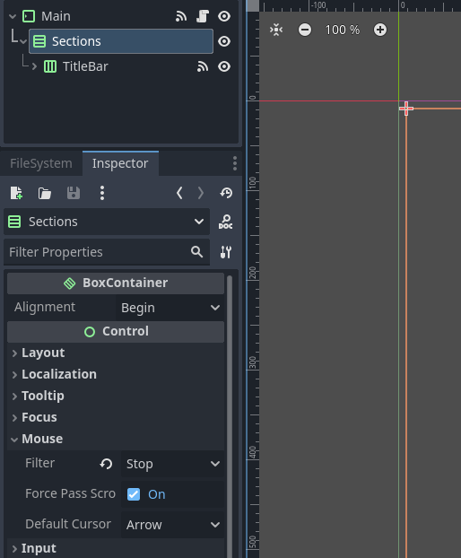  

Agora temos certeza que interações vindo do signal `gui_input` são interações diretas com o `MarginContainer`.  