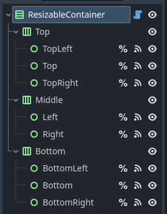
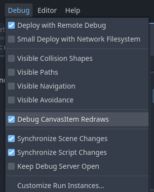

# Godot GUI Tips

## 1 - Performance
Mude o modo de renderização para *Compatibility*, não é como se você fosse precisar de qualquer renderização além do básico para desenhar uma janela na tela.  

  

Ative *Application > Run > Low Processor Mode* para que tenha um delay entre as renderizações da janela e apenas renderizar se alguma mudança for detectada. Em jogos a tela muda constantemente, então esse tipo de delay e validação só atrapalham mas como estamos falando de GUI que altera bem menos, isto ajuda muito.  

  

## 2 - Window Title Bar
Por padrão o nosso sistema operacional nos providência o gráfico básico de uma janela e nos deixa responsável por desenhar o conteúdo dentro dela.  

  

O lado positivo é que isto nos providência o básico de uma janela, como aqueles 3 botões no topo da direita (minimizar, máximizar, fechar, ...).  

Porém note que, dependendo do sistema operacional, mais opções podem estar disponíveis! Se eu clicar com o botão direito na title bar do topo, podemos ver mais ações:  

  

Se ativarmos *Display > Window > Size > Borderless*, o sistema operacional deixará de adicionar a title bar no topo:  

  

Basicamente ele está assumindo que você mesmo irá desenhar a title bar no topo caso queira (normalmente em jogos isto não faz sentido).  

:::info
Borderless ou não, ainda se trata de uma janela no seu sistema operacional então alguns atalhos podem continuar funcionando (`Super + Up/Down/Left/Right`, `Alt + Space`).  
:::

## 3 - Multiple Windows
Janelas abertas são tratadas como processos filhos, ou seja, o encerramento de uma janela pai irá encerrar os filhos.  

Caso queiramos ter múltiplas janelas idênticas, igual a editores de textos e navegadores, precisamos ter certeza que a janela principal (processo inicial) não possa ser encerrado da maneira padrão (clickando no botão de fechar).  

Podemos resolver isto escondendo a janela principal e apenas exibindo as subwindows.  

Ative *Display > Window > Size > Transparent* para que o fundo cinza padrão não seja renderizado durante a execução.  

  

:::note
Acredito que a cor padrão do canvas é preto, por isto deixar de pintar vai deixar a janela preta
:::

Ative *Display > Window > Per Pixel Transparency > Allowed* para que o fundo realmente seja transparente (caso contrário vai ficar o canvas preto).  

  

:::warning
Existe uma configuração que eu ainda não entendi a necessidade: *Rendering > Viewport > Transparent Background*.  

Mas a documentação menciona ela como necessária.  
:::

**Como visto na sessão anterior...**  

Ative Display > Window > Size > Borderless para o sistema operacional deixará de adicionar a title bar no topo.  

  

Embora ela esteja transparente, ela ainda é uma janela como as outras. Podemos conferir que ela ainda aparece quando apertando Alt+Tab (ou apenas apertando Alt no Ubuntu).  

  

Agora nós temos que tratar inputs!

**Primeiro** podemos notar que se está janela for posta na frente de outra, ela não irá deixar de consumir os seus clicks (mesmo que você queira selecionar algo na janela de trás).  

Para resolver isto podemos alterar janela raiz (criada quando seu programa inicia) para repassar adiante clicks do mouse.  

```gdscript
func _ready() -> void:
	get_window().mouse_passthrough = true
```

**Segundo** podemos notar que ela ainda está processando teclas (pode ser selecionada pelo `Alt + Tab`, fechada por `Alt + F4`, maximizada com `Super + Up`, etc).  

Ative *Display > Window > Size > No Focus* para que ela não possa ser focada (até por atalhos).  

  

Lembre que fechar o processo pai fecha todos os filhos, porém fechar todos os filhos não fecha o pai.

Isto quer dizer que o processo pai continua rodando mesmo se o usuário fechar todas as janelas filhas. Agora o usuário apenas conseguiria encerrar o programa pelo "gerenciador de tarefas" ou terminal.  

Para tratar isto podemos ligar um signal a um método responsável por notar quando a quantidade de filhos mudar e encerrar o programa se necessário.  


```gdscript
func _on_child_order_changed() -> void:
	if get_child_count() == 0:
		get_tree().quit()
```

:::note
Isto é apenas uma maneira de tratar!  

Nós poderiamos checar a cada frame se todas as janelas foram fechadas, poderiamos fazer os filhos avisarem o pai quando fossem encerrados, etc.  
:::

Agora precisamos entender que cada janela aberta é uma subwindow. Existem dois tipos de subwindows:
1. Subwindows
	- Quando sua janela pede ao sistema operacional para criar uma janela filha dela
	- Sua janela filha vai possuir a title bar padrão de janelas
2. Embed subwindows
	- Quando sua janela simula outra janela dentro dela mesmo
	- Isto impossibilita ela de ser mover para fora da janela pai

Se estamos tratando de uma aplicação que possui múltiplas janelas, precisamos que ela se mova para fora da janela pai. Caso contrário isso ocorreria:  

  

A janela 2 está saindo do limite da janela pai.  

Poderiamos inicializar a janela pai maximizada para evitar isto porém outros problemas iriam aparecer, por exemplo: Janela pai ignorar clicks e teclas, tornando impossível interagir com as janelas simuladas nele.  

Desative *Display > Window > Subwindows > Embed Subwindows* para que as subwindows sejam tratadas como janelas reais pelo sistema operacional (em vez de simuladas pela janela pai).  

  

Mas se quisermos ter uma title bar de janela única para as nossas janelas? Podemos fazer o mesmo que fizemos com janela principal, torna-la borderless.  

  

Dentro das propriedades da Janela, ative *Flags > Borderless*.  

  

Agora nós seriamos responsáveis por criar a title bar no topo da janela. Desta maneira poderiamos fazer uma title bar única igual ao Google Chrome ou Steam!  

## 4 - Custom Title Bar
Ter uma title bar própria é relativamente raro hoje em dia, pois muitas vezes requer reinventar a roda sem trazer benifícios reais.  

Mas isto não quer dizer que nenhuma aplicação faz isto:  
  
<sub>(Steam, GNOME Files, Google Chrome)</sub>  

Note que as 3 aplicações aproveitaram o espaço para providênciar mais informações e funcionalidades ao usuário. Porém nós vamos focar em pelo menos reproduzir o básico:  
1. Exibir titulo
2. Providênciar botões de minimizar, maximizar e fechar
3. Double click maximizar
4. Arrastar a title bar deve mover a janela
5. Redimensionar janela se arrastar as bordas

Depois disso você deve ser capaz de adicionar ou remover mais utilidades conforme a sua vontade.  

:::warning
Estarei partindo do princípio que queremos customizar uma title bar na janela principal, por isto o código utiliza `get_window()`, mas adaptações podem ser necessárias caso esteja tratando subwindows.  
:::

### Exibir Titulo
Basta utilizar o node Label.  

### Minimize, Maximize, Close Buttons
Basta utilizar 3 nodes Button tratando o signal `pressed`:  

```gdscript
func _on_minimize_pressed() -> void:
	get_window().mode = Window.MODE_MINIMIZED


func _on_maximize_pressed() -> void:
	if get_window().mode == Window.MODE_MAXIMIZED:
		get_window().mode = Window.MODE_WINDOWED
	else:
		get_window().mode = Window.MODE_MAXIMIZED


func _on_close_pressed() -> void:
	get_tree().quit()
```

:::tip subwindows tip
É importante tratar o signal `close_requested` vindo da janela, pois é por ele que você recebe notificações que o usuário tentou fechar de outras maneiras (taskbar do windows, etc).  
:::

### Double Click Maximize
Container não possui signal para isto diretamente porém podemos utilizar o signal mais geral `gui_input`.  

```gdscript
func _on_minimize_pressed() -> void:
	...


func _on_maximize_pressed() -> void:
	...


func _on_close_pressed() -> void:
	...


// highlight-start
func _on_title_bar_gui_input(event: InputEvent) -> void:
	if event is InputEventMouseButton:
		_on_title_bar_mouse_button(event)


func _on_title_bar_mouse_button(event: InputEventMouseButton) -> void:
	if event.button_index == MOUSE_BUTTON_LEFT and event.double_click:
		_on_title_bar_double_click()


func _on_title_bar_double_click() -> void:
	match get_window().mode:
		Window.MODE_MAXIMIZED:
			get_window().mode = Window.MODE_WINDOWED
		_:
			get_window().mode = Window.MODE_MAXIMIZED
// highlight-end
```

Já estamos dividindo em funções menores pois os passos seguintes irão adicionar mais funcionalidades nestas funções gerais.  

### Drag Window
A princípio, arrastar a janela pode ser resumido em saber duas coisas:  
- Saber se o click do mouse está sendo pressionado
- Onde que o click estava quando começou

```gdscript
// highlight-start
var _title_bar_dragging: bool = false

var _title_bar_dragging_start: Vector2i
// highlight-end


func _on_minimize_pressed() -> void:
	...


func _on_maximize_pressed() -> void:
	...


func _on_close_pressed() -> void:
	...


func _on_title_bar_gui_input(event: InputEvent) -> void:
	if event is InputEventMouseButton:
		_on_title_bar_mouse_button(event)
	// highlight-start
	elif event is InputEventMouseMotion:
		_on_title_bar_mouse_motion(event)
	// highlight-end


func _on_title_bar_mouse_button(event: InputEventMouseButton) -> void:
	if event.button_index == MOUSE_BUTTON_LEFT and event.double_click:
		_on_title_bar_double_click()
	// highlight-start
	elif event.button_index == MOUSE_BUTTON_LEFT and event.pressed:
		_title_bar_dragging = true
		_title_bar_dragging_start = get_global_mouse_position()
	elif event.button_index == MOUSE_BUTTON_LEFT and not event.pressed:
		_title_bar_dragging = false
	// highlight-end


func _on_title_bar_double_click() -> void:
	...


// highlight-start
func _on_title_bar_mouse_motion(_event: InputEventMouseMotion) -> void:
	if _title_bar_dragging:
		_on_title_bar_dragged()


func _on_title_bar_dragged() -> void:
	match get_window().mode:
		Window.MODE_WINDOWED:
			get_window().position += get_global_mouse_position() as Vector2i - _title_bar_dragging_start
// highlight-end
```

:::tip subwindows tip
**Primeiro**: Talvez seja bom mover para o centro da tela a janela pois a posição poder não estar correta durante a inicialização (bug?):  

```gdscript
func _ready() -> void:
	get_window().move_to_center()
```

**Segundo**: Talvez seja necessário utilizar `get_local_mouse_position()` em vez de `get_global_mouse_position()` pois deve ser necessário o canvas da própria subwindow.  
:::

Esse foi apenas o essencial sobre arrastar, agora podemos pensar em implementar detalhes sobre a ação de arrastar janelas.  

Por exemplo: Quando o usuário tentar arrastar uma janela máximizada, ela automaticamente sai do máximizado e se posiciona para que o mouse esteja proporcionalmente na posição correta.   

```gdscript
var _title_bar_dragging: bool = false

var _title_bar_dragging_start: Vector2i

// highlight-next-line
var _title_bar_dragging_adjustment: float = 0


func _on_minimize_pressed() -> void:
	...


func _on_maximize_pressed() -> void:
	...


func _on_close_pressed() -> void:
	...


func _on_title_bar_gui_input(event: InputEvent) -> void:
	...


func _on_title_bar_mouse_button(event: InputEventMouseButton) -> void:
	...


func _on_title_bar_double_click() -> void:
	...


func _on_title_bar_mouse_motion(event: InputEventMouseMotion) -> void:
	...


func _on_title_bar_dragged() -> void:
	match get_window().mode:
		Window.MODE_WINDOWED:
			get_window().position += get_global_mouse_position() as Vector2i - _title_bar_dragging_start
// highlight-start
		Window.MODE_MAXIMIZED:
			_title_bar_dragging_adjustment = get_global_mouse_position().x / get_window().size.x
			get_window().mode = Window.MODE_WINDOWED


func _on_resized() -> void:
	if _title_bar_dragging_adjustment != 0:
		get_window().position += (get_global_mouse_position() as Vector2i)
		get_window().position.x -= get_window().size.x * _title_bar_dragging_adjustment
		_title_bar_dragging_start = get_global_mouse_position()
		_title_bar_dragging_adjustment = 0
// highlight-end
```

:::note
Lembre de se conectar ao sinal `_on_resized`.
:::

### Resize Window (old)
Redimensionar pode ser facilmente implementado se utilizarmos o node `MarginContainer` que nos permite adicionar bordas às laterais, estas serão nossas bordas que devem reagir ao mouse.  

Nodes do tipo `Control` possuem lógica para lidar com inputs do mouse, eles podem consumir ou passar ao node de cima as input do mouse.  

Isso quer dizer que qualquer input do mouse na nossa janela (que não tiver sido consumida) chegará ao nosso `MarginContainer`. Isto não é o que queremos, para nós só é interessante que chegue inputs interagindo com a borda do nosso container.  

Podemos resolver isto parando o consumo de inputs no container logo abaixo do `MarginContainer`:  

  

:::note
Existem `Control`s que por padrão param o consumo do mouse neles, por exemplo: `Panel`.  
:::

Agora temos certeza que interações vindo do signal `gui_input` são interações diretas com o `MarginContainer`.  

```gdscript
// highlight-start
enum Margin {
	NONE,
	TOP,
	RIGHT,
	BOTTOM,
	LEFT,
	TOP_RIGHT,
	TOP_LEFT,
	BOTTOM_RIGHT,
	BOTTOM_LEFT,
}

var _margin_dragging: bool = false

var _margin_dragging_edge_start: Vector2i

var _margin_dragging_origin_limit: Vector2i

var _margin_selected: Margin
// highlight-end

var _title_bar_dragging: bool = false

var _title_bar_dragging_start: Vector2i

var _title_bar_dragging_adjustment: float = 0

// highlight-start
func _get_current_margin(mouse_position: Vector2) -> Margin:
	var margin: Margin = Margin.NONE
	
	if get_global_mouse_position().x < get_theme_constant("margin_left"):
		margin = Margin.LEFT
	elif get_global_mouse_position().x > size.x - get_theme_constant("margin_right"):
		margin = Margin.RIGHT
	
	if get_global_mouse_position().y < get_theme_constant("margin_top"):
		match margin:
			Margin.LEFT:
				return Margin.TOP_LEFT
			Margin.NONE:
				return Margin.TOP
			Margin.RIGHT:
				return Margin.TOP_RIGHT
	elif get_global_mouse_position().y > size.y - get_theme_constant("margin_bottom"):
		match margin:
			Margin.LEFT:
				return Margin.BOTTOM_LEFT
			Margin.NONE:
				return Margin.BOTTOM
			Margin.RIGHT:
				return Margin.BOTTOM_RIGHT
	
	return margin


func _on_gui_input(event: InputEvent) -> void:
	if event is InputEventMouseButton:
		_on_mouse_button(event)
	elif event is InputEventMouseMotion:
		_on_mouse_motion(event)


func _on_mouse_button(event: InputEventMouseButton) -> void:
	if event.button_index == MOUSE_BUTTON_LEFT and event.pressed:
		_margin_dragging = true
		_margin_selected = _get_current_margin(event.position)
		_margin_dragging_edge_start = get_window().position + get_window().size
		_margin_dragging_origin_limit = _margin_dragging_edge_start - get_window().min_size
	elif event.button_index == MOUSE_BUTTON_LEFT and not event.pressed:
		_margin_dragging = false


func _on_mouse_motion(event: InputEventMouseMotion) -> void:
	if _margin_dragging:
		_on_dragged(event)
	else:
		_on_hover(event)


func _on_dragged(event: InputEventMouseMotion) -> void:
	if get_window().mode != Window.MODE_WINDOWED:
		return
	
	match _margin_selected:
		Margin.TOP:
			get_window().position.y = min(
				get_window().position.y + event.position.y,
				_margin_dragging_origin_limit.y
			)
			
			get_window().size.y = _margin_dragging_edge_start.y - get_window().position.y
		Margin.RIGHT:
			get_window().size.x = event.position.x
		Margin.BOTTOM:
			get_window().size.y = event.position.y
		Margin.LEFT:
			get_window().position.x = min(
				get_window().position.x + event.position.x,
				_margin_dragging_origin_limit.x
			)
			
			get_window().size.x = _margin_dragging_edge_start.x - get_window().position.x
		Margin.TOP_RIGHT:
			get_window().position.y = min(
				get_window().position.y + event.position.y,
				_margin_dragging_origin_limit.y
			) # Top
			
			get_window().size = Vector2i(
				event.position.x, # Right
				_margin_dragging_edge_start.y - get_window().position.y, # Top
			)
		Margin.TOP_LEFT:
			get_window().position = Vector2i(
				min(
					get_window().position.x + event.position.x,
					_margin_dragging_origin_limit.x
				), # Left,
				min(
					get_window().position.y + event.position.y,
					_margin_dragging_origin_limit.y
				), # Top
			)

			get_window().size = Vector2i(
				_margin_dragging_edge_start.x - get_window().position.x, # Left
				_margin_dragging_edge_start.y - get_window().position.y, # Top
			)
		Margin.BOTTOM_RIGHT:
			get_window().size = Vector2i(
				event.position.x, # Right
				event.position.y, # Bottom
			)
		Margin.BOTTOM_LEFT:
			get_window().position.x += event.position.x # Left
			get_window().size = Vector2i(
				_margin_dragging_edge_start.x - get_window().position.x, # Left
				event.position.y, # Bottom
			)


func _on_hover(event: InputEventMouseMotion) -> void:
	match _get_current_margin(event.position):
		Margin.NONE:
			mouse_default_cursor_shape = Control.CURSOR_ARROW
		Margin.TOP:
			mouse_default_cursor_shape = Control.CURSOR_VSIZE
		Margin.RIGHT:
			mouse_default_cursor_shape = Control.CURSOR_HSIZE
		Margin.BOTTOM:
			mouse_default_cursor_shape = Control.CURSOR_VSIZE
		Margin.LEFT:
			mouse_default_cursor_shape = Control.CURSOR_HSIZE
		Margin.TOP_RIGHT:
			mouse_default_cursor_shape = Control.CURSOR_BDIAGSIZE
		Margin.TOP_LEFT:
			mouse_default_cursor_shape = Control.CURSOR_FDIAGSIZE
		Margin.BOTTOM_RIGHT:
			mouse_default_cursor_shape = Control.CURSOR_FDIAGSIZE
		Margin.BOTTOM_LEFT:
			mouse_default_cursor_shape = Control.CURSOR_BDIAGSIZE
// highlight-end


func _on_minimize_pressed() -> void:
	...


func _on_maximize_pressed() -> void:
	...


func _on_close_pressed() -> void:
	...


func _on_title_bar_gui_input(event: InputEvent) -> void:
	...


func _on_title_bar_mouse_button(event: InputEventMouseButton) -> void:
	...


func _on_title_bar_double_click() -> void:
	...


func _on_title_bar_mouse_motion(_event: InputEventMouseMotion) -> void:
	...


func _on_title_bar_dragged() -> void:
	...


func _on_resized() -> void:
	...
```

Dentro das funções novas, muitas possuem a mesma lógica utilizada para arrastar janela. Porém duas possuem lógica nova: `_get_current_margin()` e `_on_dragged()`  

**A primeira** é responsável por identificar a borda a qual o mouse se encontra (varias validações para identificar a posição do mouse em relação as bordas).  

**A segunda** é a lógica de redimensionar, para resolver ela é recomendado primeiro resolver a lógica para cima, direita, baixo e esquerda (as diagonais são combinações das lógicas das outras).  

:::info
> Por que redimensionar não é suave igual a outras aplicações?  

Isto ocorre pois nem sempre a **movimentação** e o **redimensionamento** não ocorrem na mesma frame.  

Por enquanto não é possível de se resolver isto pelo Godot.  
:::

### Resize Window (new)
A maneira anterior adiciona um grande problema: Utilizar `MarginContainer` adiciona margins vazias a sua janela e tornava impossível delas encostarem nas bordas do monitor.  

Está outra maneira envolve estruturar uma cena com todas as bordas necessárias.  

  

```gdscript
// highlight-start
enum Margin {
	TOP,
	RIGHT,
	BOTTOM,
	LEFT,
	TOP_RIGHT,
	TOP_LEFT,
	BOTTOM_RIGHT,
	BOTTOM_LEFT,
}

@export var margin_top: int = 0:
	set(m):
		margin_top = m
		
		if not get_node_or_null("%Top"):
			return
		
		%TopLeft.custom_minimum_size.y = m
		%Top.custom_minimum_size.y = m
		%TopRight.custom_minimum_size.y = m

@export var margin_right: int = 0:
	set(m):
		margin_right = m
		
		if not get_node_or_null("%Right"):
			return
		
		%TopRight.custom_minimum_size.x = m
		%Right.custom_minimum_size.x = m
		%BottomRight.custom_minimum_size.x = m

@export var margin_bottom: int = 0:
	set(m):
		margin_bottom = m
		
		if not get_node_or_null("%Bottom"):
			return
		
		%BottomLeft.custom_minimum_size.y = m
		%Bottom.custom_minimum_size.y = m
		%BottomRight.custom_minimum_size.y = m

@export var margin_left: int = 0:
	set(m):
		margin_left = m
		
		if not get_node_or_null("%Left"):
			return
		
		%TopLeft.custom_minimum_size.x = m
		%Left.custom_minimum_size.x = m
		%BottomLeft.custom_minimum_size.x = m

var _margin_dragging: bool = false

var _margin_dragging_edge_start: Vector2i

var _margin_dragging_origin_limit: Vector2i

var _margin_hovered: Margin
// highlight-end

var _title_bar_dragging: bool = false

var _title_bar_dragging_start: Vector2i

var _title_bar_dragging_adjustment: float = 0

// highlight-start
func _process(_delta: float) -> void:
	if _margin_dragging:
		_on_dragged()


func _on_dragged() -> void:
	if get_window().mode != Window.MODE_WINDOWED:
		return
	
	var mouse_position: Vector2i = get_global_mouse_position() as Vector2i
	
	match _margin_hovered:
		Margin.TOP:
			get_window().position.y = min(
				get_window().position.y + mouse_position.y,
				_margin_dragging_origin_limit.y
			)
			
			get_window().size.y = _margin_dragging_edge_start.y - get_window().position.y
		Margin.RIGHT:
			get_window().size.x = mouse_position.x
		Margin.BOTTOM:
			get_window().size.y = mouse_position.y
		Margin.LEFT:
			get_window().position.x = min(
				get_window().position.x + mouse_position.x,
				_margin_dragging_origin_limit.x
			)
			
			get_window().size.x = _margin_dragging_edge_start.x - get_window().position.x
		Margin.TOP_RIGHT:
			get_window().position.y = min(
				get_window().position.y + mouse_position.y,
				_margin_dragging_origin_limit.y
			) # Top
			
			get_window().size = Vector2i(
				mouse_position.x, # Right
				_margin_dragging_edge_start.y - get_window().position.y, # Top
			)
		Margin.TOP_LEFT:
			get_window().position = Vector2i(
				min(
					get_window().position.x + mouse_position.x,
					_margin_dragging_origin_limit.x
				), # Left,
				min(
					get_window().position.y + mouse_position.y,
					_margin_dragging_origin_limit.y
				), # Top
			)

			get_window().size = Vector2i(
				_margin_dragging_edge_start.x - get_window().position.x, # Left
				_margin_dragging_edge_start.y - get_window().position.y, # Top
			)
		Margin.BOTTOM_RIGHT:
			get_window().size = Vector2i(
				mouse_position.x, # Right
				mouse_position.y, # Bottom
			)
		Margin.BOTTOM_LEFT:
			get_window().position.x += mouse_position.x # Left
			get_window().size = Vector2i(
				_margin_dragging_edge_start.x - get_window().position.x, # Left
				mouse_position.y, # Bottom
			)


func _on_top_left_gui_input(event: InputEvent) -> void:
	_margin_hovered = Margin.TOP_LEFT
	_on_margin_gui_input(event)


func _on_top_gui_input(event: InputEvent) -> void:
	_margin_hovered = Margin.TOP
	_on_margin_gui_input(event)


func _on_top_right_gui_input(event: InputEvent) -> void:
	_margin_hovered = Margin.TOP_RIGHT
	_on_margin_gui_input(event)


func _on_left_gui_input(event: InputEvent) -> void:
	_margin_hovered = Margin.LEFT
	_on_margin_gui_input(event)


func _on_right_gui_input(event: InputEvent) -> void:
	_margin_hovered = Margin.RIGHT
	_on_margin_gui_input(event)


func _on_bottom_left_gui_input(event: InputEvent) -> void:
	_margin_hovered = Margin.BOTTOM_LEFT
	_on_margin_gui_input(event)


func _on_bottom_gui_input(event: InputEvent) -> void:
	_margin_hovered = Margin.BOTTOM
	_on_margin_gui_input(event)


func _on_bottom_right_gui_input(event: InputEvent) -> void:
	_margin_hovered = Margin.BOTTOM_RIGHT
	_on_margin_gui_input(event)


func _on_margin_gui_input(event: InputEvent) -> void:
	if event is InputEventMouseButton:
		_on_margin_mouse_button(event)


func _on_margin_mouse_button(event: InputEventMouseButton) -> void:
	if event.button_index == MOUSE_BUTTON_LEFT and event.pressed:
		_margin_dragging = true
		_margin_dragging_edge_start = get_window().position + get_window().size
		_margin_dragging_origin_limit = _margin_dragging_edge_start - get_window().min_size
	elif event.button_index == MOUSE_BUTTON_LEFT and not event.pressed:
		_margin_dragging = false
// highlight-end


func _on_minimize_pressed() -> void:
	...


func _on_maximize_pressed() -> void:
	...


func _on_close_pressed() -> void:
	...


func _on_title_bar_gui_input(event: InputEvent) -> void:
	...


func _on_title_bar_mouse_button(event: InputEventMouseButton) -> void:
	...


func _on_title_bar_double_click() -> void:
	...


func _on_title_bar_mouse_motion(_event: InputEventMouseMotion) -> void:
	...


func _on_title_bar_dragged() -> void:
	...


func _on_resized() -> void:
	...
```

:::warning
Eu não passei a limpo o código acima, usei como base o de outro projeto que eu possuia.  

Isto quer dizer que posso ter esquecido de alterar algum nome de função e variável corretamente ou seguindo o mesmo padrão visto anteriormente.  
:::

## 5 - Drag and Drop (DND)
Podemos dividir em dois tipos:
- Drag from Godot
- Drag from Operating System

Entenda que não é possível simplesmente arrastar um item de uma aplicação para outra e esperar que a receptora entenda aquele tipo de dado.  

Por exemplo, imagine que nós puxemos a aba do terminal do VSCode para o Godot.  

  

Embora VSCode nos permita arrastar está aba e reposiciona-la dentro do próprio VSCode, o Godot não entende o que é está aba (definitivamente não é um Node ou Control).  

Para resolver este problema, o sistema operacional age como intermediários entre as aplicações, forçando a aplicação a formatar de uma maneira esperada pelo OS antes de transferir entre aplicações

:::note
Isto quer dizer que cada sistema operacional possue seu formato de transferência (normalmente as bibliotecas abstraem isto).  
:::

Por outro lado, quando toda a operação de DND é dentro do Godot, não precisamos nos preocupar com formatar da maneira que o sistema operacional deseja e podemos passar os dados em um formato conhecido pelo Godot.  

### DND: Godot -> Godot
  

No momento que você começa a arrastar qualquer [Control](https://docs.godotengine.org/en/stable/classes/class_control.html), Godot irá chamar o método [`_get_drag_data()`](https://docs.godotengine.org/en/stable/classes/class_control.html#class-control-private-method-get-drag-data) daquele Control.  

Exemplo:  

```gdscript
extends TextureRect


func _get_drag_data(at_position: Vector2) -> Variant:
	return texture
```

- Se o método retornar `null`, Godot entenderá que não existe conteúdo sendo arrastado
	- Por padrão este método virtual retorna `null`
- Se o método retornar qualquer outro dado, Godot entenderá que existe conteúdo sendo arrastado

Neste momento Godot lança a notificação [NOTIFICATION_DRAG_BEGIN](https://docs.godotengine.org/en/stable/classes/class_node.html#class-node-constant-notification-drag-begin) para todos os [Nodes](https://docs.godotengine.org/en/stable/classes/class_node.html).  

:::info
Este tipo de notificação é muito utilizada em GUI's pois nos permite destacar uma área onde o conteúdo pode ser solto.  

Por exemplo, Godot detecta que você está arrastando algo válido para aquele campo e cria uma borda azul para deixar claro que é possível soltar o conteúdo lá.  

  
:::

Agora que estamos no estado "dragging", sempre que passarmos o mouse em cima de um Control, Godot irá chamar o método [`_can_drop_data()`](https://docs.godotengine.org/en/stable/classes/class_control.html#class-control-private-method-can-drop-data) para saber se é possível soltar conteúdo nele.  

Exemplo:  

```gdscript
extends Button


func _can_drop_data(at_position: Vector2, data: Variant) -> bool:
	return data is Texture
```

- Se o método retornar `false`, Godot entenderá que não suporta o conteúdo sendo arrastado
	- Por padrão este método virtual retorna `false`
- Se o método retornar `true`, Godot entenderá que suporta o conteúdo sendo arrastado

:::info
É normal ver o mouse mudar de aparência para destacar que o conteúdo pode ser largado naquele local.  
:::

No momento que soltarmos o conteúdo, Godot irá chamar o método [`_drop_data()`](https://docs.godotengine.org/en/stable/classes/class_control.html#class-control-private-method-drop-data) **apenas** se passou na validação do método `_can_drop_data()`.  

Exemplo:  

```gdscript
extends Button


func _can_drop_data(at_position: Vector2, data: Variant) -> bool:
	return data is Texture


func _drop_data(at_position: Vector2, data: Variant) -> void:
	icon = data
```

Após soltar o click, independente se tiver sido de algo válido, Godot irá emitir a notificação [NOTIFICATION_DRAG_END](https://docs.godotengine.org/en/stable/classes/class_node.html#class-node-constant-notification-drag-end) para todos os Nodes.  

:::info
É possível conseguir informações ao vivo do estado do dragging na [Viewport](https://docs.godotengine.org/en/stable/classes/class_viewport.html).  

- [`gui_get_drag_data()`](https://docs.godotengine.org/en/stable/classes/class_viewport.html#class-viewport-method-gui-get-drag-data)
	- O dado sendo arrastado
- [`gui_is_drag_successful()`](https://docs.godotengine.org/en/stable/classes/class_viewport.html#class-viewport-method-gui-is-drag-successful)
	- O resultado do último drag
- [`gui_is_dragging()`](https://docs.godotengine.org/en/stable/classes/class_viewport.html#class-viewport-method-gui-is-dragging)
	- O estado atual do drag
:::

### DND: OS -> Godot
  

No momento Godot apenas suporta **drop** do **file manager**, ao fazer isto sua janela irá receber os para os arquivos passados.  

:::info
Esta ação ocorre entre sistema operacional e as janelas da nossa aplicação, mas é importante entender que está janela **não** pode ser [embedded](https://docs.godotengine.org/en/stable/classes/class_viewport.html#class-viewport-property-gui-embed-subwindows).  

Isso é necessário pois "embed window" é apenas uma simulação de janela dentro da nossa aplicação, logo não é vista como janela pelo OS.  
:::

O node [Window](https://docs.godotengine.org/en/stable/classes/class_window.html) possui o sinal [files_dropped](https://docs.godotengine.org/en/stable/classes/class_window.html#class-window-signal-files-dropped) para avisar quando um ou mais arquivos são largados na janela.  

Sabendo isto podemos conectar uma função a este sinal da janela principal:  

```gdscript
func _ready() -> void:
	get_window().files_dropped.connect(_on_files_dropped)


func _on_files_dropped(files: PackedStringArray) -> void:
	pass
```

:::note
Se estivessemos falando de uma subwindow, poderiamos utilizar a própria interface do Godot para conectar.  
:::

Um detalhe a se notar é que neste caso não recebemos a posição onde os arquivos foram largados, então precisariamos calcular manualmente se está dentro da área esperada.  

```gdscript
func _ready() -> void:
	get_window().files_dropped.connect(_on_files_dropped)


func _on_files_dropped(files: PackedStringArray) -> void:
	if Rect2(global_position, size).has_point(get_global_mouse_position()):
		pass
```

Este código pode ser adicionado a qualquer Control para que ele trate drops nele.  

### DND: OS -> Godot Web

Existem dois comportamentos dos navegadores que tornam esse processo um pouco diferente do acima:  
- A posição global do mouse **não** é atualizada enquanto o usuário estiver arrastando arquivo(s)
- O navegador cria cópias temporárias dos arquivos arrastados e ele podem ser **deletados** na frame seguinte

Uma maneira de resolver o primeiro problema é esperar atualização de movimento do mouse antes de tratar qualquer lógica do drop.  

```gdscript
func _ready() -> void:
	get_tree().root.window_input.connect(_on_window_input)
	get_window().files_dropped.connect(_on_files_dropped)


func _on_window_input(event: InputEvent) -> void:
	if event is InputEventMouseMotion:
		mouse_moved.emit()


func _on_files_dropped(files: PackedStringArray) -> void:
	await mouse_moved

	if Rect2(global_position, size).has_point(get_global_mouse_position()):
		pass
```

Porém ao fazer isto existe **grande** chance do segundo problema atacar (deletar os arquivos temporários). Uma possível solução é ler os arquivos antes do `await`:  

```gdscript
func _ready() -> void:
	get_tree().root.window_input.connect(_on_window_input)
	get_window().files_dropped.connect(_on_files_dropped)


func _on_window_input(event: InputEvent) -> void:
	if event is InputEventMouseMotion:
		mouse_moved.emit()


func _on_files_dropped(files: PackedStringArray) -> void:
	var filebytes := FileAccess.get_file_as_bytes(files[0])

	await mouse_moved

	if Rect2(global_position, size).has_point(get_global_mouse_position()):
		pass
```

Neste exemplo, estou apenas pegando os bytes do primeiro arquivo e armazenando numa variável mas você deve adaptar para o seu caso de uso.  

## 6 - Debug
É possível literalmente visualizar o quanto a sua aplicação se redesenha na tela.  

  

Isto pode ser útil para te alertar se algum control seu está se redesenhando demais.  

:::warning
Atualmente isto apenas funciona quando utilizando o modo de renderização "Mobile" e este modo afeta o desempenho do Godot.  

Minha recomendação seria apenas utilizar durante as etapas de testes.  
:::

## References
- https://github.com/thiagola92/learning-godot-window
- https://www.youtube.com/watch?v=cJ5Rkk5fnGg
- https://learn.microsoft.com/en-us/windows/apps/design/input/drag-and-drop
- https://www.freedesktop.org/wiki/Specifications/XDND/