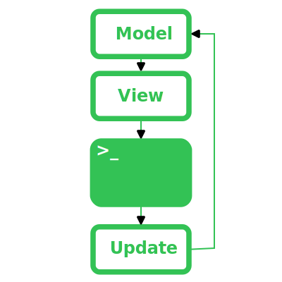

# Bubbletea and Bubbles

## The Elm Architecture
*(MVU, Model-View-Update)*  

A arquitetura se resume a 3 partes:
- **Model**: Conjuntos de dados sobre o estado da aplicação
- **View**: Converte os dados do model para algo visual
- **Update**: Reage a atualizações para atualizar os dados do model

Seja qual for a sua aplicação (CLI, TUI, GUI, ...), ela é responsável por receber o que o usuário deve visualizar e por notificar atualizações vindas do usuário:  

  


## Bubbletea
É responsável por rodar em loop a arquitetura Elm. Todo o código para isto se resume a:  

```go
package main

import tea "github.com/charmbracelet/bubbletea"

func main() {
    program := tea.NewProgram(
        MyStruct{} // Here you pass your model.
    )

    _, err := program.Run()

    if err != nil {
        print(err.Error())
    }
}
```

Entenda que **Model** é terminologia para representar uma coleção de dados e é por isto que **Bubbletea** utiliza structs para representar models.  

### Models Structure
Models dentro do Bubbletea devem seguir a seguinte estrutura:  

```go
type MyStruct struct {
    // Fields.
}

func (m MyStruct) Init() tea.Cmd {
    // Run on initialization.
}

func (m MyStruct) Update(msg tea.Msg) (tea.Model, tea.Cmd) {
    // Process a message.
}

func (m MyStruct) View() string {
    // Write to screen.
}
```

Podemos ver que é dividido em 4 partes:  
- Uma `struct` responsável por representar o **Model** da arquitetura Elm
- Um método `Init()` único da estrutura bubbletea
- Um método `Update()` responsável por representar o **Update** da arquitetura Elm
- Um método `View()` responsável por representar o **View** da arquitetura Elm

:::info
Em muitos tutoriais, pessoas também incluem uma função responsável por criar o model e configura-lo com os padrões desejados:  

```go
func newMyStruct() MyStruct {
    return MyStruct{
        // Set default fields values here
    }
}

func main() {
    program := tea.NewProgram(newMyStruct()) // Use here
}
```
:::

### Keys
Teclas pressionadas no teclado vão para o mesmo lugar que todas interações (`Update()`), lá resta a você reconhecer como sendo um pressionamento de tecla.  

```go
func (m MyStruct) Update(msg tea.Msg) (tea.Model, tea.Cmd) {
    switch msg := msg.(type) {
    case tea.KeyMsg:
        if msg.String() == "ctrl+c" {
            return m, tea.Quit
        }
    }

    return m, nil
}
```

No exemplo podemos ver que possuimos um `switch` para nos ajudar a identificar o tipo da mensagem, isso é necessário pois a mensagem pode ter qualquer tipo (não necessariamente uma mensagem de pressionamento de tecla).  

Mensagens de teclas dentro do Bubbletea podem ser convertido para strings, o que nos da uma string de fácil entedimento porém nem sempre uma ação está ligada a apenas um atalho, então pode ser útil sabermos como ligar diversos atalhos a uma ação:  

```go
var quit = key.NewBinding(
    key.WithKeys("ctrl+c", "ctrl+q", "q")
)

// ...

func (m MyStruct) Update(msg tea.Msg) (tea.Model, tea.Cmd) {
    switch msg := msg.(type) {
    case tea.KeyMsg:
        switch {
        case key.Matches(msg, quit):
            return m, tea.Quit
        }
    }

    return m, nil
}
```

:::tip
Em vez de criar uma variável para cada atalho, você pode agrupar todas em uma que simbolize todo o mapeamento dos atalhos:  

```go
var keyMap struct {
    Up   key.Binding
    Down key.Binding
    Quit key.Binding
}

var keys = keyMap{
    Up: key.NewBinding(
        key.WithKeys("up", "w"),
    ),
    Down: key.NewBinding(
        key.WithKeys("down", "s"),
    ),
    Quit: key.NewBinding(
        key.WithKeys("ctrl+c", "ctrl+q", "q"),
    ),
}

// ...

func (m MyStruct) Update(msg tea.Msg) (tea.Model, tea.Cmd) {
    switch msg := msg.(type) {
    case tea.KeyMsg:
        switch {
        case key.Matches(msg, keys.Quit):
            return m, tea.Quit
        }
        case key.Matches(msg, keys.Down):
            // Do something
        }
        case key.Matches(msg, keys.Up):
            // Do something
        }
    }

    return m, nil
}
```

:::

## Bubbles
É uma coleção de models com parte da lógica já preparada.  

Olhando a assinatura das funções e structs do [spinner](https://github.com/charmbracelet/bubbles/blob/master/spinner/spinner.go), podemos ver que ele implementa:  

- **Model**: `type Model struct`
- **Update**: `func (m Model) Update(msg tea.Msg) (Model, tea.Cmd)`
- **View**: `func (m Model) View() string`

Ele implementa quase todas as partes necessárias para ser executado diretamente no Bubbletea, a única parte que está faltando é `Init()`. Por que isso?  

Acontece que spinner não tem intenção de ser um modelo perfeito para ser utilizado diretamente pelo Bubbletea, pois não faz sentido criar um programa Bubbletea que apenas exibe um spinner.  

Porém podemos criar nosso próprio model que utiliza este spinner:  

```go
type MyStruct struct {
	spinner spinner.Model
}

func newSpinner() MyStruct {
	return MyStruct{
		spinner: spinner.New(),
	}
}

func (m MyStruct) Init() tea.Cmd {
	return m.spinner.Tick // spinner requires this to start
}

func (m MyStruct) Update(msg tea.Msg) (tea.Model, tea.Cmd) {
	var cmd tea.Cmd

	switch msg := msg.(type) {
	case tea.KeyMsg:
		if msg.String() == "ctrl+c" {
			return m, tea.Quit
		}
	default:
		m.spinner, cmd = m.spinner.Update(msg)
	}

	return m, cmd
}

func (m MyStruct) View() string {
	return m.spinner.View()
}

func main() {
    program := tea.NewProgram(
        MyStruct{
            spinner: spinner.New(),
        }
    )

    _, err := program.Run()

    if err != nil {
        print(err.Error())
    }
}
```

Note como basicamente reutilizamos tudo do spinner para fazer nosso model:  
- Nossa `struct` é o spinner sozinho
- Nossa `View()` apenas chama a `View()` do spinner
- Nosso `Update()` chama `Update()` do spinner e detecta se o atalho para sair foi pressionado

Como podemos ver os componentes do Bubbles foram feitos para serem utilizados pelos seus models (e não pelo Bubbletea diretamente). Imagine o susto de alguém executando o spinner diretamente e ele nunca fechando pois ninguém processa `ctrl+c` para sair.  

## References
- https://guide.elm-lang.org/architecture/
- https://github.com/charmbracelet/bubbletea
- https://github.com/charmbracelet/bubbles
- https://www.youtube.com/watch?v=5lxQJS3b38w
- https://www.youtube.com/watch?v=ERaZi0YvBRs