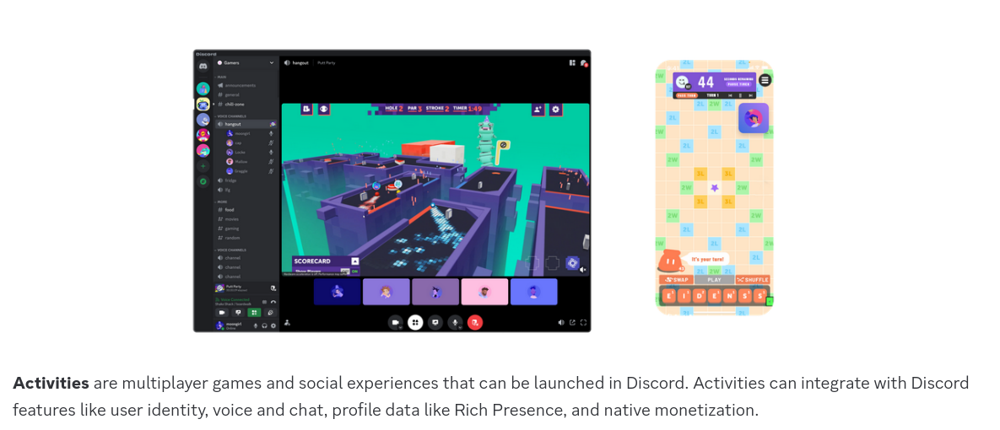
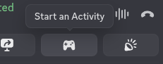
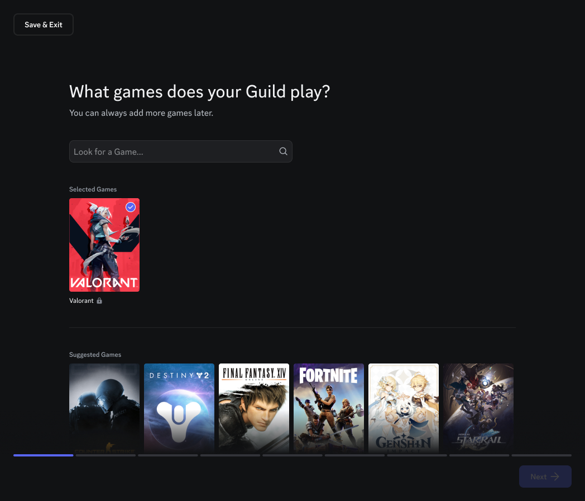

# Discord Social SDK
Internamente Discord possui uma nomeclatura realmente confusa.  

O nome de uma feature qualquer do Discord, pode não ser o mesmo dentro da SDK **ou**, até mesmo, não possuir um nome certo. Por exemplo, activities...  

## Activity
  
<small>(https://discord.com/developers/docs/activities/overview)</small>

Na imagem podemos ver que a definição dada é:  

> Activities are multiplayer games and social experiences that can be launched in Discord

Activites eram essas atividades em grupo que nós poderiamos iniciar ao pressionar o botão "Start an Activity" durante uma chamada de voz:  

  

E é justamente isto que **eu**, como usuário do Discord, esperava que activity fosse ser para sempre. 

---

Recentemente descobri que Discord decidiu generalizar o termo para:  

***Qualquer atividade que o usuário esteja fazendo e que tenha sido compartilhada com o Discord.***  

É por isto que podemos encontrar várias seções de atividades dentro do Discord:  
https://support.discord.com/hc/en-us/articles/7931156448919-Activity-Status-Recent-Activity  

A nova SDK utiliza está definição nova, enquanto documentações antigas do Discord ainda podem não ter sido atualizadas.  

## Guild (aka Server)
> Guilds in Discord represent an isolated collection of users and channels, and are often referred to as "servers" in the UI.  

Meu palpite é que "server" seja um termo muito específico dentro de computação, então utilizar um termo de jogos internamente ajuda bastante. Maaaas não é um termo que qualquer pessoa do dia a dia iria entender e por isto decidiram utilizar "server" na UI.  

Para mim deveriam ter ficado com Guild por organização, mesmo que pessoas normais fossem achar nerd ou estranho.  

---

Vale mencionar que recentemente tentaram utilizar o termo Guild para outra feature deles (que foi cancelada):  

  
<small>(https://support.discord.com/hc/en-us/articles/23187611406999-Guilds-FAQ)</small>  

## Channel
Normalmente se imaginaria canais de texto e canais de voz, mas acontece que quase tudo é um channel:  

- Canal de texto de um server
- Canal de voz de um server
- Categorizador dos servers
    - Sabe aquilo para você botar diversos canais de voz/texto em categorias?
- Threads
- Mensagem privada entre usuários
- Mensagem em um grupo
- ...

<small>(https://discord.com/developers/docs/resources/channel#channel-object-channel-types)</small>   

## Lobby
É um grupo de usuários... Fim.  

Um lobby existe sem a necessidade dos usuários estarem fazendo nada nele (activity/guild/channel/...). É o local onde multiplos usuários decidiram se agrupar junto e ainda não foi decidido o que vão fazer.  

Meio difícil de imaginar isto na interface do Discord né?  

# References
- [Activity](https://discord.com/developers/docs/activities/overview)
- [Activity blog](https://discord.com:2053/blog/server-activities-games-voice-watch-together)
- [Activity video 1](https://www.youtube.com/watch?v=POMIDMK6WfM)
- [Activity video 2](https://www.youtube.com/watch?v=8jD0dkCgF7k)
- [Activity status](https://support.discord.com/hc/en-us/articles/7931156448919-Activity-Status-Recent-Activity)
- [SDK Activity](https://discord.com/developers/docs/social-sdk/classdiscordpp_1_1Activity.html)
- [Guild](https://discord.com/developers/docs/resources/guild)
- [SDK Guild](https://discord.com/developers/docs/social-sdk/classdiscordpp_1_1GuildMinimal.html)
- [SDK Channel](https://discord.com/developers/docs/social-sdk/classdiscordpp_1_1ChannelHandle.html)
- [SDK Lobby](https://discord.com/developers/docs/social-sdk/classdiscordpp_1_1LobbyHandle.html)
- [SDK Call](https://discord.com/developers/docs/social-sdk/classdiscordpp_1_1Call.html)
